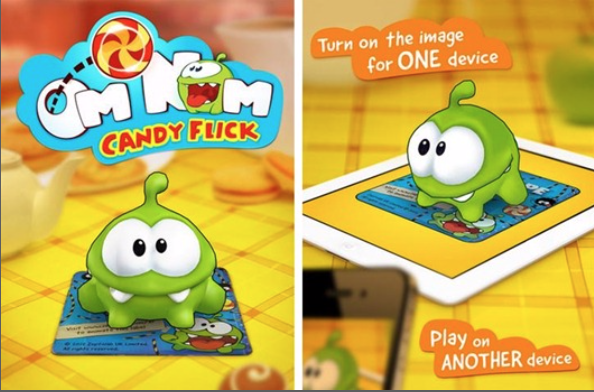
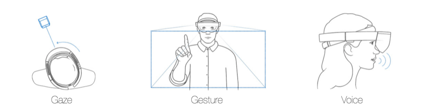

# Chapter 1: Hello ARKit!

### 前言

什麼是AR, ARKit可以做到什麼，又有哪些限制?

------

### 大綱

- [Augmented reality](#1)
  - Marker-based tracking
  - Markerless tracking
- [Introducing ARKit](#2)
- [What can ARKit do for you?](#3)
  - Tracking
  - 2D image and 3D object detection
  - Scene understanding and persistence
  - Light estimation
  - Real-time environment map
  - Scene interaction
  - Metric scaling system
  - Rendering integrations
- [Limitations of ARKit](#4)
  - Surface detection takes time
  - Motion processing lag
  - Low-light conditions
  - Smooth textureless surfaces
  - Ghost effect
- [Technology behind ARKit](#5)
- [Official ARKit documentation](#6)

------

<h2 id="1">Augmented reality</h2>

首先，先來談談什麼是AR，先替AR給個定義，簡單來說AR讓我們將虛擬東西放到真實世界的場景中。

基本上，目前常見的做法，就是透過相機的鏡頭來偵測真實世界的場景，再透過一些複雜的算法，讓手機可以分別出不同場景，例如哪裡是牆，哪裡是平面等。

**Marker-based tracking**這個是目前最常看到的一種AR應用，就是利用一種tracking card，來讓相機定位到某個特定平面，然後在平面上呈現虛擬物。

另外一種比較複雜的技巧就是Markerless tracking，例如微軟的AR眼鏡(HoloLens)，透過複雜且精密的硬體裝置，來偵測使用者在真實世界的相對位置，然後跟虛擬物產生互動。但要如何互動，畢竟眼鏡跟手機不同，沒有辦法直接去點觸畫面來戶動。

因此，對於AR眼鏡有不同的互動方式。

- Gaze: 講兩眼中心的方向投射出去，這個投射向量就好比滑鼠一樣，看接觸到哪個真實或虛擬世界的物品。然後進行對應的互動行為。
- Gesture: 偵測對應的手勢，不同的手勢也許有不同的互動方式。
- Voice: 聲音，利用語音辨識來進行不同的互動。

------

<h2 id="1">Introducing ARKit</h2>

了解什麼是AR，那什麼又是ARKit?

> ARKit就是apple提供給iOS開發者關於AR開發相關的framework, 可以讓開發者利用iphone的鏡頭輕鬆產生2D或3D的虛擬物件，並進行互動。

------

<h2 id="3">What can ARKit do for you?</h2>

那ARKit到底目前可以做到怎樣的清況？

**Tracking**，追蹤目前手機在真實世界的移動。然後透過手機的移動狀況去隨時改變虛擬物的位置，大小，或者形狀等。

**2D image and 3D object detection**: 可以透過手機的鏡頭分辨出特定的2D圖片或者是3D物件。

**Scene understanding and persistence**: Scene的概念，ARKit會在自己的world map中建立並管理那些已經偵測到平面，並當作一個scene，就我理解也許ARKit已經辨識出廚房中的不同平面，並建立廚房這個scene。所以當裝置移動，ARKit無法偵測廚房scene中的某個平面，ARKit就會發出通知離開這個Scene。另外多人AR經驗共享，某人在廚房Scene中留個AR字條，另外一個人可以在同個廚房Scene讀取到相同的AR字條。

**Light estimation**: ARKit可以根據估計某個scnene光源亮度，才可以虛擬物上打上適合這個scene的光。

**Real-time environment map**: ARKit可以不斷的即時產生真實的環境地圖，例如根據不同位置的光源亮度，即使產生不同的反射。

**Scene interaction**: 可以跟2D或3D物件進行互動，也是ARKit的重點之一。可以透過hit test function來進行互動，甚至可以跟其他不同framework搭配，ex. CoreML, Vision甚至SiriKit來完成Scene之間互動行為。

**Rendering integrations**: ARKit只提供tracking的資訊跟不同平面的偵測能力，但沒有提供graphics API進行繪製，必須跟其他graphics framework進行整合。Ex. SpiriteKit, SceneKit, Metal。

------

<h2 id="4">Limitations of ARKit</h2>

ARKit並不是萬能，還是有很多限制，在開發前，必須認清的限制。**Surface detection takes time**，平面的偵測是很耗時間的。**Motion processing lag**, 當裝置在連續性的快速移動，ARKit目前並沒辦法很快地處理這些資訊。**Low-light conditions**, ARKit需要在光源充足的地方才有辨識出Scene的data。**Smooth textureless surfaces**，ARKit目前也沒辦法產生平滑的平面，也就是看到虛擬物件邊緣的鉅齒狀都很嚴重。**Ghost effect**, 當使用AR一陣子，就會看到一些AR物件會莫名的違反物理規則，例如原本應該在平面上的物件，莫名的漂浮起來。

------

<h2 id="5">Technology behind ARKit</h2>

ARKit = AVFoundation + CoreMotion

ARKit其實是綜合這兩個framework。ARKit是利用**Visual Inertial Odometry (VIO)**來追蹤裝置在真實世界的移動狀況。VIO常常被用在AVFoundation之中，另外device motion data是從CoreMotion擷取出來。

------

<h2 id="6">Official ARKit documentation</h2>

- [Apple Developer Documentation for ARKit](http://apple.co/2sE0rUq)
- [Human Interface Guidelines for AR](http://apple.co/2xOwp1Q)
- [Introducing ARKit - Augmented Reality for iOS (2017)]( http://apple.co/2t4UPlA)
- [What’s New In ARKit 2]( https://apple.co/2xYvS2l)
- [Understanding ARKit Tracking and Detection]( https://apple.co/2vI9Xsx)
- [Going Beyond 2D with SpriteKit (2017)](http://apple.co/2jek9pz)
- [SceneKit - What’s New (2017)](http://apple.co/2hTdRI3)
- [What’s New in ARKit 2 (2018)]( https://apple.co/2xYvS2l)
- [Understanding ARKit Tracking and Detection (2018)]( https://apple.co/2vI9Xsx)
- [Interactive Content with ARKit ](http://apple.co/2yI4gi2)
- [Creating an AR Game](https://apple.co/2McZ9NA)