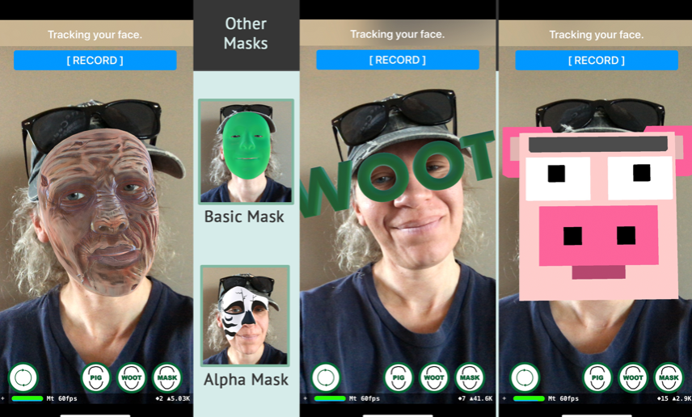

# Chapter 14: Getting Started with Face-Based AR

### 前言

在臉上做AR特效應該是目前線上所有直播app所具備基本功能吧。接下來新的app，就是要針對人臉進行辨識，並學習加上AR效果。

------

### 大綱

- [ARKit for face-based AR](#1)
- [The starter project](#2)
  - The application icon and launch screen
  - The interface
  - ViewController.swift
- [Starting a face tracking session](#3)
- [Handling errors and interruptions](#4)

------

<h2 id="1">ARKit for face-based AR</h2>

There are four primary features included with ARKit’s face tracking capabilities:

- **Face detection and tracking**: Real-time face detection and tracking with a refresh rate of 60 frames per second.
- **Real-time facial expression tracking**: More than 50 specific facial expressions are tracked in real-time.
- **Font color image, front depth image**: The TrueDepth front-facing camera captures color pixel buffers and depth data.
- **Light estimation**: With face-based AR apps, an estimate of directional or environmental lighting is possible by using the detected face as a light probe

------

<h2 id="2">The starter project</h2>

基本上這個app有三個主要的功能

- 在人臉增加面具(mask)
- 在人臉上置放文字(woot)
- 置換整個人臉變成豬頭(pig) - 且豬頭的眼睛嘴巴動作會依據人臉的動作而變化。



------

<h2 id="3">Starting a face tracking session</h2>

```Swift
    // 利用computed property簡化使用
		var session: ARSession {
        return sceneView.session
    }

    func resetTracking() {
        guard ARFaceTrackingConfiguration.isSupported else {
            updateMessage(text: "Face Tracking Not Supported")
            return
        }

        updateMessage(text: "Looking for a face.")

        // 利用ARFaceTrackingConfiguration宣告ARKit將用來進行人臉追蹤
        let configuration = ARFaceTrackingConfiguration()
        configuration.isLightEstimationEnabled = true // default值
        configuration.providesAudioData = false // default值

        // 當每次session啟動時，都要重置tracking和移調之前anchors
        session.run(configuration, options: [.resetTracking, .removeExistingAnchors])
    }


```

------

<h2 id="4">Handling errors and interruptions</h2>

處理session有問題的event

```Swift
    func session(_ session: ARSession, didFailWithError error: Error) {
        print("** didFailWithError")
        updateMessage(text: "Session failed.")
    }

    func sessionWasInterrupted(_ session: ARSession) {
        print("** sessionWasInterrupted")
        updateMessage(text: "Session interrupted.")
    }

    func sessionInterruptionEnded(_ session: ARSession) {
        print("** sessionInterruptionEnded")
        updateMessage(text: "Session interruption ended.")
    }
```

