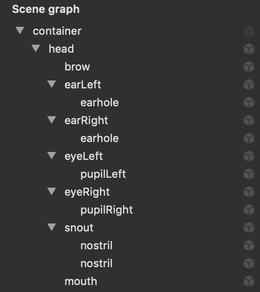

# Chapter 16: Creating Assets for Face-Based AR

### 前言

前面是加入不同的mask, 現在是要利用scenview來產生不同的AR效果

------

### 大綱

- [Creating 3D Content](#1)
- [Creating the Glasses class](#2)
- [Adding the glasses option](#3)
- [Creating Pig](#4)
- [Creating the Pig class](#5)

------

<h2 id="1">Creating 3D Content</h2>

這一節主要是利用Xcode內建的功能建立一個scn，並把這個sce讀入到AR中。scn概念就像是XIB或storyboard一樣，可以在scn建立複雜的畫面，也就是階層式的node關係，然後透過code把這個node讀取進來，再加以直接使用。

------

<h2 id="2">Creating the Glasses class</h2>

上面建立一個glass.scn, 現在也建立對應的node class, 把這個scn給讀取進來。

```swift
import ARKit
import SceneKit

class Glasses: SCNNode {
    let occlusionNode: SCNNode

    init(geometry: ARSCNFaceGeometry) {
        geometry.firstMaterial!.colorBufferWriteMask = []
        occlusionNode = SCNNode(geometry: geometry)
        occlusionNode.renderingOrder = -1

        super.init()

        addChildNode(occlusionNode)

        // 將scn讀取進來
        guard let url = Bundle.main.url(forResource: "glasses",
                                        withExtension: "scn",
                                        subdirectory: "Models.scnassets")
            else {
                fatalError("Missing resource")
        }
        // scn轉成node
        let node = SCNReferenceNode(url: url)!
        node.load()

        addChildNode(node)
    }

    required init?(coder aDecoder: NSCoder) {
        fatalError("\(#function) has not been implemented")
    }

    // - Tag: ARFaceAnchor Update
    func update(withFaceAnchor anchor: ARFaceAnchor) {
        let faceGeometry = occlusionNode.geometry as! ARSCNFaceGeometry
        faceGeometry.update(from: anchor.geometry)
    }
    
}

```

------

<h2 id="3">Adding the glasses option</h2>

這也不是重點，只是在app UI增加的glass選項可以使用。

```Swift
enum ContentType: Int {
    case none
    case mask
    case glasses
}
```


------

<h2 id="4">Creating Pig</h2>

Pig.scn相對於glass.scn更加複雜，有更多對應的child node，之後的章節會根據人臉的資訊，對這些child node進行對應的操作，例如眨眼，開嘴等。



------

<h2 id="5">Creating the Pig class</h2>

這內容跟之前的glass class差異不大。

```Swift
import ARKit
import SceneKit

class Pig: SCNNode {
    let occlusionNode: SCNNode

    init(geometry: ARSCNFaceGeometry) {
        geometry.firstMaterial!.colorBufferWriteMask = []
        occlusionNode = SCNNode(geometry: geometry)
        occlusionNode.renderingOrder = -1

        super.init()
        self.geometry = geometry

        guard let url = Bundle.main.url(forResource: "pig",
                                        withExtension: "scn",
                                        subdirectory: "Models.scnassets")

            else {
                fatalError("Missing resource")
        }

        let node = SCNReferenceNode(url: url)!
        node.load()

        addChildNode(node)
    }

    required init?(coder aDecoder: NSCoder) {
        fatalError("\(#function) has not been implemented")
    }

    // - Tag: ARFaceAnchor Update
    func update(withFaceAnchor anchor: ARFaceAnchor) {
        let faceGeometry = geometry as! ARSCNFaceGeometry
        faceGeometry.update(from: anchor.geometry)
    }
}
```

