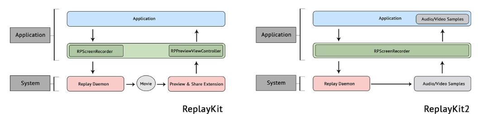

# Chapter 18: Recording Your ARKit Experience with ReplayKit

### 前言

這章重點還滿清楚就是ReplayKit使用，怎樣把剛剛AR特效的效果錄影起來。

------

### 大綱

- [Getting started with ReplayKit](#1)
  - How does ReplayKit work?
  - How does ReplayKit 2 work?
- [Adding ReplayKit to FaceCase](#2)
- [Enhancing the user's experience](#3)
  - Reporting errors
  - Checking availability
  - Offering options after recording


------

<h2 id="1">Getting started with ReplayKit</h2>

ReplayKit在iOS9就有了，一直到2017年apple提出ReplayKit 2。

ReplayKit 2的功能更加廣泛

- iOS screen record and broadcast
- Broadcast pairing
- Fast camera switching
- In-app screen capture

架構差異



------

<h2 id="2">Adding ReplayKit to FaceCase</h2>

我覺得用法其實還滿直接單純，並沒有太複雜。

```Swift
import ReplayKit

//////////////////////////////////////

let sharedRecorder = RPScreenRecorder.shared()
private var isRecording = false

//////////////////////////////////////

// MARK: - RPPreviewViewControllerDelegate (ReplayKit)

extension ViewController: RPPreviewViewControllerDelegate {

    func previewControllerDidFinish(_ previewController: RPPreviewViewController) {
        print("previewControllerDidFinish")
        dismiss(animated: true, completion: nil)
    }

    private func startRecording() {
        sharedRecorder.isMicrophoneEnabled = true

        sharedRecorder.startRecording { error in
            guard error == nil else {
                print("There was an error starting the recording: \(String(describing: error?.localizedDescription))")
                return
            }

            print("Started Recording Successfully")
            self.isRecording = true

            DispatchQueue.main.async {
                self.recordButton.setTitle("[ STOP RECORDING ]", for: .normal)
                self.recordButton.backgroundColor = UIColor.red
            }
        }
    }

    func stopRecording() {
        sharedRecorder.isMicrophoneEnabled = false

        sharedRecorder.stopRecording { previewViewController, error in
            guard error == nil else {
                print("There was an error starting the recording: \(String(describing: error?.localizedDescription))")
                return
            }

            // 這段preview的地方需要比較注意
            if let unwrappedPreview = previewViewController {
                unwrappedPreview.previewControllerDelegate = self
                self.present(unwrappedPreview, animated: true, completion: {})
            }

            self.isRecording = false
            DispatchQueue.main.async {
                self.recordButton.setTitle("[ RECORD ]", for: .normal)
                self.recordButton.backgroundColor = UIColor(red: 0.0039,
                    green: 0.5882, blue: 1, alpha: 1.0)
            }
        }
    }

}
```

------

<h2 id="3">Enhancing the user's experience</h2>

- Error handle的處理

```Swift

    sharedRecorder.delegate = self

///////////////////////////////////

    // RPScreenRecorderDelegate methods
    func screenRecorder(_ screenRecorder: RPScreenRecorder, didStopRecordingWith previewViewController: RPPreviewViewController?, error: Error?) {
        guard error == nil else {
            print("There was an error recording: \(String(describing:error?.localizedDescription))")
            self.isRecording = false
            return
        }
    }
```

- 檢查是否支援錄影

```swift
    guard sharedRecorder.isAvailable else {
        print("Recording is not available.")
        return
    }

//////////////////////////////////////

// RPScreenRecorderDelegate methods

    func screenRecorderDidChangeAvailability(_ screenRecorder: RPScreenRecorder) {
        recordButton.isEnabled = sharedRecorder.isAvailable
        if !recordButton.isEnabled {
            self.isRecording = false
        }
        // 更新button title
        if sharedRecorder.isAvailable {
            DispatchQueue.main.async {
                self.recordButton.setTitle("[ RECORD ]", for: .normal)
                self.recordButton.backgroundColor = UIColor(red: 0.0039,
                                                            green: 0.5882,
                                                            blue: 1,
                                                            alpha: 1.0)
            }
        } else {
            DispatchQueue.main.async {
                self.recordButton.setTitle("[ RECORDING DISABLED ]", for: .normal)
                self.recordButton.backgroundColor = UIColor.red
            }
    }
}
```


- 提供更彈性的選項(例如使用者覺得錄不好，可以直接刪除此檔案)

```Swift
-            if let unwrappedPreview = previewViewController {
-                unwrappedPreview.previewControllerDelegate = self
-                self.present(unwrappedPreview, animated: true, completion: {})
-            }

// 原本只是單純呈現preview, 現在在這裡多增加一個alert提示，並多提拱delete跟edit選項
+            let alert = UIAlertController(title: "Recording Complete", message: "Do you want to preview/edit your recording or delete it?", preferredStyle: .alert)
+            let deleteAction = UIAlertAction(title: "Delete", style: .destructive, handler: { (action) in
+                self.sharedRecorder.discardRecording {
+                    print("Recording deleted.")
+                }
+            })
// edit就是原本present的功能
+            let editAction = UIAlertAction(title: "Edit",
+            style: .default,
+            handler: { (action: UIAlertAction) -> Void in
+                if let unwrappedPreview = previewViewController {
+                    unwrappedPreview.previewControllerDelegate = self
+                    self.present(unwrappedPreview, animated: true, completion: {})
+                }
+            })
+
+            alert.addAction(editAction)
+            alert.addAction(deleteAction)
+            self.present(alert, animated: true, completion: nil)

```

