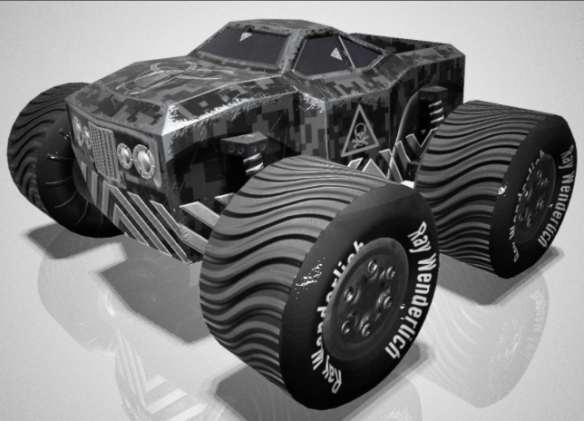

# Chapter 19: Beginning Game Physics

### 前言

這個新的app，主要是建立一個複雜的AR模型車，並利用SceneKit內建提供的物理引擎，讓整個車子的移動更加真實。



------

### 大綱

- [Getting started](#1)
  - [The vehicle parts](#2)
    - The chassis body
    - The axle
    - The wheels
    - Putting all the parts together
- [Building the monster truck](#3)
  - Creating the monster truck scene
  - Adding the body
  - Setting up the lighting environment
  - Adding the Axles
  - Adding the wheels
- [Loading the monster truck](#4)
- [Adding vehicle physics](#5)
  - Creating the vehicle chassis physics
  - Creating the wheel physics
  - Creating the vehicle physics
  - Updating the truck’s position


------

<h2 id="1">Getting started</h2>

簡單介紹這個app大概會做到哪些功能。

- 基本ARKit的session管理
- 平面偵測
- 遊戲邏輯方面分成三個steps
  - .detectSurface: 偵測平面
  - .hitStartToPlay: 置放車子
  - .playGame: 可以輕觸螢幕讓車子加速，然後透過手機物理感測的左右控制車子輪子方向


------

<h2 id="2">The vehicle parts</h2>

在模型的部分，提供了車子主體，輪子等，需要自己組合成車子


------

<h2 id="3">Building the monster truck</h2>

接下來就花一節的篇幅介紹要如何組起來，我自己是對這塊沒太大興趣，所以就跳過這塊了。

------

<h2 id="4">Loading the monster truck</h2>

將組合好的模型讀取到程式中。

```swift
    var truckNode: SCNNode!
    var wheelFLNode: SCNNode!
    var wheelFRNode: SCNNode!
    var wheelRLNode: SCNNode!
    var wheelRRNode: SCNNode!

//////////////////////////////////

   // 先讀scene
    let truckScene = SCNScene(named: "MonsterTruck.scnassets/Models/MonsterTruck.scn")!
  // 再從scene中把需要的node讀取進來 
    truckNode = truckScene.rootNode.childNode(withName: "Truck", recursively: true)
    wheelFLNode = truckScene.rootNode.childNode(withName: "Wheel_FL", recursively: true)
    wheelFRNode = truckScene.rootNode.childNode(withName: "Wheel_FR", recursively: true)
    wheelRLNode = truckScene.rootNode.childNode(withName: "Wheel_RL", recursively: true)
    wheelRRNode = truckScene.rootNode.childNode(withName: "Wheel_RR", recursively: true)
  // 建立node階層關係
    truckNode.addChildNode(wheelFLNode!)
    truckNode.addChildNode(wheelFRNode!)
    truckNode.addChildNode(wheelRLNode!)
    truckNode.addChildNode(wheelRRNode!)

    truckNode.isHidden = true
    sceneView.scene.rootNode.addChildNode(truckNode)
```

------

<h2 id="5">Adding vehicle physics</h2>

這裡就是重頭戲，如何添加物理引擎，在Scenekit已經有內建的車子的行為模式，所以接下來就是要懂如何用。

在車子這塊主要有三項物理行為

- **SCNPhysicsVehicle**: This is a physics behavior that will modify a standard physics body to behave like a vehicle.
- **SCNPhysicsBody**: This is a normal stock standard physics body that will be used as the vehicle’s chassis body. This body will be provided to the SCNPhysicsVehicle during its creation.
- **SCNPhysicsVehicleWheel**: This is a special physics body type that simulates the behavior of a wheel and also its appearance and other physical characteristics. This body will also be provided to the SCNPhysicsVehicle during its creation.

##### **Creating the wheel physics**

先從輪子下手

```Swift
   // 先設定所需要的物理係數
    let wheelRadius: CGFloat = 0.04
    let wheelFrictionSlip: CGFloat = 0.9
    let suspensionMaxTravel: CGFloat = 4.0
    let suspensionMaxForce: CGFloat = 100
    let suspensionRestLength: CGFloat = 0.08
    let suspensionDamping: CGFloat = 2.0
    let suspensionStiffness: CGFloat = 2.0
    let suspensionCompression: CGFloat = 4.0


    func createPhysicsVehicleWheel(wheelNode: SCNNode, position: SCNVector3) -> SCNPhysicsVehicleWheel {
       // 利用Scenekit所提供SCNPhysicsVehicleWheel來建立輪子的行為
        let wheel = SCNPhysicsVehicleWheel(node: wheelNode)
        wheel.connectionPosition = position
        wheel.axle = SCNVector3(x: -1.0, y: 0, z: 0)
        wheel.maximumSuspensionTravel = suspensionMaxTravel
        wheel.maximumSuspensionForce = suspensionMaxForce
        wheel.suspensionRestLength = suspensionRestLength
        wheel.suspensionDamping = suspensionDamping
        wheel.suspensionStiffness = suspensionStiffness
        wheel.suspensionCompression = suspensionCompression
        wheel.radius = wheelRadius
        wheel.frictionSlip = wheelFrictionSlip

        return wheel
    }

```

##### **Creating the vehicle physics**

下一步，就是vehicle physics

```Swift
    var physicsVehicle:SCNPhysicsVehicle!

    func createVehiclePhysics() {
        if physicsVehicle != nil {
            // 若之前已經產生過，則先remove舊的，再次產生新的behavior
            sceneView.scene.physicsWorld.removeBehavior(physicsVehicle)
        }
        // 產生4個輪子的behavior
        let wheelFL = createPhysicsVehicleWheel(
            wheelNode: wheelFLNode!,
            position: SCNVector3(x: -0.07, y: 0.04, z: 0.06))
        let wheelFR = createPhysicsVehicleWheel(
            wheelNode: wheelFRNode!,
            position: SCNVector3(x: 0.07, y: 0.04, z: 0.06))
        let wheelRL = createPhysicsVehicleWheel(
            wheelNode: wheelRLNode!,
            position: SCNVector3(x: -0.07, y: 0.04, z: -0.06))
        let wheelRR = createPhysicsVehicleWheel(
            wheelNode: wheelRRNode!,
            position: SCNVector3(x: 0.07, y: 0.04, z: -0.06))
        // 整個車子的行為是根據body跟輪子進行合成
        physicsVehicle = SCNPhysicsVehicle(
            chassisBody: truckNode.physicsBody!,
            wheels: [wheelFL, wheelFR, wheelRL, wheelRR])
        // 相虛擬世界增加此behavior
        sceneView.scene.physicsWorld.addBehavior(physicsVehicle)
    }

```

##### Updating the truck’s position

根據添加的物理行為，來更新車子移動位置

```Swift
    func updatePositions() {
        self.truckNode.position = self.focusNode.position
        self.truckNode.position.y += 0.20
				// 在每次更新之位置之前，需要先把velocity和angularVelocity進行重置，不然velocity和angularVelocity是會不斷進行累加
        self.truckNode.physicsBody?.velocity = SCNVector3Zero
        self.truckNode.physicsBody?.angularVelocity = SCNVector4Zero
        // resetTransform會根據當下SCNPhysicsVehicle所提供的物理行為進行body的位置更新
        self.truckNode.physicsBody?.resetTransform()
    }

```

