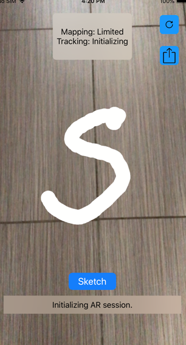

# Chapter 21: World Tracking & Persistent AR Experiences

#### 前言

這個新app的主要功能就是可以把ar體驗記錄下來，下次開啟app時可以繼續上次的ar體驗。

這app可以在實體世界的任何地方進行塗鴉，然後紀錄。下次重啟app只要經過同樣的地方就可以看到之前留下的塗鴉。



------

#### 大綱

- [Getting started](#1)
- [Placing anchors](#2)
- [Saving your world map](#3)
- [Loading and restoring content](#4)
- [Resetting content](#5)

------

<h2 id="1">Getting started</h2>
這個app只能在iOS12上才能使用。

Sketch Button: 按下去後。可以隨意地移動裝置進行塗鴉。

Reset Button: 就是清空當前所有塗鴉。

------

<h2 id="2">Placing anchors</h2>

要達到Persistent，要依賴ARKit幾個重要class - **ARWorldMap, ARSession, ARAnchor**。

- ARWorldMap: 可以想像是用來記錄環境特徵，例如當app移到相同的場景，可以把之前的ar塗鴉讀取出來放在場景上，以達到Persistent的功能。
- ARSession: 主要是用來協助進行存檔，讀檔。
- ARAnchor: 這就是要被存起來或讀取的資料。

> Adding ARAnchor objects to your ARSession is a requirement because the objects are the means to restore the state of the app when it relaunches in the same physical environment 

```Swift
   // MARK: - Place AR content
-  func addLineObject(sourcePoint: SCNVector3, destinationPoint: SCNVector3) {
-    let lineNode = SCNLineNode(from: sourcePoint, to: destinationPoint, radius: 0.02, color: lineColor)
-    guard let hitTestResult = sceneView
-      .hitTest(self.viewCenter!, types: [.existingPlaneUsingGeometry, .estimatedHorizontalPlane])
-      .first
+  func addLineAnchorForObject(sourcePoint: SCNVector3?, destinationPoint: SCNVector3?) {
+    guard let hitTestResult = sceneView.hitTest(self.viewCenter!, types: [.existingPlaneUsingGeometry, .estimatedHorizontalPlane]).first
       else { return }
-    lineNode.transform = SCNMatrix4(hitTestResult.worldTransform)
-    sceneView.scene.rootNode.addChildNode(lineNode)
+
+    currentLineAnchorName = "virtualObject\(count)"
+    count = count + 1
+    // 每次都根據currentLineAnchorName產生唯一的line anchor
+    let lineAnchor = ARLineAnchor(name: currentLineAnchorName!, transform: hitTestResult.worldTransform, sourcePoint: sourcePoint, destinationPoint: destinationPoint)
+    // (這步就是讓session可以協助將anchor記錄起來)將這唯一的line anchor加入session中
+    sceneView.session.add(anchor: lineAnchor)
+    lineObjectAnchors.append(lineAnchor)
   }
 }

```

```Swift
  func renderer(_ renderer: SCNSceneRenderer, didAdd node: SCNNode, for anchor: ARAnchor) {
    let lineARAnchor = anchor as? ARLineAnchor
    if let lineAnchor = lineARAnchor,
       let source = lineARAnchor?.sourcePoint,
       let destination = lineARAnchor?.destinationPoint {
        lineObjectAnchors.append(lineAnchor)
        let lineNode = SCNLineNode(from: source, to: destination, radius: 0.02, color: lineColor)
        node.addChildNode(lineNode)
    }
  }
```

------

<h2 id="3">Saving your world map</h2>

- 要取得穩定可靠(取得很多辨識度良好的環境特徵)的world map是要看時機的。
- 可以透過`ARFrame.WorldMappingStatus`觀察是否是好時機。

```swift

  func session(_ session: ARSession, didUpdate frame: ARFrame) {

    switch frame.worldMappingStatus {
    case .extending, .mapped:
      if let lastLineAnchor = lineObjectAnchors.last,
        lineObjectAnchors.count > 0 && frame.anchors.contains(lastLineAnchor) {
        // 最適合進行存檔的時機
        saveExperienceButton.isEnabled = true
        saveExperienceButton.isHidden = false
      }
    default:
      saveExperienceButton.isHidden = true
      saveExperienceButton.isEnabled = false
    }

    mappingStatusLabel.text = """
    Mapping: \(frame.worldMappingStatus.description)
    Tracking: \(frame.camera.trackingState.description)
    """
  }

// 存檔
  @IBAction func saveExperience(_ sender: UIButton) {
    // 從session中取得當前的WorldMap
    sceneView.session.getCurrentWorldMap { (worldMap, error) in
      guard let map = worldMap else {
        // 當無法獲取map, map = nil
        self.showAlert(title: "Can't get current world map", message: error!.localizedDescription)
        return
      }

      // get the SnapshotAnchor from sceneView.
      // SnapshotAnchor is a custom ARAnchor for saving a snapshot in a world map
      guard let snapshotAnchor = SnapshotAnchor(capturing: self.sceneView) else {
        fatalError("Can't take snapshot")
      }
      map.anchors.append(snapshotAnchor)

      do {
        // 將map轉成data
        let data = try NSKeyedArchiver.archivedData(withRootObject: map, requiringSecureCoding: true)
        // 將data記錄在適當的位置上
        try data.write(to: self.mapSaveURL, options: [.atomic])

        DispatchQueue.main.async {
          self.loadExperienceButton.isHidden = false
          self.loadExperienceButton.isEnabled = true
        }
      } catch {
        fatalError("Can't save map: \(error.localizedDescription)")
      }
    }
  }
```

------

<h2 id="4">Loading and restoring content</h2>

可以把AR記錄起來，當來就要可以讀取出來。

```Swift
  func getWorldMap() -> ARWorldMap {
    // 確認有存檔的data
    guard let data = mapDataFromFile else {
      fatalError("""
                 Map data should already be verified to exist
                 before Load button is enabled.
                 """)
    }
    do {
      // 從data還原成world map
      guard let worldMap = try NSKeyedUnarchiver.unarchivedObject(ofClass: ARWorldMap.self, from: data) else {
          fatalError("No ARWorldMap in archive.")
      }
      return worldMap
    } catch {
      fatalError("Can't unarchive ARWorldMap from file data: \(error)")
    }
  }

    ////////////////////////////////////////////////
    
    @IBAction func loadExperience(_ sender: Any) {

    // 取得先前紀錄的world map
    let worldMap: ARWorldMap = getWorldMap()
    // 這個snapshot是用來幫助使用者知道當初紀錄的worldmap是長怎樣 
    // 從world map 讀取data到snapshotThumbnailImageView
    if let snapshotData = worldMap.snapshotAnchor?.imageData, let snapshot = UIImage(data: snapshotData) {
      self.snapshotThumbnailImageView.image = snapshot
    } else {
      print("No snapshot image in world map")
    }

    worldMap.anchors.removeAll(where: { $0 is SnapshotAnchor })
 
    let configuration = self.defaultConfiguration
    // 建立新config的session, 其中初始化的worldmap是當初紀錄的worldmap
    configuration.initialWorldMap = worldMap
    sceneView.session.run(configuration, options: [.resetTracking, .removeExistingAnchors])

    // 重置相關參數
    isRelocalizingMap = true
    lineObjectAnchors.removeAll()
  }

```


------

<h2 id="5">Resetting content</h2>

```Swift
  @IBAction func resetTracking(_ sender: UIButton?) {
    sceneView.session.run(defaultConfiguration,
                             options: [.resetTracking, .removeExistingAnchors])
    isRelocalizingMap = false
    lineObjectAnchors.removeAll()
  }

```

