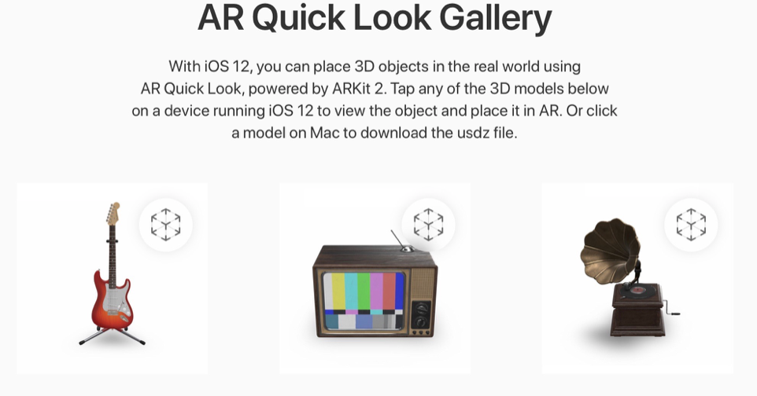

# Chapter 23: Introducing USDZ & AR Quick Look

#### 前言

簡單介紹了ARKit 2.0中新支援3D格式，如何利用Quick Look快速瀏覽此格式。

------

#### 大綱

- [What is USDZ?](#1)
- [What is AR Quick Look?](#2)
- [Creating USDZ files](#3)
- [AR Quick Look for Web](#4)
- [AR Quick Look for apps](#5)

------

<h2 id="1">What is USDZ?</h2>

- 這是apple所提供新的3D格式。
- USD = Universal Scene Description, Z indicates it’s a Zip archive。
- 用USDZ當3D格式的優點
  - Robust schemas for interchange of geometry, shading and skeletal deformation.
  - High performance for data retrieval, object rendering and instancing.
  - Capability to natively package user-selectable content variations.
  - Future-friendly flexible architecture designed to be easily adaptable to changing requirements

------

<h2 id="2">What is AR Quick Look?</h2>

- Quick Look: 用來快速瀏覽文件內容，但不用真的打開文件。例如快速查閱mail中的附件檔案內容。

- Quick Look now offers support for **the new USDZ file format via its AR Quick Look feature.**

- [AR Quick Loook Gallery](https://apple.co/2C5362d)

  

  

------

<h2 id="3">Creating USDZ files</h2>

- 必須利用Xcode Command Line Tool來建立USDZ格式。
- 確保Xcode Command Line Tool在Xcode 10.0以上。
- `xcrun usdz_converter`(利用Xcode Command Line Tool中的usdz_converter)
  - `pig.obj`(input) `pig.usdz`(output)
  - 其他的option就是用來建立texture maps
  - `-v`: 打印轉換過程

```
xcrun usdz_converter pig.obj pig.usdz
  -color_map pig_color.png
  -metallic_map pig_metallic.png
  -roughness_map pig_roughness.png
  -normal_map pig_normal.png
  -ao_map pig_ao.png
  -v”
```


------

<h2 id="4">AR Quick Look for Web</h2>

- iOS 12, Safari has built-in support for previewing USDZ files 


------

<h2 id="5">AR Quick Look for apps</h2>

- 利用QuickLook framework 並實作QLPreviewControllerDelegate, QLPreviewControllerDataSource完成所有功能。

```Swift
import QuickLook

 class ViewController: UIViewController, UITableViewDataSource, UITableViewDelegate, QLPreviewControllerDelegate, QLPreviewControllerDataSource {}

  func tableView(_ tableView: UITableView, didSelectRowAt indexPath: IndexPath) {
    modelIndex = indexPath.row

    // 內建原生QLPreviewController
    let previewController = QLPreviewController()
    previewController.dataSource = self
    previewController.delegate = self
    present(previewController, animated: false)
  }


  // MARK: - QLPreviewControllerDataSource

   func numberOfPreviewItems(in controller: QLPreviewController) -> Int {
        return 1
    }

   func previewController(_ controller: QLPreviewController, previewItemAt index: Int) -> QLPreviewItem {
        let url = Bundle.main.url(forResource: modelNames[modelIndex], withExtension: "usdz")!
        return url as QLPreviewItem
    }
```

