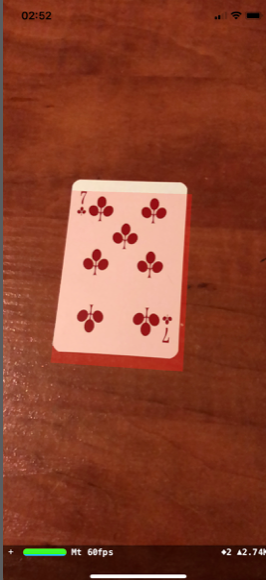

# Chapter 24: Detecting Images & 3D Objects

#### 前言

之前的章節有做過辨識某個特定的2D圖片後，呈現相關AR內容。在新的ARKit 2.0中新增可辨識特定的3D物件另外可以對某個2D圖片進行追蹤。

------

#### 大綱

- [Image Tracking](#1)
  - [Detecting a card](#2)
  - [Highlighting a card](#3)
  - Tracking a card
  - [A word on tracking configuration](#4)
  - [Tracking a card, version 2.0](#5)
- Detecting 3D Objects
  - [Creating a reference model](#6)
  - A brief overview of ARDock
  - [Preparing the ARKit session](#7)
  - Highlighting the detected object
  - A few notes about quality and accuracy


------

<h2 id="1">Image Tracking</h2>

- Image detection和Image tracking的不同

  - Image detection is **a static process** that locates the reference image in the real world through the device’s camera.
  - Image tracking, on the other hand, is **a dynamic process** that begins immediately after an image is detected. It tracks the location of the reference image if it change

- ARKit 2.0 提供新的 configuration - `ARImageTrackingConfiguration.` 

  - 相比ARWorldTrackingConfiguration最大的優勢less expensive in terms of processing power — CPUs and batteries。

    

------


<h2 id="2">Detecting a card</h2>

這節內容之前章節已經有做過了。偵測提供的內建的特殊圖片。

```swift
    // World tracking
    let configuration = ARWorldTrackingConfiguration()
    // 當ARKit偵測到這些圖片時，會透過ARSCNViewDelegate中的renderer(_:nodeFor:)回傳ARImageAnchor
    let triggerImages = ARReferenceImage.referenceImages(inGroupNamed: "deck", bundle: nil)!
    configuration.detectionImages = triggerImages

    sceneView.session.run(configuration)

////////////////////////////

extension DeckViewController : ARSCNViewDelegate {
  func renderer(_ renderer: SCNSceneRenderer, nodeFor anchor: ARAnchor) -> SCNNode? {

    if let imageAnchor = anchor as? ARImageAnchor {
      let overlayNode = createCardOverlayNode(for: imageAnchor)
      return overlayNode
    }

    return nil
  }
}
```


------


<h2 id="3">Highlighting a card</h2>

- 再偵測到撲克牌上覆蓋一個AR紅色透明平面。



```swift
extension DeckViewController {

  func createCardOverlayNode(for anchor: ARImageAnchor) -> SCNNode {
    let box = SCNBox(
      width: anchor.referenceImage.physicalSize.width,
      height: 0.0001,
      length: anchor.referenceImage.physicalSize.height,
      chamferRadius: 0)

    if let material = box.firstMaterial {
      material.diffuse.contents = UIColor.red
      material.transparency = 0.3
    }

    return SCNNode(geometry: box)
  }

```


------


<h2 id="4">A word on tracking configuration</h2>

- New tracking configuration `ARImageTrackingConfiguration`. This is specifically **designed to detect and track 2D images without the burden of tracking a full 3D world.** 
  - It uses less CPU
  - It does it better: In world tracking, injected content is still tracked and displayed even if the detected image is no longer visible in the camera — you experienced that a few moments ago.
  - It’s more precise
  - It works in moving environments

------


<h2 id="5">Tracking a card, version 2.0</h2>

- 切換成新的configuration

```Swift
-    // World tracking
-    let configuration = ARWorldTrackingConfiguration()
+    // Image tracking
+    let configuration = ARImageTrackingConfiguration()
     // 當ARKit偵測到這些圖片時，會透過ARSCNViewDelegate中的renderer(_:nodeFor:)回傳ARImageAnchor
     let triggerImages = ARReferenceImage.referenceImages(inGroupNamed: "deck", bundle: nil)!
-    configuration.detectionImages = triggerImages
+    configuration.trackingImages = triggerImages
```

------


<h2 id="6">Creating a reference model</h2>

就像2D要提供reference image, 3D就要提供reference object, 那要如何建立reference object，Apple在WWDC 2018有提供一個範例可以讓我們產生想要的reference object。[ARKit Scanner](apple.co/2CGWZgy)。

------


<h2 id="7">Preparing the ARKit session</h2>

```swift
    // World tracking
    let configuration = ARWorldTrackingConfiguration()
    let models = ARReferenceObject.referenceObjects(inGroupNamed: "models", bundle: nil)!
    configuration.detectionObjects = models

    sceneView.session.run(configuration)

extension RubikViewController : ARSCNViewDelegate {
  func renderer(_ renderer: SCNSceneRenderer, nodeFor anchor: ARAnchor) -> SCNNode? {
    if let anchor = anchor as? ARObjectAnchor {
      print("Found 3D object: \(anchor.referenceObject.name!)")
    }
    return nil
  }
}
```

