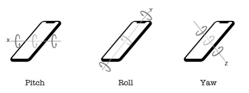

# Chapter 3: Basic Session Management

## 前言

了解什麼是AR session, 要如何管理session，包括啟動，關閉，重設。也學著如何處理session錯誤。

------

## 大綱

- [Getting started](#1)
  - View Controller Changed
- [Starting an AR Session](#2)
  - Creating the configuration
  - Checking device capapilities
  - Running the session
- [Controlling an AR Session](#3)
- [Updating the status message](#4)
- [Handing AR session errors](#5)
  - Handling session interruptions
  - Resuming an interrupted session
- [Handling AR session status changes](#6)
- [Showing debug options](#7)

------


<h2 id="1">Getting started</h2>

先從本章範例的起手專案的架構開始了解。

利用 `//MARK:` 將相關functions進行分類。分成下列幾大項

-   *// MARK: - Properties*
-   *// MARK: - Outlets*
-   *// MARK: - Actions*
-  *// MARK: - View Management*
-  *// MARK: - Initialization*
- The ARSCNViewDelegate protocol extension，通常會把要實作的protocol放到extension，這樣可以讓程式碼更加乾淨清楚。
  -   *// MARK: - SceneKit Management*
  -   *// MARK: - Session State Management*
  -   *// MARK: - Session Error Managent*

------


<h2 id="2">Starting an AR Session</h2>

AR Session是ARKit中最基本也是最重要的元件，用來負責移動的追蹤跟影像的處理。

再開始AR Session之前，必須先建立Configuration告訴告訴AR Session要如何處理device, 虛擬物件跟真實世界連接性。Configuration有兩個不同type。

- AROrientationTrackingConfiguration

  - 處理3種方向

    

- ARWorldTrackingConfiguration

  - 處理6種方向(就是包含AROrientationTrackingConfiguration另外加上3種)

    


知道了什麼是Configuration之後，要先檢查裝置是否支援這些方向的偵測。畢竟這些偵測的資訊都是從裝置中的sensor得到的，太古老的裝置都沒有支援這些的能力。這裡又提到了config的另外一個屬性叫做worldAlignment。

- gravity: y軸是跟重力平行，圓點是手機位置
- gravityAndHeading:  y軸是跟重力平行，圓點是手機位置, 但x,z是跟羅盤方向一樣。
- camera: 場景的座標系統個camera方向近綁定。


```swift
    guard ARWorldTrackingConfiguration.isSupported else {
        print("*** ARConfig: AR World Tracking Not Supported")
        return
    }

    let config = ARWorldTrackingConfiguration()
    config.worldAlignment = .gravity
    config.providesAudioData = false


    sceneView.session.run(config)
```

------


<h2 id="3">Controlling an AR Session</h2>

- 暫停：當使用者切換到其他app時，我們需要將AR session進行暫停。
- 恢復：恢復到剛剛原本暫停的狀態，也就是利用原本相同的confing啟動seesion。
- 更新：什麼時候會更新config，也許是你想要按下某個按鈕後，可以進行聲音的處理，這時候就要在按鈕按下時，更新session的config。
- 重設:  當使用關閉裝置一段時間後。

------


<h2 id="4">Updating the status message</h2>

透過`session(_ session: ARSession, cameraDidChangeTrackingState camera: ARCamera)`來隨時更新session的狀態。

```swift
    func renderer(_ renderer: SCNSceneRenderer, updateAtTime time: TimeInterval) {
        DispatchQueue.main.async {
            self.statusLabel.text = self.trackingStatus
        }
    }
```


------


<h2 id="5">Handing AR session errors</h2>


```Swift
    func session(_ session: ARSession, didFailWithError error: Error) {
        trackingStatus = "AR Session Failure: \(error)"
    }

    func sessionWasInterrupted(_ session: ARSession) {
        trackingStatus = "AR Session Was Interrupted!"
    }

    func sessionInterruptionEnded(_ session: ARSession) {
        trackingStatus = "AR Session Interruption Ended!"
    }
```


------


<h2 id="6">Handling AR session status changes</h2>


```Swift
    func session(_ session: ARSession, cameraDidChangeTrackingState camera: ARCamera) {
        switch camera.trackingState {
        case .notAvailable:
            trackingStatus = "Tracking: Not available!"
        case .normal:
            trackingStatus = "Tracking: All good!"
        case .limited(let reason):
            switch reason {
            case .excessiveMotion:
                trackingStatus = "Tracking: Limited due to excessive motion!"
            case .insufficientFeatures:
                trackingStatus = "Tracking: Limited due to insufficient features!"
            case .initializing:
                trackingStatus = "Tracking: Initializing..."
            case .relocalizing:
                trackingStatus = "Tracking: Relocalizing..."
            }
        }
    }

```


------


<h2 id="7">Showing debug options</h2>


```Swift
    sceneView.debugOptions = [.showFeaturePoints, .showWorldOrigin, .showBoundingBoxes, .showWireframe]

```

