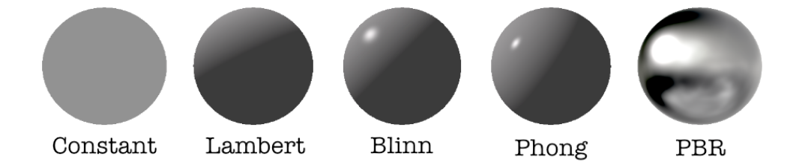
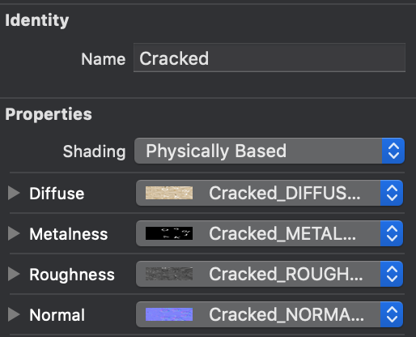

# Chapter 4: Adding 3D Objects & Textures

## 前言

如何從.scene讀取3D物件到真實空間中，就好比如何從storyboard或Xib讀取畫面直接使用。

------


## 大綱

- [Getting started](#1)
- [Adding 3D objects](#2)
  
  - Importing 3D objects
  - Converting 3D objects
- [Creating the dice scene](#3)
  
  - Copying models
- [Shader, meterials and textures](#4)
  
  - Lighting models(shaders)
  - Materials
  - Textures
- [Physically based rendering(PBR)](#5)
  
  - Environment map
  - Diffuse map
  - Normal map
  - Height map
  - Occlusion map
  - Emission map
  - Self-illumination map
  - Displacement map
  - Metalness and roughness maps
  - Metalness map
  - Roughness map
  - PBR Earth project
-  [Texturing the 3D Objects](#6)
  
  - Applying environment textures
  - Applying 3D model textures
- [Loading & Placing 3D objects](#7)
  
  - Creating an empty scene
  - Loading the environment map
  - Loading the 3D objects
  
  - Adding a swipe gesture
  - Changing dice styles

------


<h2 id="1">Getting started</h2>

起手專案裡面多了兩個新區塊，分別是

- Load Models: 會這個區塊建立一個function將3D物件讀取進來。
- Helper Function: 就是其他會需要用到的functions。

------


<h2 id="2">Adding 3D objects</h2>

如何將常見的3D物件的格式- `COLLADA(.dae)`轉成SceneKit格式- `(.scn)`。

將.dae匯入Xcode的.scnassets中，可以透過`Editor ▸ Convert to SceneKit scene file format (.scn)`將.dae無痛轉換成.scn。

------


<h2 id="3">Creating the dice scene</h2>

接下來在.scnassets建立一個DiceScene.scn(會準備在這個scene中放入5顆骰子)。

然後將剛剛從dice.dae轉換出來的dice.scn(只有一顆骰子)，重複5次複製貼上到DiceScene.scn中產生5顆骰子。

------


<h2 id="4">Shader, meterials and textures</h2>

這裡要開始講解一些關於3D物件基本常見名詞

- Lighting models (shaders)照明模型
  - [理解ambient, diffuse, specular的含義](https://kknews.cc/zh-tw/photography/jjbyzal.html)
    - **Constant**:使用一个扁平的照明模型,在计算渲染像素的颜色时,只包含ambient信息.
    - **Lambert**:在计算渲染像素的颜色时,只包含ambient信息和diffuse信息.
    - **Blinn**:在计算渲染像素的颜色时,只包含ambient信息,diffuse信息,specular信息,而且specular高光区是用Blinn-Phong法则计算的.
    - **Phong**:在计算渲染像素的颜色时,只包含ambient信息,diffuse信息,specular信息,而且specular高光区是用Phong法则计算的.
    - **PBR**:即*Physically Based Rendering基于物理的渲染*,包含了真实情况下,物理光源和材质对光的漫反射和吸收.
  - 結論來說，PBR是最真實世界的照亮模型。



- Materials & Textures
  - [贴图(Map)、纹理(Textures)、材质(Matrial)的区别是什么？](https://www.zhihu.com/question/25745472)

------


<h2 id="5">Physically based rendering(PBR)</h2>

- [Texture mapping]([https://zh.wikipedia.org/wiki/%E6%9D%90%E8%B4%A8%E8%B4%B4%E5%9B%BE](https://zh.wikipedia.org/wiki/材质贴图))
- **Diffuse map(颜色贴图,漫反射贴图)**:给几何体一个基本的颜色纹理,不考虑灯光和特效
- **Normal map(法线贴图)**:灯光是使用形状表面的法向量来决定照亮哪个面的.系统自带形状是使用单一的整个面的向量,而法线贴图则以RGB值定义了精确到每个像素的法向量,这样每个像素对灯光的反应都不同,形成表面崎岖不平的灯光效果.
- **Reflective map(反射贴图)**:以黑白图片精确定义了材质每个像素的反光程度.就是周围环境的光线在物体表面映射出的图像(实际就是天空盒子图像在物体表面的反光).
- [[SceneKit专题]10.Materials材质](https://www.jianshu.com/p/936752aff5a3)

------


<h2 id="6">Texturing the 3D Objects</h2>

在瞭解完許多特殊名詞後，我們就要替這5顆骰子，分別貼上不同的Texture。

在DiceScene.scn先選到一顆骰子(child node)，然後再Xcode右邊的`Material inspector`建立新的Material。

在新的material中將shading指定成`Physical Based`，然後將指定對應的Diffucse, Metalness, Roughness, Normal。



------


<h2 id="7">Loading & Placing 3D objects</h2>

在之前所有的步驟，都還沒寫到任何一行程式碼，主要的工作就是將desginer提供的3D檔案換成.scn，然後可以讓我們用程式直接讀取這個3D檔案。現在，就開始學著如何讀取剛剛建立的東西。

- 在`initScene()`中建立空白的scene，並讀取environment map。

```Swift
 func initScene() {
    let scene = SCNScene()
    scene.lightingEnvironment.contents = "PokerDice.scnassets/Textures/Environment_CUBE.jpg"
    scene.lightingEnvironment.intensity = 2
  }
```

- 讀取3D物件，在`viewDidLoad()`呼叫`loadModels()`

```Swift
var diceNodes: [SCNNode] = []

func loadModels() {
        let diceScene = SCNScene(named: "PokerDice.scnassets/Models/DiceScene.scn")!
        for count in 0..<5 {
            diceNodes.append(diceScene.rootNode.childNode(withName: "dice\(count)", recursively: false)!)
        }
    let focusScene = SCNScene(named: "PokerDice.scnassets/Models/FocusScene.scn")!
    focusNode = focusScene.rootNode.childNode(withName: "focus", recursively: false)!
    sceneView.scene.rootNode.addChildNode(focusNode)
  }
```

- 將3D物件透過swipe手勢來置放骰子到真實事件中。
  - `func therowDiceNode`: 透過定義好diceOffset將diceNode依序clone到真實世界的場景中。
  - `func swipupGestureHandler`: 李用Swipe手勢來呼叫therowDiceNode。

```Swift
  var diceCount: Int = 5
  var diceStyle: Int = 0
  var diceOffset: [SCNVector3] = [SCNVector3(0.0,0.0,0.0),
                                  SCNVector3(-0.05, 0.00, 0.0),
                                  SCNVector3(0.05, 0.00, 0.0),
                                  SCNVector3(-0.05, 0.05, 0.02),
                                  SCNVector3(0.05, 0.05, 0.02)]

func therowDiceNode(transform: SCNMatrix4, offset: SCNVector3) {
        let position = SCNVector3(transform.m41 + offset.x,
                                  transform.m42 + offset.y,
                                  transform.m43 + offset.z)

        let diceNode = diceNodes[diceStyle].clone()
        diceNode.name = "dice"
        diceNode.position = position

        sceneView.scene.rootNode.addChildNode(diceNode)
        diceCount -= 1
    }

 @IBAction func swipupGestureHandler(_ sender: Any) {
    guard let frame = sceneView.session.currentFrame else { return }
    for count in 0..<diceCount {
        therowDiceNode(transform: SCNMatrix4(frame.camera.transform), offset: diceOffset[count])
    }
```

- 改變 dice styles
  - 之前我們產生5種不同材質的dice, 我們透過一個button來改變骰子的材質。

```Swift
  @IBAction func styleButtonPressed(_ sender: Any) {
    diceStyle = diceStyle >= 4 ? 0 : diceStyle + 1
  }
```

