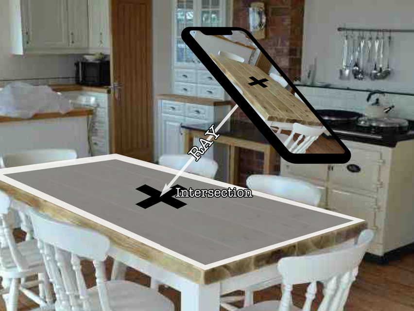

# Chapter 5: Detecting Surfaces

## 前言

之前看過一段影片，上面說ARKit裡面最困難的東西其實就是平面的偵測，尤其是垂直平面的偵測，ARKit剛出來還只能侷限在水平的平面，一直到2.0才支援垂直面，這章就要學習如何透過ARKit偵測平面，並透過ray casting的技巧將focus node置放在偵測平面上的合適位置。

------

## 大綱

- [Getting started](#1)
- [Adding game states](#2)
  - Define game states
  - Adding game state message
- [Anchors](#3)
- [Detecting surfaces](#4)
- [Creating new planes](#5)
  - Creating material for the plane
  - Creating the plane node
  - Handling new plane anchors
- [Updating planes](#6)
  - Getting the plane geometry
  - Update the plane position
  - Handling plane anchor updates
- [Creating a focus node](#7)
  - Ray Casting
  - Creating the focus point
  - Handling orientation changes
  - Updating the focus node
- [Challenge](#8)

------


<h2 id="1">Getting started</h2>

在GameUtil的資料夾中有些已經寫好的Util function, 這些function都是很常被使用，例如radian和degree的轉換，這些常常用來處理rotation和angles。SCNVecto3的向量運算擴展等等。

------


<h2 id="2">Adding game state</h2>

這個跟AR沒太大關係，只是這個骰子app的一些遊戲邏輯。

- detectSurface: 先讓ARKit偵測真實環境的狀態，只要順利偵測到一個平面，就可以利用start button開始進行遊戲。
- pointToSurface: 玩家必須指定一個平面，並讓focus cursor呈現在指定平面上。
- swipeToPlay: 玩家可以開始丟骰子。

------


<h2 id="3">Anchors</h2>

Anchor是錨，用來定位船在海中的位置。那ARAnchor表示就是3D物件在真實世界的位置。

例如ARPlaneAnchor是一個特殊的anchor, 用來定位一個3D平面的資訊，包括位置，方向，中心點..等。

------


<h2 id="4">Detecting surfaces</h2>

要如何讓ARKit偵測真實世界中的平面，就是在ARConfiguration中新增平面偵測。

```swift
config.planeDetection = .horizontal
```

------


<h2 id="5">Creating new planes</h2>

透過定位真實世界的平面(取得對應ARPlaneAnchor)，利用anchor的資訊來建立虛擬的3D平面在真實的平面上。

```swift
  func createARPlaneNode(planeAnchor: ARPlaneAnchor, color: UIColor) -> SCNNode {
    // 根據anchor資訊建立一個平面
    let planeGeometry = SCNPlane(width: CGFloat(planeAnchor.extent.x), height: CGFloat(planeAnchor.extent.z))

    // 替此平面建立material
    let planeMaterial = SCNMaterial()
    planeMaterial.diffuse.contents = "PokerDice.scnassets/Textures/Surface_DIFFUSE.png"
    planeGeometry.materials = [planeMaterial]

    // 建立plane node
    let planeNode = SCNNode(geometry: planeGeometry)
    planeNode.position = SCNVector3Make(planeAnchor.center.x, 0, planeAnchor.center.z)
    // SCNPlane預設是upright, 所以要進行90度翻轉
    planeNode.transform = SCNMatrix4MakeRotation(-Float.pi / 2, 1, 0, 0)

    return planeNode
  }

 // 利用deleage來取得新偵測到的anchor
  func renderer(_ renderer: SCNSceneRenderer, didAdd node: SCNNode, for anchor: ARAnchor) {
    guard let planeAnchor = anchor as? ARPlaneAnchor else { return }

    // Handling new plane anchors
    DispatchQueue.main.async {
        let planeNode = self.createARPlaneNode(planeAnchor: planeAnchor, color: UIColor.yellow.withAlphaComponent(0.5))
        node.addChildNode(planeNode)
    }
  }
```

------


<h2 id="6">Updating planes</h2>

建立好新的plane時，為何還需要更新呢？當使用者位置改變，原本偵測到anchor也會更新其內容，對應到新的使用者位置，此時，原本建好3D plane, 也應該要隨著anchor內容做更新，讓平面可以隨著使用者位置，改變角度或方向之類。

```swift
 func updateARPlaneNode(planeNode: SCNNode, planeAnchor: ARPlaneAnchor) {
    // Getting the plane geometry
    let planeGeometry = planeNode.geometry as! SCNPlane
    planeGeometry.width = CGFloat(planeAnchor.extent.x)
    planeGeometry.height = CGFloat(planeAnchor.extent.z)

    // Updating the plane position
    planeNode.position = SCNVector3Make(planeAnchor.center.x, 0, planeAnchor.center.z)
  }

func renderer(_ renderer: SCNSceneRenderer, didUpdate node: SCNNode, for anchor: ARAnchor) {
    guard let planeAnchor = anchor as? ARPlaneAnchor else { return }

    // Handling plane anchor updates
    DispatchQueue.main.async {
        self.updateARPlaneNode(planeNode: node.childNodes[0], planeAnchor: planeAnchor)
    }
  }
```

------


<h2 id="7">Creating a focus node</h2>

在這裡要提到一個很重要的觀念就是**Ray casting**。就是從手機螢幕的中心位置(focus point)透射出一個垂直射線然後嘗試跟虛擬場景找到焦點。



- `sceneView.hitTest()` 就是用來進行ray cast的重要function。
  - `.existingPlaneUsingExtent`:  specifies that you’re only looking for the detected planes based on their extents。
  - [worldTransform](https://developer.apple.com/documentation/arkit/arhittestresult/2867907-worldtransform): 是一個matrix，包含了position,  orientation和Scaling的相關資訊。
    - 其中position是這個transform matrix的第三行。

```Swift
var focusPoint: CGPoint!

// 螢幕中心點偏下
focusPoint = CGPoint(x: view.center.x, y: view.center.y + view.center.y * 0.25)

// 更新focus node
  func updateFocusNode() {
    // ray cast
    let results = self.sceneView.hitTest(self.focusPoint, types: [.existingPlaneUsingExtent])

    if results.count == 1 {
        if let match = results.first {
            let t = match.worldTransform
            self.focusNode.position = SCNVector3( x: t.columns.3.x,
                                                  y: t.columns.3.y,
                                                  z: t.columns.3.z)
            self.gameState = .swipeToPlay
        }
    } else {
        self.gameState = .swipeToPlay
    }
  }
```

------


<h2 id="8">Challenge</h2>

已經學會如何添加跟更新平面的方法，但有時會發現多個被偵測到的不同平面有時會莫名被併成一塊，要處理這樣的方式。就是要將已經添加但沒有用到的平面進行刪除。

要如何刪除已經添加的平面

```Swift
  func removeARPlaneNode(node: SCNNode){
    for childNode in node.childNodes {
        childNode.removeFromParentNode()
    }
   }

  func renderer(_ renderer: SCNSceneRenderer, didRemove node: SCNNode, for anchor: ARAnchor) {
    guard anchor is ARPlaneAnchor else { return }

    DispatchQueue.main.async {
        self.removeARPlaneNode(node: node)
    }
  }
```

