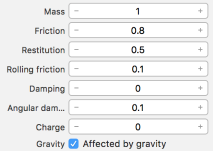

# Chapter 6: Adding Physics

## 大綱

想要讓3D物件更加真實化，除了外觀以外，行為也要符合真實世界物理行為。在這章著重講解如何添加行為到骰子上，讓骰子從拋出到落地的行為更加真實。

------

## 摘要

- [Getting started](#1)
  - The physics body
  - The physics shape
  - Other physical properties
- [Adding physics](#2)
  - Controlling the physics world speed
  - Controlling the physics simulation speed
  - Recovering fallen dice
- [Plane physics](#3)
  - Adding plane physics
- [Randomizing rotation](#4)
- [Force](#5)
  - Adding force
- [Lights and shadows](#6)
  - Adding a shadow-casting light 
  - Light estimation
- [Wrapping things up](#7)
  - Suspending AR plane detection
  - Hiding visible planes
  - Blocking swipe gestures
  - Starting the game
  - Resetting the game
- [Hit testing](#8)

------


<h2 id="1">Getting started</h2>

要讓3D物件擁有真實的物理行為，換成ARKit的說法，就是在SCNode上添加SCNPhysicsBody。

SCNPhysicsBody分成三種 static body, A dynamic body, A kinematic body。

對這三個最清楚的解釋如下: [參考](https://www.jianshu.com/p/923df74c0b60)

> `staticBody`是一个不受外力或碰撞影响的物体，不能移动。比如地板、墙壁等。
>
> `dynamicBody`是一个可以受力和碰撞影响的物体。
>
> `kinematicBody`是一个不受外力或碰撞影响的物理实体，但它会在移动时造成碰撞影响其他物体。
>
> **举一个简单的例子：桌球游戏中，球桌是staticBody，球是dynamicBody，球杆是kinematicBody。**

其他物理行為參數



> Mass: 质量，以千克为单位。
> 质量会影响物体对力的反应。`dynamicBody`的默认质量是1。`staticBody`和`kinematicBody`的默认质量为0，但它们不受质量影响。
> 物理模拟的影响取决于不同物体的相对质量，而不是绝对值。所以你不需要对应用程序中的物体进行实际测量。
>
> Friction: 滑动摩擦力。
> 当两个物体接触并滑动时，摩擦力决定它们对运动的阻力。如果两个物体的摩擦力都是0，它们会自由地滑动。如果都是1，就不会滑动。默认值为0.5。
>
> Restitution: 可以理解成弹性。
> 决定了物体在碰撞过程中会保留多少动能。比如一个球掉在地面，如果是0，就不会反弹。如果是1，就会弹回原处。如果大于1，它会弹得比原来更高。默认值是0.5。
>
> Rolling friction: 滚动摩擦力。
> 圆型物体在滚动时的阻力。如果是0，将持续滚动而不减速，除非另有动作。如果是1，将无法滚动。默认值为0。
>
> Damping: 移动阻尼。
> 类似空气摩擦或水摩擦，就是在移动中的阻力。与其他的力独立并共存。如果是0，表示没有阻力，不会造成速度损失。如果是1，就会阻止物体移动。默认值是0.1。
>
> Angular Damping: 旋转阻尼。
> 同上，影响物体在旋转中的阻力。默认值是0.1。
>
> Charge: 电荷，以库仑为单位。
> 当受到电场或磁场影响时，带有正电荷或负电荷的物体的行为会不同。三种类型的物体的默认电荷均为0，即不会受电场和磁场的影响。
>
> Gravity: 否受重力影响

------


<h2 id="2">Adding physics</h2>

要來替這5顆骰子增加一些合理的物理行為，骰子丟出去至少會受重力影響仼下掉，而不是漂浮在空中。在SceneGraph中選取這5顆骰子，然後在 **Physics Inspector**中PhysicsBody將type從None改到Dynamic. 在Dynamic可以設定其物理行為參數。接下來 **Physics Shape section**選擇最近行骰子的shape為boundingBox。

完成到目前的設定，會看到骰子受到重力的影響，很快掉落，可以改變真實世界的速度。這行會讓掉落速度變慢很多。

```swift
scene.physicsWorld.speed = 0.05
```

接下來談談剛剛設定的哪些物理參數，在SceneKit’s是用60fps進行這些物理模擬，當然這個數字越高，物理模擬行為越真實，當然也越操cpu。

```Swift
scene.physicsWorld.timeStep = 1.0 / 60.0
```

------


<h2 id="3">Plane physics</h2>

再來，我們目標就是要骰子可以掉落在一個平面上，然後有一個反彈的效果。

```Swift
// 建立一個虛擬AR Plane
  func crateARPlanePhysics(geometry: SCNGeometry) -> SCNPhysicsBody {
    // 根據geometry產生合適的shape
    let physicsBody = SCNPhysicsBody(type: .kinematic, shape: SCNPhysicsShape(geometry: geometry, options: nil))
    // 設定這個平面的摩擦力跟彈性
    physicsBody.restitution = 0.5
    physicsBody.friction = 0.5

    return physicsBody
  }
```

------


<h2 id="4">Randomizing rotation</h2>

OK, 到目前為止，我們可以透過swipe手勢，骰子就會受重力影響掉落到一個虛擬平面上，但會發現5顆骰子掉到平面後，滾動的方向都一致。這不合乎物理現象，所以現在要添加隨機的滾動方向。

```Swift
    let rotation = SCNVector3(Double.random(min: 0, max: Double.pi),
        Double.random(min: 0, max: Double.pi),
        Double.random(min: 0, max: Double.pi))
    // 利用eulerAngles來決定滾動行為
    diceNode.eulerAngles = rotation
```

------


<h2 id="5">Force</h2>

接下來，就是要添加一丟骰子的感覺，就是骰子會朝向某個方向拋出去的感覺。

```Swift
// 先決定骰子跟focuse node的距離
    let distance = simd_distance(focusNode.simdPosition,
                                 simd_make_float3(transform.m41,
                                                  transform.m42,
                                                  transform.m43))

// 利用距離來計算丟骰子的方向
    let direction = SCNVector3(-(distance * 2.5) * transform.m31,
        -(distance * 2.5) * (transform.m32 - Float.pi / 4),
        -(distance * 2.5) * transform.m33)

// 更新骰子的physicsBody位置來符合實際的位置
    diceNode.physicsBody?.resetTransform()
// 利用這個direction，讓ARKit來模擬出丟出去力量
    diceNode.physicsBody?.applyForce(direction, asImpulse: true)
```

------


<h2 id="6">Lights and shadows</h2>

添加燈光跟陰影，讓整個場景更加的真實。

- 在 Object Library選擇Floor, 添加到DiceScene中。
- 在 Object Library選擇Directional Light, 添加到DiceScene中。
- 在Node Inspector分別調整Floor node和Directional Light node的position。
- 到Attributes Inspector的Shadow section將Casts shadows勾選起來，並將mode改成Deferred。
  - 這步很重要，這可以讓ARPlane來自動調整這個shadow。

```Swift
  var lightNode: SCNNode!
  lightNode = diceScene.rootNode.childNode(withName: "directional", recursively: false)!
  sceneView.scene.rootNode.addChildNode(lightNode)

  config.isLightEstimationEnabled = true
```

------


<h2 id="7">Wrapping things up</h2>

- 暫停ARPlane偵測，一但開始玩骰子遊戲後，就不需要一直讓ARKit不斷偵測平面。只需要順利偵測到一個需要的平面就可以了。

```Swift
  func suspendARPlaneDetection() {
    let config = sceneView.session.configuration as! ARWorldTrackingConfiguration
    config.planeDetection = []
    sceneView.session.run(config)
  }
}
```

- 隱藏已顯示的平面。

```Swift
  func hideARPlaneNode() {
    // 找到目前所有已經定位到的anchor
    for anchor in (self.sceneView.session.currentFrame?.anchors)! {
        // 找到跟這個anchor有關的node
        if let node = self.sceneView.node(for: anchor) {
            for child in node.childNodes {
                // 只要將找到第一個可用的matrial的color buffer清空，即可hide
                let material = child.geometry?.materials.first!
                material?.colorBufferWriteMask = []
            }
        }
    }
  }
```

- ARSession重置。

```swift
  func resetARSession() {
    let config = sceneView.session.configuration as! ARWorldTrackingConfiguration
    config.planeDetection = .horizontal
    // resetTracking，進行ARKit的重置
    // removeExistingAnchors, 移除之前所有偵測到的anchors
    sceneView.session.run(config, options: [.resetTracking, .removeExistingAnchors])
  }

```

------


<h2 id="8">Hit testing</h2>

最後要模擬的就是把丟出去的骰子在撿回來。透過hit test, 讓接觸手機螢幕的位置的射線是否跟骰子有產生交點。

```swift
    override func touchesBegan(_ touches: Set<UITouch>, with event: UIEvent?) {
        DispatchQueue.main.async {
            // 取得user在螢幕的tocuh位置
            if let touchLocation = touches.first?.location(in: self.sceneView) {
                // 根據touch位置進行ray cast, 確認是否有touch到任何3D物件
                if let hit = self.sceneView .hitTest(touchLocation, options: nil).first {
                    // 若有，且touch物件是骰子
                    if hit.node.name == "dice" {
                        hit.node.removeFromParentNode()
                        self.diceCount += 1
                    }
                }
            }
        }
    }
```

