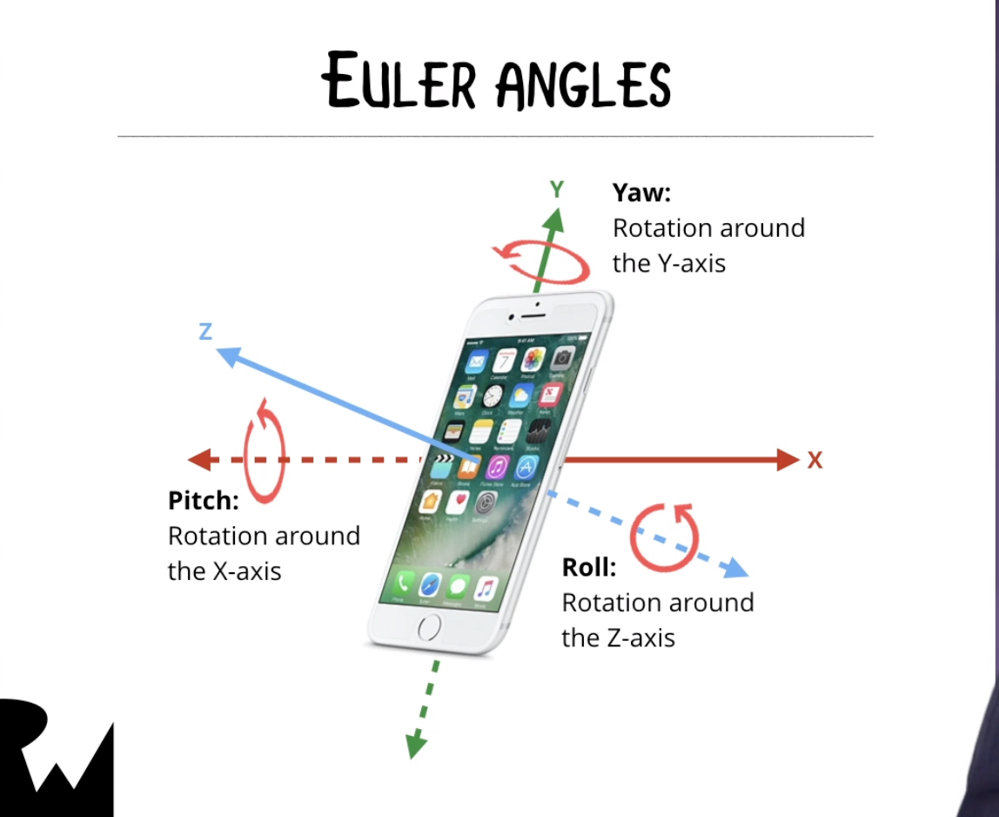
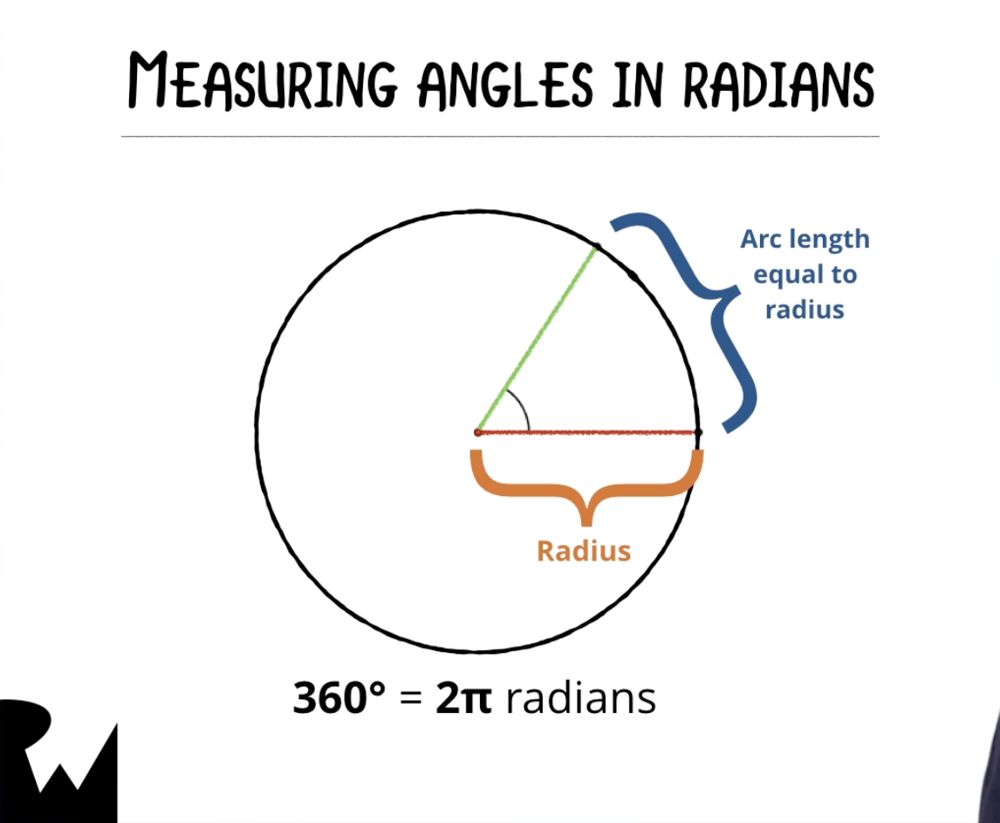
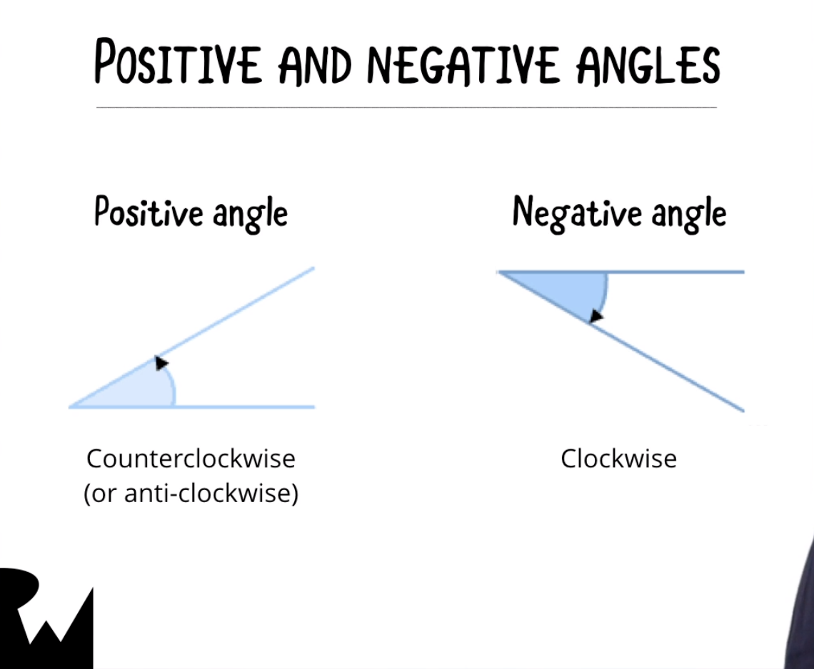
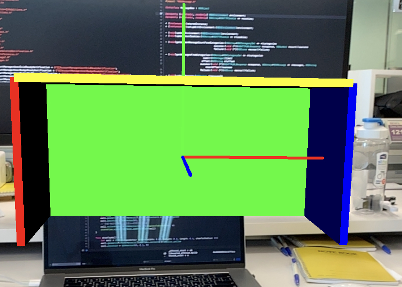

# 番外篇 - 座標系統

要玩AR，一定躲不了對虛擬世界的座標系統的處理，清楚了解座標系統，才有辦法繼續更深入AR。

#### 原點

座標系統核心中心就是原點，如何定義原點，圓點的定義是手機在實體世界起動AR Session時的位置。可以透過`ARSCNDebugOptions.showWorldOrigin`來觀察虛擬世界的座標中心。

#### 階層式座標

Root node定義出最底層的座標系統，添加到root node中每個子節點都會建立自己的座標系統，所以是一層一層的對應下去。

#### 位置

**Position**: 這比較好理解，就是由`SCNVector3`定義的3維向量(x, y, z)

#### 角度

**EulerAngles**: 這部分應該是比較困難的部分，角度也是由`SCNVector3`定義的3維向量(pitch, yaw, roll)。



每個維度是由[弧度](https://zh.wikipedia.org/wiki/弧度)定義，因為日常用的單位的是degree(角度)，所以需要轉換成轉成程式用的單位arc(弧度)。



 

```Swift
extension Int {
  func degreesToRadians() -> CGFloat {
    return CGFloat(self) * CGFloat.pi / 180.0
  }
}
```

正負是根據旋轉方向而定，順時針(負)，逆時針(正)。



#### 例子

自己寫例子來測試自己是否夠瞭解。例子如下



```Swift
   override func viewWillAppear(_ animated: Bool) {
        super.viewWillAppear(animated)
        
        // Create a session configuration
        let configuration = ARWorldTrackingConfiguration()

        // Run the view's session
        sceneView.session.run(configuration)
        drawRightWall()
        drawLeftWall()
        drawFrontWall()
        drawTopWall()
    }

  func drawRightWall() {
        let wall = SCNNode(geometry: SCNBox(width: 0.01, height: 0.2, length: 0.2, chamferRadius: 0))
        wall.geometry?.firstMaterial?.diffuse.contents = UIColor.blue
        wall.position = SCNVector3(0.2, 0, 0)
        // 預設是直放
        wall.eulerAngles = SCNVector3(0, 0, 0)
        sceneView.scene.rootNode.addChildNode(wall)
    }

  func drawLeftWall() {
        let wall = SCNNode(geometry: SCNBox(width: 0.01, height: 0.2, length: 0.2, chamferRadius: 0))
        wall.geometry?.firstMaterial?.diffuse.contents = UIColor.red
        wall.position = SCNVector3(-0.2, 0, 0)
        // 根據Y軸旋轉180度(在這個case，因為box是單一色，所以其實是跟沒旋轉的效果是一樣，但如果box的兩面顏色不同，那就會有差異了)
        wall.eulerAngles = SCNVector3(0, 180.degreesToRadians(), 0)
        sceneView.scene.rootNode.addChildNode(wall)
    }

  func drawFrontWall() {
        let wall = SCNNode(geometry: SCNBox(width: 0.01, height: 0.2, length: 0.4, chamferRadius: 0))
        wall.geometry?.firstMaterial?.diffuse.contents = UIColor.green
        wall.position = SCNVector3(0, 0, -0.1)
        // 根據Y軸旋轉90度，這樣是box就會面朝使用者
        wall.eulerAngles = SCNVector3(0, 90.degreesToRadians(), 0)
        sceneView.scene.rootNode.addChildNode(wall)
    }

    func drawTopWall() {
        let wall = SCNNode(geometry: SCNBox(width: 0.01, height: 0.2, length: 0.4, chamferRadius: 0))
        wall.geometry?.firstMaterial?.diffuse.contents = UIColor.yellow
        wall.position = SCNVector3(0, 0.1, 0)
        // 先根據x軸旋轉90度，再根據z軸旋轉90度
        wall.eulerAngles = SCNVector3(90.degreesToRadians(), 0, 90.degreesToRadians())
        sceneView.scene.rootNode.addChildNode(wall)
    }
```

#### 向量運算

在AR裡面，尤其在物體移動或變形，需要進行大量的運算，我們會透過[simd(Single Instruction Multiple Data.)](https://developer.apple.com/documentation/accelerate/simd)執行向量運算，讓運算速度大幅提升。`

舉個例子

```swift
   guard let nodes =  sceneView?.scene.rootNode.childNodes else { return }
   // 每個node都要進行三次的運算
    for node in nodes {
      node.position.x += 10
      node.position.y += 10
      node.position.z += 10
    }
   // 透過simd執行向量運算，只要一次就可已完成上面的運算結果
   // 當node很多時，這樣的差異就會更加的明顯。
    let delta = simd_float3(10)
    for node in nodes {
      node.simdPosition += delta
    }
```

