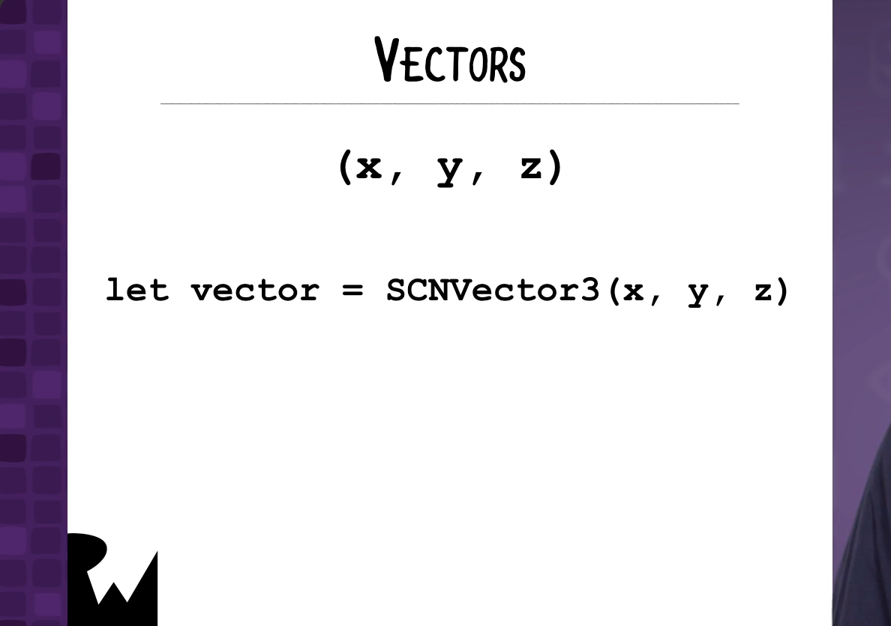
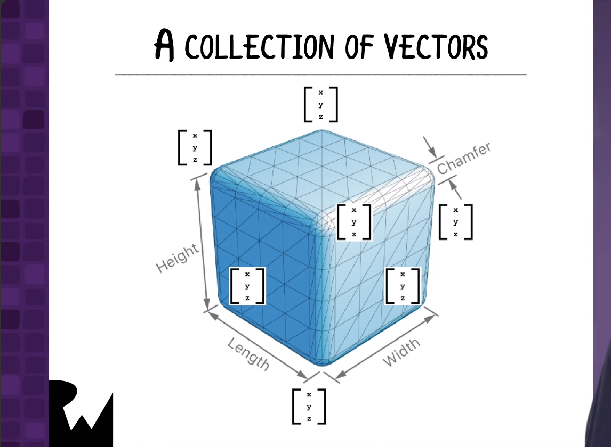
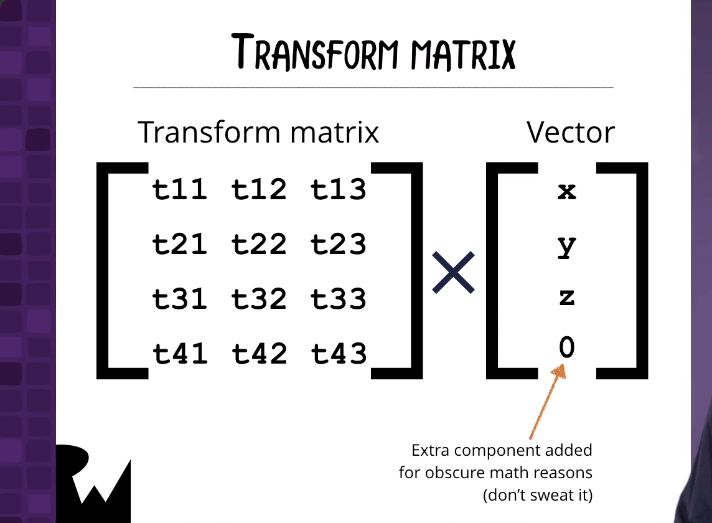
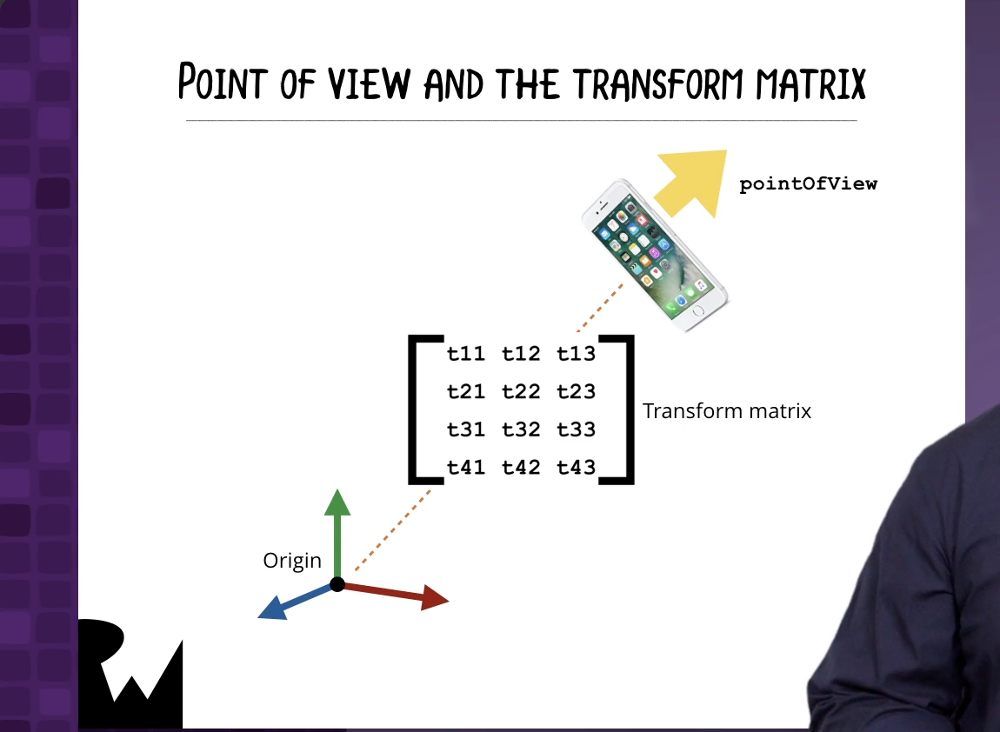
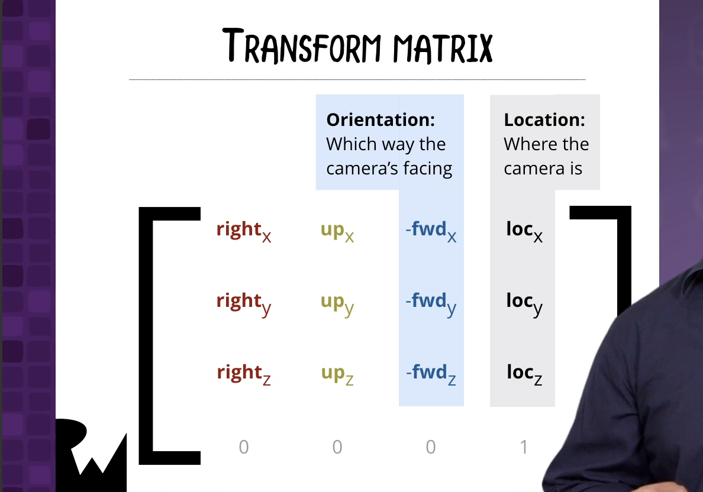

# Happy AR Painter

------

## 大綱

- [**Introduction**](#1)
- [**pointOfView and Matrix Math**](#2)
- [**Location, Orientation, and Position**](#3)
- [**The Other Tab**](#4)
- [**Let’s Paint!**](#5)
- [**Painting Animated Shapes With Actions**](#6)
- [**Conclusion**](#7)

------

<h2 id="1">Introduction</h2>


------

<h2 id="2">pointOfView and Matrix Math</h2>











------

<h2 id="3">Location, Orientation, and Position</h2>

- 取得鏡頭在3D座標系統的相對位置跟轉向

```swift
  // MARK: ARSCNViewDelegate methods
  // ===============================

  // Called every time the augmented reality scene is about to be rendered
  // (ideally, at least 60 times a second).
  func renderer(_ renderer: SCNSceneRenderer,
                willRenderScene scene: SCNScene,
                atTime time: TimeInterval) {
    // A canvas‘ pointOfView is a node representing the camera‘s point of view.
    guard let pointOfView = canvas.pointOfView else { return }

    // Get the device’s location, orientation, and position
    // The current location and orientaton of the camera relative to the origin point
    // are embedded in the pointOfView’s transformation matrix (a 4 by 4 matrix).
    let transform = pointOfView.transform

    // The orientation is in the 3rd column of the transform matrix.
    let orientation = SCNVector3(-transform.m31,
                                 -transform.m32,
                                 -transform.m33)

    // The location is in the 4th column of the transform matrix.
    let location = SCNVector3(transform.m41,
                              transform.m42,
                              transform.m43)
    let position = orientation + location
    print("location: \(location)\norientation: \(orientation)")
  }
```

------

<h2 id="4">The Other Tab</h2>


------

<h2 id="5">Painting Animated Shapes With Actions</h2>

- 加到print下方

```swift
  // By putting this code in a “DispatchQueue.main.async” block,
    // we ensure that this code gets executed in the main queue.
    // We need to do this because we’re removing nodes from the scene
    // and checking the state of the “Paint” button, both of which
    // need to be done in the main queue.
    DispatchQueue.main.async {
      // Erase any old cursor shapes
      self.eraseNodes(named: "cursor")

      // Create the brush
      let brush = self.createBrush(brushShape: self.brushSettings.shape,
                                   brushSize: self.brushSettings.size,
                                   position: position)

      if self.paintButton.isHighlighted {
        // The user IS pressing the “Paint” button
        // Give the shape a shine and set it to the selected color
        brush.geometry?.firstMaterial?.diffuse.contents = self.brushSettings.color
        brush.geometry?.firstMaterial?.specular.contents = UIColor.white

        if self.brushSettings.isSpinning {
          // Spin the shape continuously around the y-axis
          let rotateAction = SCNAction.rotate(by: 2 * .pi,
                                              around: SCNVector3(0, 1, 0),
                                              duration: 2)
          let rotateForeverAction = SCNAction.repeatForever(rotateAction)
          brush.runAction(rotateForeverAction)
        }
      } else {
        // The user IS NOT pressing the “Paint” button
        // Set the shape to the cursor color and name
        brush.geometry?.firstMaterial?.diffuse.contents = UIColor.lightGray
        brush.name = "cursor"
      }

      // Paint the shape to the screen
      self.canvas.scene.rootNode.addChildNode(brush)
    }

  // MARK: Node creation methods
  // ===========================

  // Erase any nodes with the given name.
  func eraseNodes(named nameToErase: String) {
    self.canvas.scene.rootNode.enumerateChildNodes { (node, _) in
      if node.name == nameToErase {
        node.removeFromParentNode()
      }
    }
  }

```

------

<h2 id="6">Painting Animated Shapes With Actions</h2>


------

<h2 id="7">Conclusion</h2>

