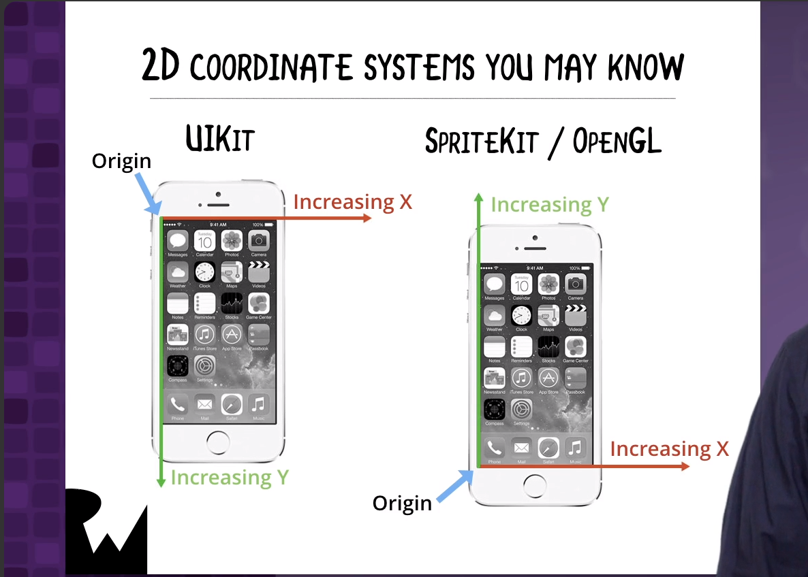
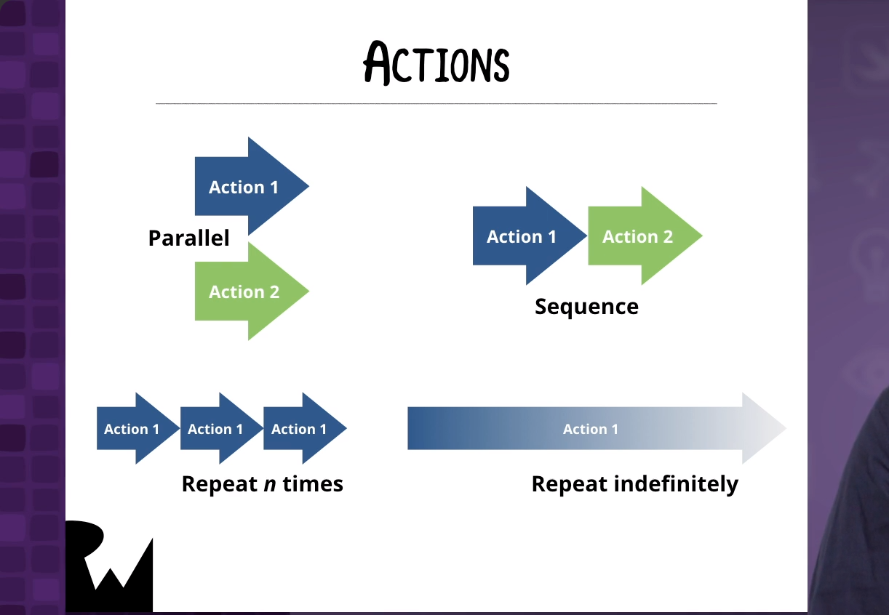

# Hello, Augmented World!

------

## 大綱

- [**Introduction**](#1)
- [**Defining AR**](#2)
- [**Introducing ARKit**](#3)
- [**Template App**](#4)
- [**Intro to SceneKit**](#5)
- [**Your First SceneKit Shape**](#6)
- [**Shiny Objects**](#7)
- [**Challenge: Draw a Shiny Green Pyramid**](#8)
- [**Earth**](#9)
- [**Challenge: Cat On a Plane**](#10)
- [**Euler Angles**](#11)
- [**Challenge: Tilt the Cat**](#12)
- [**Actions**](#13)
- [**Beyond Shapes**](#14)
- [**Conclusion**](#15)

------

<h2 id="1">Introduction</h2>


------

<h2 id="2">Defining AR</h2>


------

<h2 id="3">Introducing ARKit</h2>


------

<h2 id="4">Template App</h2>

- It’s time to dive right into ARKit programming by starting with the ARKit app template that Xcode provides.

------

<h2 id="5">Intro to SceneKit</h2>

- A look at SceneKit and some key concepts, including 3D coordinates, aligning those coordinates with the real world, SceneKit geometries, and SceneKit’s node graph.




------

<h2 id="6">Your First SceneKit Shape</h2>

- 設定sceneview

```swift
   override func viewDidLoad() {
        super.viewDidLoad()
        
        // Set the view's delegate
        sceneView.delegate = self
        
        // Show statistics such as fps and timing information
        sceneView.showsStatistics = true
        
        sceneView.debugOptions = [ARSCNDebugOptions.showWorldOrigin,
                                ARSCNDebugOptions.showFeaturePoints]
        sceneView.autoenablesDefaultLighting = true
    }
```

- 在座標圓心畫個藍色球

```swift
  func drawSphereAtOrigin() {
    sphere = SCNNode(geometry: SCNSphere(radius: 0.05))
    sphere.geometry?.firstMaterial?.diffuse.contents = UIColor.blue
    // 相對於parent node的座標
    // 畫在parent node的座標系統圓心
    sphere.position = SCNVector3(0, 0, 0)
    sceneView.scene.rootNode.addChildNode(sphere)
  }
```

------

<h2 id="7">Shiny Objects</h2>

- You just drew a dull object. Now you’ll make it shiny, and learn about diffuse and specular reflection while doing so.


- 畫一個正方體

```swift
  func drawBoxAt1200High() {
    let box = SCNNode(geometry: SCNBox(width: 0.1,
                                       height: 0.1,
                                       length: 0.1,
                                       chamferRadius: 0.0))
    // z = -0.3, 表示在核心的後方30cm
    // y = 0.2, 表示在核心的上方20cm
    box.position = SCNVector3(0, 0.2, -0.3)
    box.geometry?.firstMaterial?.diffuse.contents = UIColor.orange
    box.geometry?.firstMaterial?.specular.contents = UIColor.white
    sceneView.scene.rootNode.addChildNode(box)
  }
```

------

<h2 id="8">Challenge: Draw a Shiny Green Pyramid</h2>

- You know how to draw a sphere, and make it shiny and blue. Can you draw a shiny green pyramid?


```swift
 func drawPyramidAt600Low() {
    let pyramid = SCNNode(geometry: SCNPyramid(width: 0.1,
                                             height: 0.1,
                                             length: 0.1))
    pyramid.geometry?.firstMaterial?.diffuse.contents = UIColor.green
    pyramid.geometry?.firstMaterial?.specular.contents = UIColor.red
    pyramid.position = SCNVector3(0, -0.2, 0.3)
    sceneView.scene.rootNode.addChildNode(pyramid)
  }
```

------

<h2 id="9">Earth</h2>

- Let's turn that shiny blue sphere into our home planet by covering it with a photo of the Earth’s surface.

- 將中心的藍色圓球換成地球的圖片

```swift
func drawSphereAtOrigin() {
    sphere = SCNNode(geometry: SCNSphere(radius: 0.05))
    sphere.geometry?.firstMaterial?.diffuse.contents = UIImage(named: "earth")
    sphere.position = SCNVector3(0, 0, 0)
    sceneView.scene.rootNode.addChildNode(sphere)
  }
```

------

<h2 id="10">Challenge: Cat On a Plane</h2>

- Take what you’ve learned from the previous lesson and draw a flat surface with a cat picture on it.


- 畫平面

```swift
 func drawPlaneAt900() {
    let plane = SCNNode(geometry: SCNPlane(width: 0.1,
                                           height: 0.1))
    plane.geometry?.firstMaterial?.diffuse.contents = UIImage(named: "cat")
    plane.geometry?.firstMaterial?.isDoubleSided = true
    plane.position = SCNVector3(-0.2, 0, 0)
    sceneView.scene.rootNode.addChildNode(plane)
  }
```


------

<h2 id="11">Euler Angles</h2>

- They’re pronounced “oiler”, not “yoo-ler”, and they’re how you can tilt objects at jaunty angles.


- 畫個紅色甜甜圈

```swift
  func drawTorusAt300() {
    let torus = SCNNode(geometry: SCNTorus(ringRadius: 0.05,
                                           pipeRadius: 0.03))
    torus.geometry?.firstMaterial?.diffuse.contents = UIColor.red
    torus.geometry?.firstMaterial?.specular.contents = UIColor.white
    torus.position = SCNVector3(0.2, 0, 0)
    torus.eulerAngles = SCNVector3(0, 0, 45.degreesToRadians())
    sceneView.scene.rootNode.addChildNode(torus)
  }

extension Int {
  func degreesToRadians() -> CGFloat {
    return CGFloat(self) * CGFloat.pi / 180.0
  }
}
```


------

<h2 id="12">Challenge: Tilt the Cat</h2>

- Now that you know about Euler angles, apply them to that cat picture.


- 畫個有貓的圖面

```swift
  func drawPlaneAt900() {
    let plane = SCNNode(geometry: SCNPlane(width: 0.1,
                                           height: 0.1))
    plane.geometry?.firstMaterial?.diffuse.contents = UIImage(named: "cat")
    plane.geometry?.firstMaterial?.isDoubleSided = true
    plane.position = SCNVector3(-0.2, 0, 0)
    plane.eulerAngles = SCNVector3(-45.degreesToRadians(),
                                  20.degreesToRadians(),
                                  45.degreesToRadians())
    sceneView.scene.rootNode.addChildNode(plane)
  }
```

------

<h2 id="13">Actions</h2>

- Actions are objects that make changes to SceneKit objects. They can move objects, rotate them, grow and shrink them, change their appearance and more. Learn how to use them to put a little spin on the Earth!



- 讓地球旋轉的action

```swift
  func drawSphereAtOrigin() {
    sphere = SCNNode(geometry: SCNSphere(radius: 0.05))
    sphere.geometry?.firstMaterial?.diffuse.contents = UIImage(named: "earth")
    sphere.geometry?.firstMaterial?.specular.contents = UIColor.yellow
    sphere.position = SCNVector3(0, 0, 0)
    sceneView.scene.rootNode.addChildNode(sphere)
    let rotateAction = SCNAction.rotate(by: 360.degreesToRadians(),
                                        around: SCNVector3(0, 1, 0),
                                        duration: 8)
    let rotateForeverAction = SCNAction.repeatForever(rotateAction)
    sphere.runAction(rotateForeverAction)
  }
```


------

<h2 id="14">Beyond Shapes</h2>

- All this time, you’ve been drawing simple shapes using SceneKit geometries. Let’s draw something fancier.

- 讀取太空梭3Ｄ物件，並繞地球進行旋轉

```swift
  func drawOrbitingShip() {
    let scene = SCNScene(named: "art.scnassets/ship.scn")!
    let ship = (scene.rootNode.childNode(withName: "ship", recursively: false))!
    ship.position = SCNVector3(1, 0, 0)
    ship.scale = SCNVector3(0.3, 0.3, 0.3)
    ship.eulerAngles = SCNVector3(0, 180.degreesToRadians(), 0)
    // ship是sphere的child, 所以會受sphere的action影響
    sphere.addChildNode(ship)
  }
```

------

<h2 id="15">Conclusion</h2>

- You’ve just completed a crash course in SceneKit and written some basic AR app. Let's review where you are and see what comes next.

