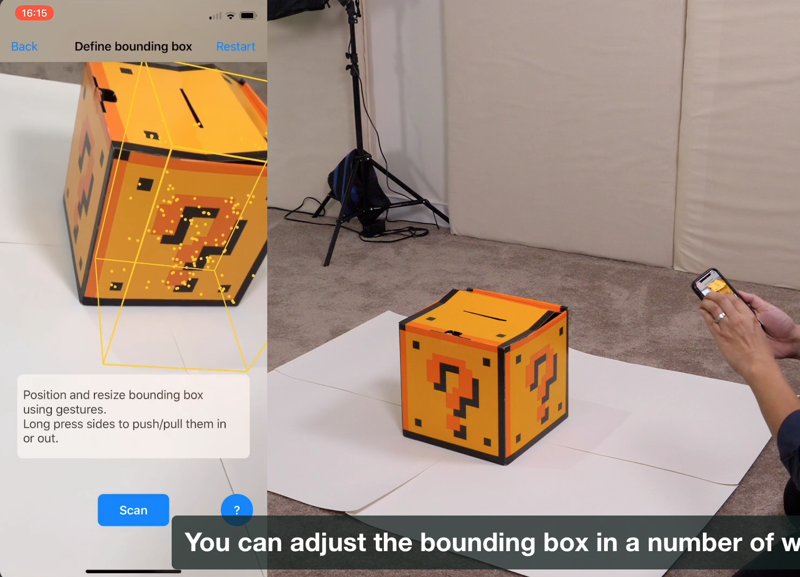

# Into the Third Dimension

------

## 大綱

- [**Introduction**](#1)
- [**Scanning 3D Objects**](#2)
- [**Importing Reference Objects**](#3)
- [**Detecting Reference Objects in the Real World**](#4)
- [**Conclusion**](#5)

------

<h2 id="1">Introduction</h2>

- Take BaedekAR into the third dimension by using the same concepts to detect known 3D objects instead of 2D ones.

------

<h2 id="2">Scanning 3D Objects</h2>

- Before you can detect 3D objects in the real world, you’ll need to provide reference objects, which means that you’ll have to scan them first. You’ll download Apple’s app for scanning 3D objects and put it to use.




------

<h2 id="3">Importing Reference Objects</h2>

- Now that you’ve scanned your reference objects, it’s time to import them into the app.


------

<h2 id="4">Detecting Reference Objects in the Real World</h2>

- With the reference images imported into the app, now you can detect their real-world counterparts.

```swift
  func startARSession() {
    // Make sure that we have an AR resource group.
    guard let referenceObject = ARReferenceObject.referenceObjects(inGroupNamed: "AR Resources", bundle: nil) else {
      fatalError("This app doesn't have an AR resource group named 'AR Resources'!")
    }

    // Set up the AR configuration.
    config.worldAlignment = .gravityAndHeading
    config.detectionObjects = referenceObject

    // Start the AR session.
    sceneView.session.run(config, options: [.resetTracking, .removeExistingAnchors])

    statusViewController.scheduleMessage("Look around for art!",
                                         inSeconds: 7.5,
                                         messageType: .contentPlacement)
  }
```

```swift
 // This delegate method gets called whenever the node corresponding to
  // a new AR anchor is added to the scene.
  func renderer(_ renderer: SCNSceneRenderer, didAdd node: SCNNode, for anchor: ARAnchor) {
    // We only want to deal with object anchors, which encapsulate
    // the position, orientation, and size, of a detected image that matches
    // one of our reference images.
    guard let objectAnchor = anchor as? ARObjectAnchor else { return }
    let referenceObject = objectAnchor.referenceObject
    let imageName = referenceObject.name ?? "[Unknown]"

    let isArtImage = true
    var statusMessage = "Found \(artworkDisplayNames[imageName] ?? "artwork")"
  }
```

------

<h2 id="5">Conclusion</h2>

