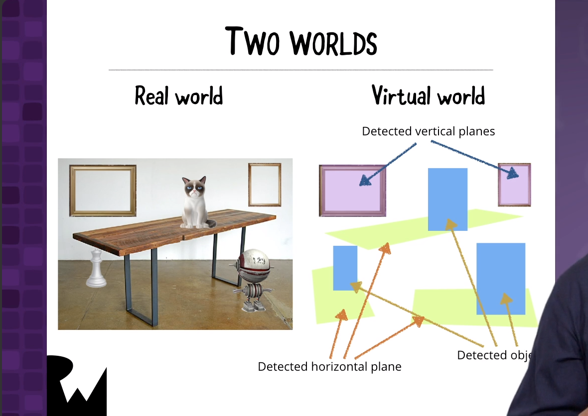
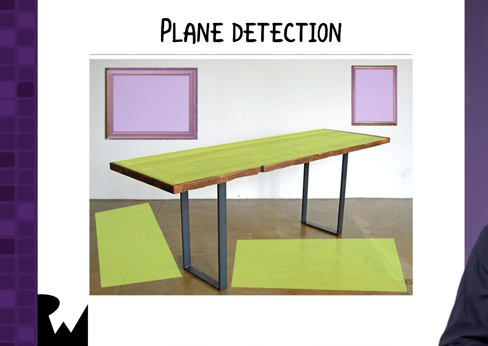
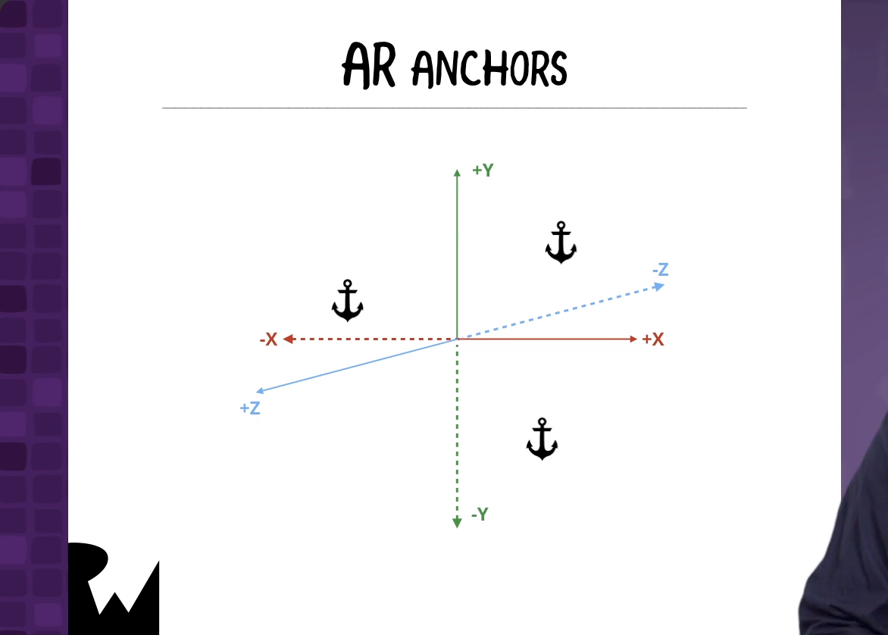
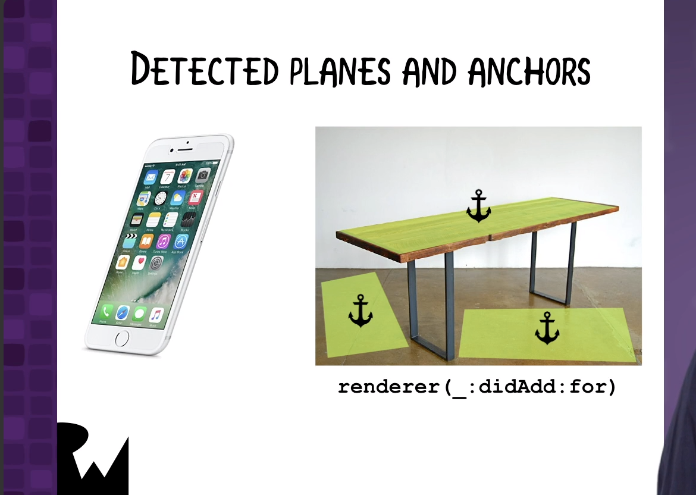
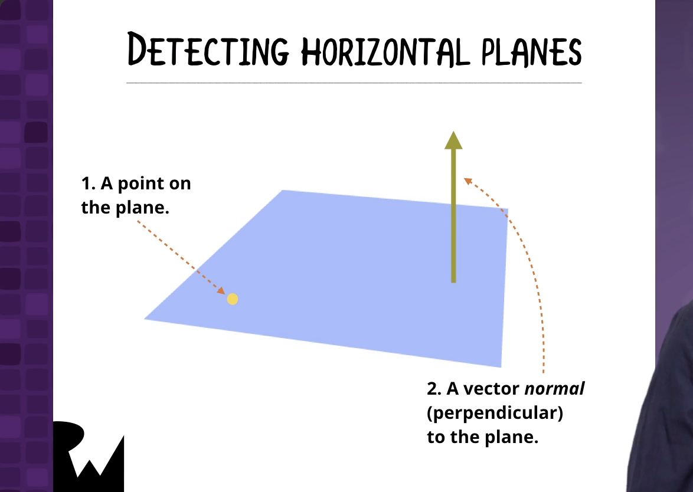
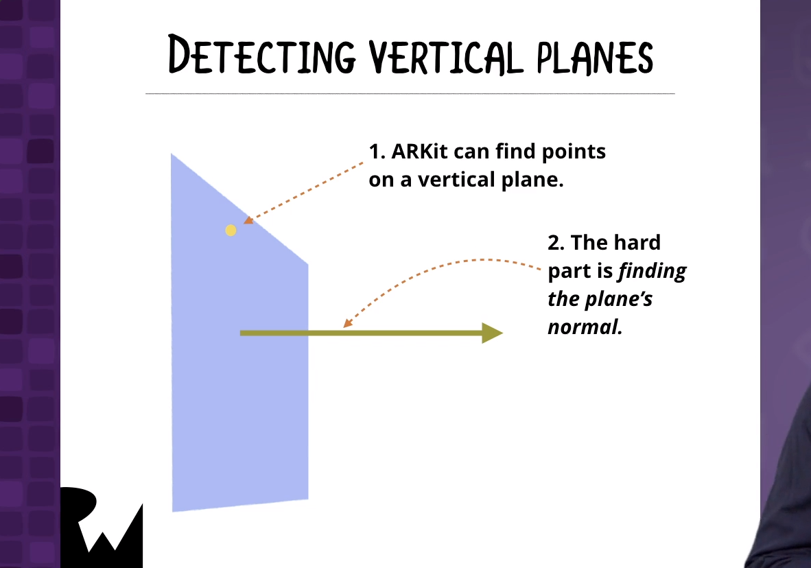
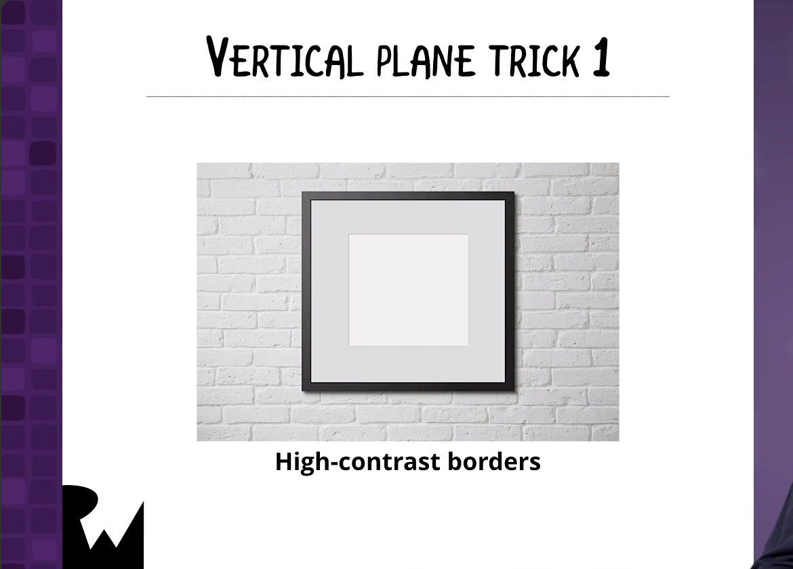
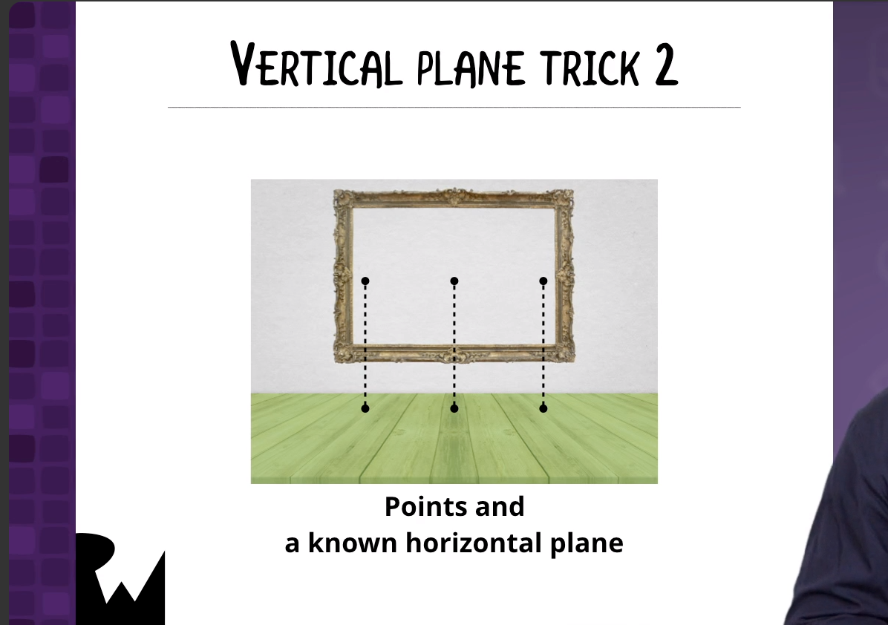
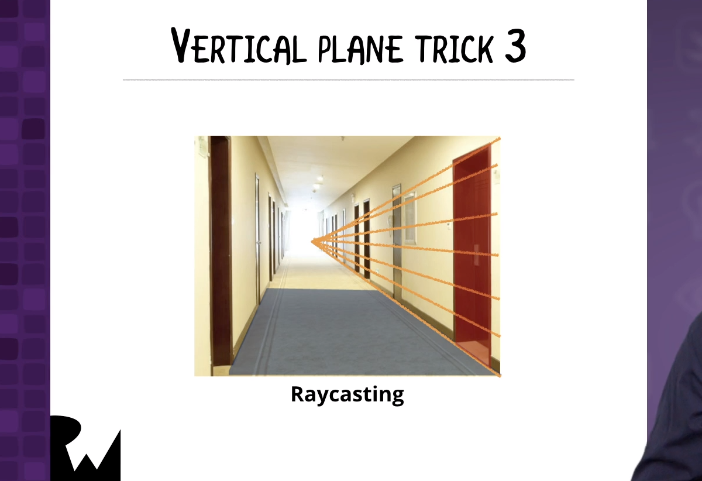
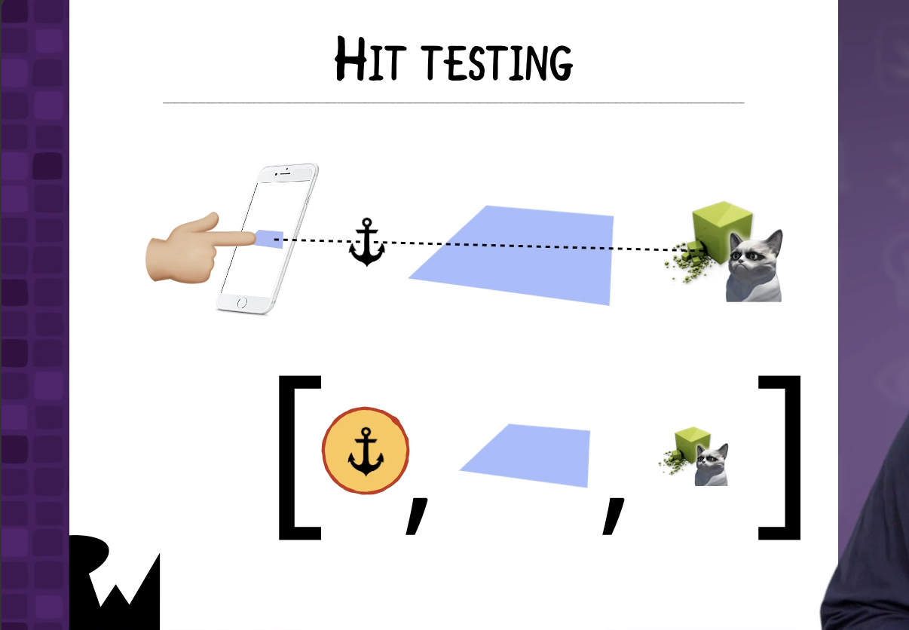

# Raykea

------

## 大綱

- [**Introduction**](#1)
- [**Two Worlds**](#2)
- [**Basic Plane Detection**](#3)
- [**Plane Detection Theory**](#4)
- [**Drawing AR Planes Over Detected Surfaces**](#5)
- [**Back to the Two Worlds**](#6)
- [**Changes to a Previously Detected Surface**](#7)
- [**Hit Tests**](#8)
- [**Looking at a Detected Surface**](#9)
- [**Finishing Raykea**](#10)
- [**Conclusion**](#11)

------

<h2 id="1">Introduction</h2>


------

<h2 id="2">Two Worlds</h2>







------

<h2 id="3">Basic Plane Detection</h2>

- 建立configuration

```swift
  func createARConfiguration() -> ARConfiguration {
    let config = ARWorldTrackingConfiguration()  // Use "6 degrees of freedom" tracking
    config.worldAlignment = .gravity
    config.planeDetection = [.horizontal, .vertical]
    config.isLightEstimationEnabled = true
    return config
  }
```



- 取回平面的anchor資料

```swift
  func renderer(_ renderer: SCNSceneRenderer, didAdd node: SCNNode, for anchor: ARAnchor) {
    // We only want to deal with plane anchors, which encapsulate
    // the position, orientation, and size, of a detected surface.
    guard let planeAnchor = anchor as? ARPlaneAnchor else { return }

    // Draw the appropriate plane over the detected surface.
    drawPlaneNode(on: node, for: planeAnchor)
  }
```

------

<h2 id="4">Plane Detection Theory</h2>











------

<h2 id="5">Drawing AR Planes Over Detected Surfaces</h2>

```swift
  func drawPlaneNode(on node: SCNNode, for planeAnchor: ARPlaneAnchor) {
    // Create a plane node with the same position and size
    // as the detected plane.
    let planeNode = SCNNode(geometry: SCNPlane(
      width: CGFloat(planeAnchor.extent.x),
      height: CGFloat(planeAnchor.extent.z)))
    planeNode.position = SCNVector3(planeAnchor.center.x,
                                   planeAnchor.center.y,
                                   planeAnchor.center.z)
    planeNode.geometry?.firstMaterial?.isDoubleSided = true

    // Align the plane with the anchor.
    planeNode.eulerAngles = SCNVector3(-Double.pi / 2, 0, 0)

    // Give the plane node the appropriate surface.
    if planeAnchor.alignment == .horizontal {
      planeNode.geometry?.firstMaterial?.diffuse.contents = UIImage(named: "grid")
      planeNode.name = "horizontal"
    } else {
      planeNode.geometry?.firstMaterial?.diffuse.contents = UIImage(named: "ray")
      planeNode.name = "vertical"
    }

    // Add the plane node to the scene.
    node.addChildNode(planeNode)
    appState = .readyToFurnish
  }
```

------

<h2 id="6">Back to the Two Worlds</h2>


------

<h2 id="7">Changes to a Previously Detected Surface</h2>

```swift
  // This delegate method gets called whenever the node for
  // an *existing* AR anchor is updated.
  func renderer(_ renderer: SCNSceneRenderer, didUpdate node: SCNNode, for anchor: ARAnchor) {
    // Once again, we only want to deal with plane anchors.
    guard let planeAnchor = anchor as? ARPlaneAnchor else { return }

    // Remove any children this node may have.
    node.enumerateChildNodes { (childNode, _) in
      childNode.removeFromParentNode()
    }

    // Update the plane over this surface.
    drawPlaneNode(on: node, for: planeAnchor)
  }
```

```swift
 // This delegate method gets called whenever the node corresponding to
  // an existing AR anchor is removed.
  func renderer(_ renderer: SCNSceneRenderer, didRemove node: SCNNode, for anchor: ARAnchor) {
    // We only want to deal with plane anchors.
    guard anchor is ARPlaneAnchor else { return }

    // Remove any children this node may have.
    node.enumerateChildNodes { (childNode, _) in
      childNode.removeFromParentNode()
    }
  }
```

------

<h2 id="8">Hit Tests</h2>



------

<h2 id="9">Looking at a Detected Surface</h2>

```swift
  // We can’t check *every* point in the view to see if it contains one of
  // the detected planes. Instead, we assume that the planes that will be detected
  // will intersect with at least one point on a 5*5 grid spanning the entire view.
  func isAnyPlaneInView() -> Bool {
    let screenDivisions = 5 - 1
    let viewWidth = view.bounds.size.width
    let viewHeight = view.bounds.size.height

    for y in 0...screenDivisions {
      let yCoord = CGFloat(y) / CGFloat(screenDivisions) * viewHeight
      for x in 0...screenDivisions {
        let xCoord = CGFloat(x) / CGFloat(screenDivisions) * viewWidth
        let point = CGPoint(x: xCoord, y: yCoord)

        // Perform hit test for planes.
        let hitTest = sceneView.hitTest(point,
                                        types: .estimatedHorizontalPlane)
        if !hitTest.isEmpty {
          return true
        }

      }
    }
    return false
  }
```

------

<h2 id="10">Finishing Raykea</h2>

```swift
  @objc func handleScreenTap(sender: UITapGestureRecognizer) {
    // Find out where the user tapped on the screen.
    let tappedSceneView = sender.view as! ARSCNView
    let tapLocation = sender.location(in: tappedSceneView)

    // Find all the detected planes that would intersect with
    // a line extending from where the user tapped the screen.
    let planeIntersections = tappedSceneView.hitTest(
      tapLocation,
      types: [.estimatedHorizontalPlane])

    // If the closest of those planes is horizontal,
    // put the current furniture item on it.
    if !planeIntersections.isEmpty {
      addFurniture(hitTestResult: planeIntersections.first!)
    }
  }
```

```swift
  func addFurniture(hitTestResult: ARHitTestResult) {
    // Get the real-world position corresponding to
    // where the user tapped on the screen.
    let transform = hitTestResult.worldTransform
    let positionColumn = transform.columns.3
    let initialPosition = SCNVector3(positionColumn.x,
                                     positionColumn.y,
                                     positionColumn.z)

    // Get the current furniture item, correct its position if necessary,
    // and add it to the scene.
    let node = furnitureSettings.currentFurniturePiece()
    node.position = initialPosition + furnitureSettings.currentFurnitureOffset()
    sceneView.scene.rootNode.addChildNode(node)
  }
```

------

<h2 id="11">Conclusion</h2>


------

