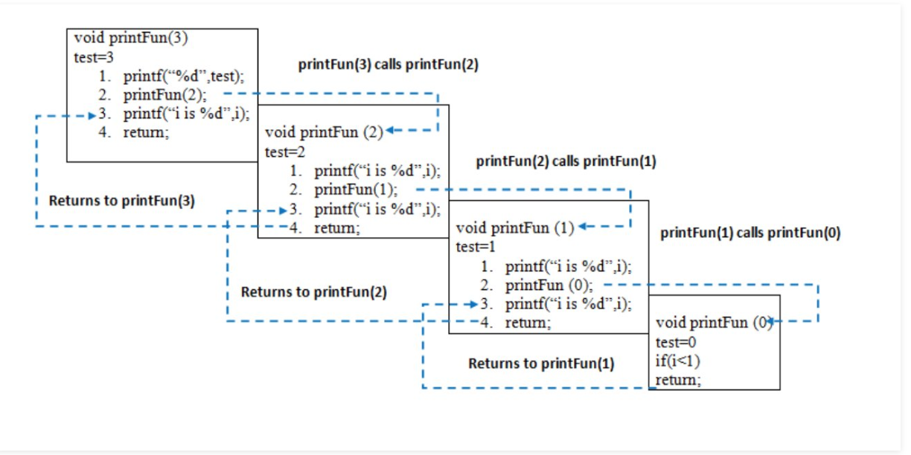

# 12

Hi, here's your problem today. This problem was recently asked by Google:

You are given the root of a binary tree. Return the deepest node (the furthest node from the root).

Here's a starting point:

```python
class Node(object):
  def __init__(self, val):
    self.val = val
    self.left = None
    self.right = None

  def __repr__(self):
    # string representation
    return self.val


def deepest(node):
  # Fill this in.

root = Node('a')
root.left = Node('b')
root.left.left = Node('d')
root.right = Node('c')

print deepest(root)
# (d, 3)
```

------


This is a classic case for a recursive solution

This algorithm has a time complexity of O(N) as we need to check all the nodes of the tree. It has a space complexity of O(logN) because that is the max depth of the recursion call stack at any given time.

```python
def deepestNode(node):
  return r_deepestNode(node, 0)
  
def r_deepestNode(node, height):
  height += 1
  if node.left == None and node.right == None:
    return (node.val, height)
  elif node.left != None and node.right == None:
    return r_deepestNode(node.left, height)
  elif node.right != None and node.left == None:
    return r_deepestNode(node.right, height)
  else:
    # 比較左右子樹誰比較高
    if (r_deepestNode(node.left, height)[1] >= r_deepestNode(node.right, height)[1]):
        return r_deepestNode(node.left, height)
    else:
        return r_deepestNode(node.right, height)
```


Recursive and Call stack

  


https://www.udemy.com/course/flutter-bootcamp-with-dart/learn/lecture/15785414#questions