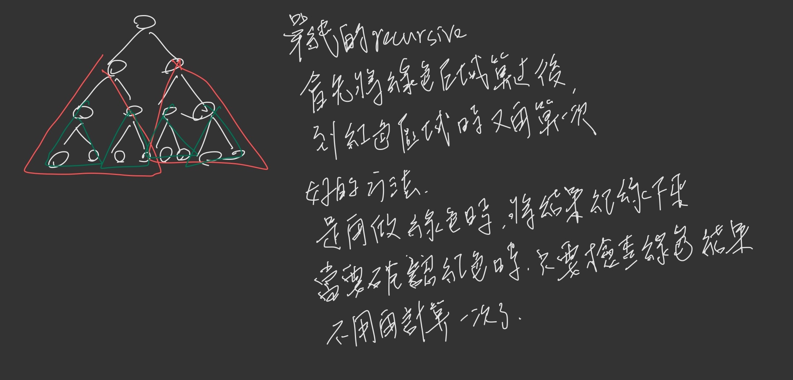

# 15

[250. Count Univalue Subtrees](https://leetcode.com/problems/count-univalue-subtrees/)

This problem was asked by Google.

A unival tree (which stands for "universal value") is a tree where all nodes under it have the same value.

Given the root to a binary tree, count the number of unival subtrees.

**Example :**

```
Input:  root = [5,1,5,5,5,null,5]

              5
             / \
            1   5
           / \   \
          5   5   5

Output: 4
```

------

方法一

遞迴時間複雜度計算 this runs in O(n^2) time. For each node of the tree, we’re evaluating each node in its subtree again as well.

```python
def count_unival_subtrees(root):
  if root is None:
    return 1
  left = count_unival_subtrees(root.left)
  right = count_unival_subtrees(root.right)
  
  return 1 + left + right if is_unival(root) else left + right

def is_unival(root):
  return unival_helper(root, root.value)
  
def unival_helper(root, value):
   if root is None:
        return True
   if root.value == value:
        return unival_helper(root.left, value) and unival_helper(root.right, value)
   return False
```

方法二

利用cache計算過的東西不在重複計算

```python
def count_unival_subtrees(root):
    count, _ = helper(root)
    return count

# Also returns number of unival subtrees, and whether it is itself a unival subtree.
def helper(root):
    if root is None:
        return 0, True
    left_count, is_left_unival = helper(root.left)
    right_count, is_right_unival = helper(root.right)
    total_count = left_count + right_count
    # 利用cache計算過的東西(is_left_unival, is_right_unival)不在重複計算
    if is_left_unival and is_right_unival:
        if root.left is not None and root.value != root.left.value:
            return total_count, False
        if root.right is not None and root.value != root.right.value:
            return total_count, False
        return total_count + 1, True
    return total_count, False
```


  