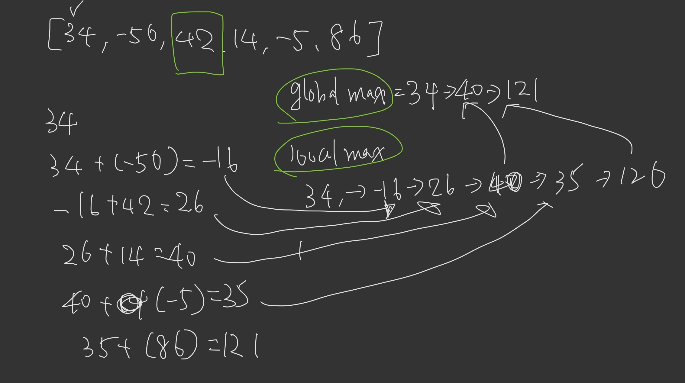

# 2

Hi, here's your problem today. This problem was recently asked by Twitter:

Example:

```
[34, -50, 42, 14, -5, 86]
```

Given this input array, the output should be 137. The contiguous subarray with the largest sum is [42, 14, -5, 86].

Here's a starting point:

```python
def max_subarray_sum(arr):
  global_index = [0, 0]
  global_max = float('-inf')
  
  for i in range(len(arr) - 1):
    local_index = [0,0]
    local_max = float('-inf')
    sum = arr[i]
   
    for j in range(i+ 1, len(arr)):
      sum += arr[j]
      if sum > local_max:
        local_max = sum
        local_index[0] = i
        local_index[1] = j      
    
    if local_max > global_max:
      global_max = local_max
      global_index = local_index
   
  return arr[global_index[0]: global_index[1]+1]

print max_subarray_sum([34, -50, 42, 14, -5, 86])
# 137
```

------

```python
# time:O(n^3)
def max_subarray_sum(arr):
  current_max = 0
  for i in range(len(arr)): # O(n)
    for j in range(len(arr)): # O(n)
      current_max = max(current_max, sum(arr[i:j])) # sum: O(n)
  return current_max
```

```python
# what is the sum of the best contiguous subarray ending at the current index ?
def max_subarray_sum(arr):
  global_max = 0 # the sum of the best contiguous subarray ending at the current index
  local_max = 0 # max sum of all contiguous subarrays considered thus far
  for x in arr:
    # 現在這個值 vs 之前最大的總和+現在這個值
    local_max = max(x, local_max + x)
    global_max = max(global_max, local_max)
   return global_max
    
```

  