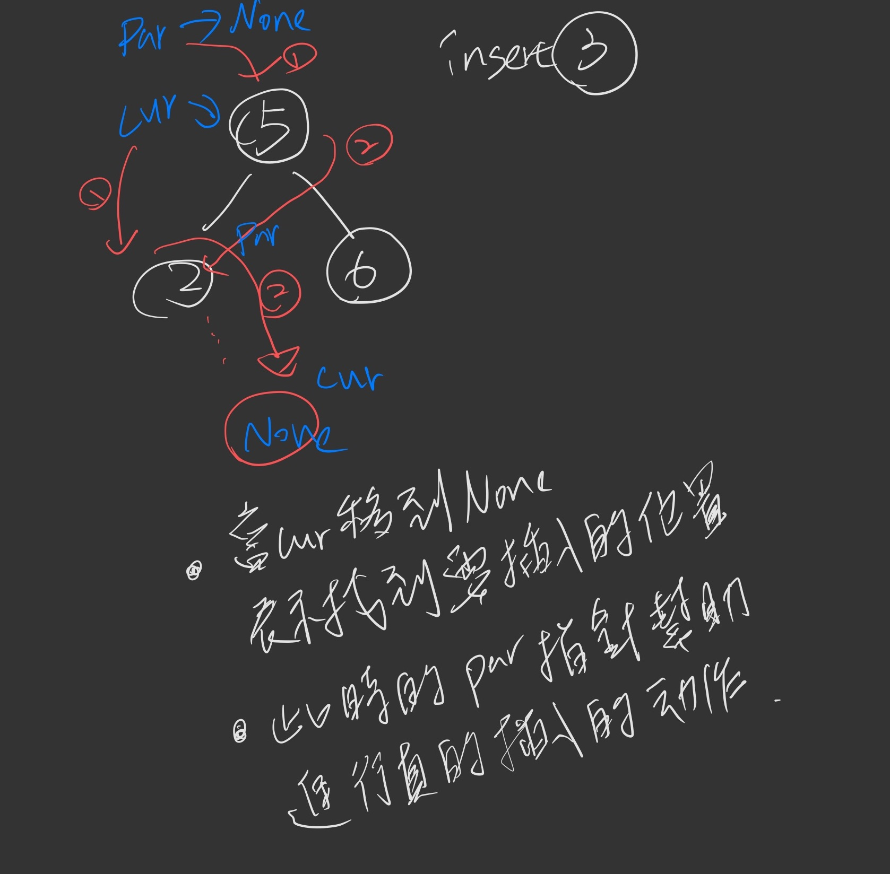

# 6

Hi, here's your problem today. This problem was recently asked by LinkedIn:
Given a sorted list of numbers, change it into a balanced binary search tree. You can assume there will be no duplicate numbers in the list.


```python
from collections import deque

class Node:
  def __init__(self, value, left=None, right=None):
    self.value = value
    self.left = left
    self.right = right

  def __str__(self):
    # level-by-level pretty-printer
    nodes = deque([self])
    answer = ''
    while len(nodes):
      node = nodes.popleft()
      if not node:
        continue
      answer += str(node.value)
      nodes.append(node.left)
      nodes.append(node.right)
    return answer


def createBalancedBST(nums):
  # Fill this in.

print createBalancedBST([1, 2, 3, 4, 5, 6, 7])
# 4261357
#   4
#  / \
# 2   6
#/ \ / \
#1 3 5 7
```

------


- The time complexity of this solution is O(n), since every element is iterated through.

- The space complexity of this solution is O(n), since a new Node is created for every element.

```python
def createBalancedBST(nums):
  if not nums:
    return None
  
  mid = len(nums) // 2
  left = createBalancedBST(nums[0:mid])
  right = createBalancedBST(nums[mid+1:len(nums)])
  
  return Node(mid, left, right)
  
```


// Iterative版本

```python
def createBalancedBST(nums):
  if not nums:
    return None
  
  mid = len(nums) // 2
  root = node(mid)
  nums.remove(mid)
  
  for i in range(len(nums)):
    insert(root, Node(nums[i]))
    
  return root
    
def insert(root,node):
  current = root
  paernt = None
  #  While traversing, it stores the parent node of each current node and when the current node becomes empty or None,
  while current:
    parent = current
    if node.val < current.val:
      current = current.left
    else:
      current = current.right
      
  if parent == None:
    # there is no node in thr tree
    parent = node
  elif node.val < parent.val:
    parent.left = node
  else:
    parent.right = node
```

  

