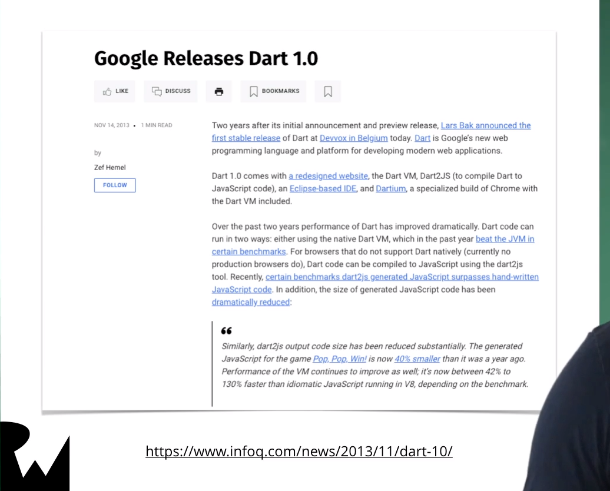
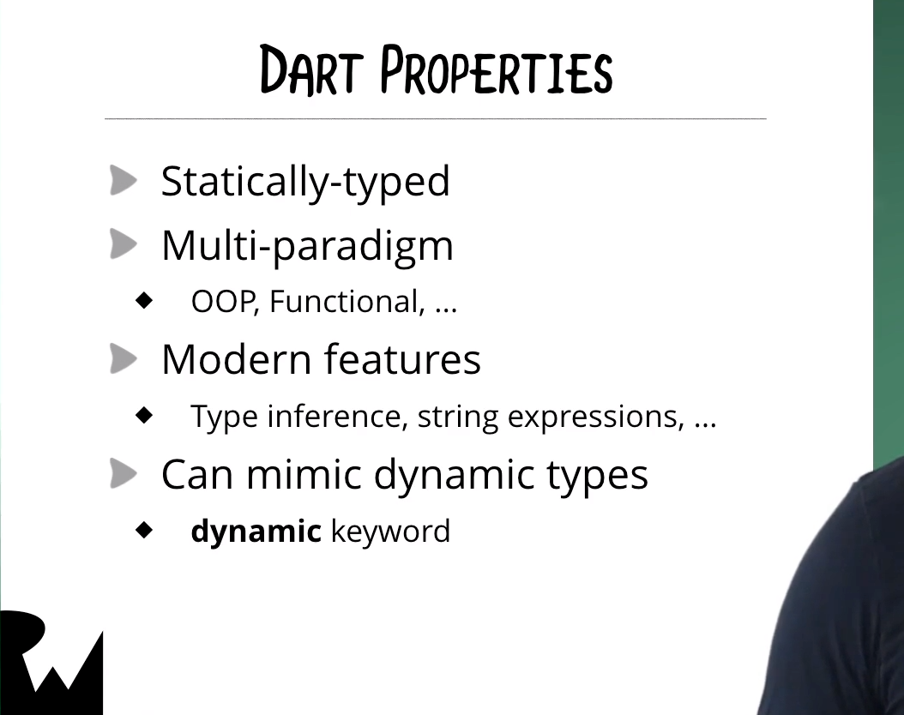
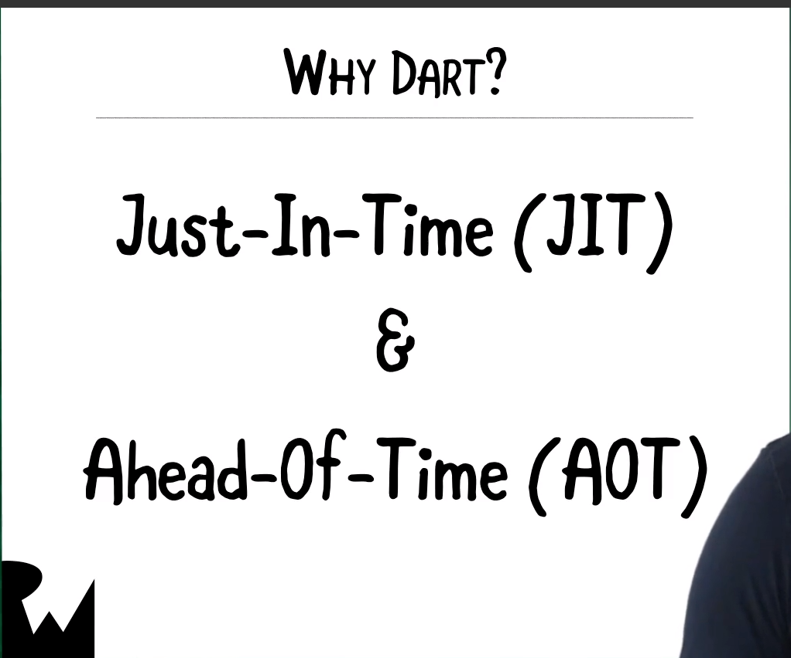
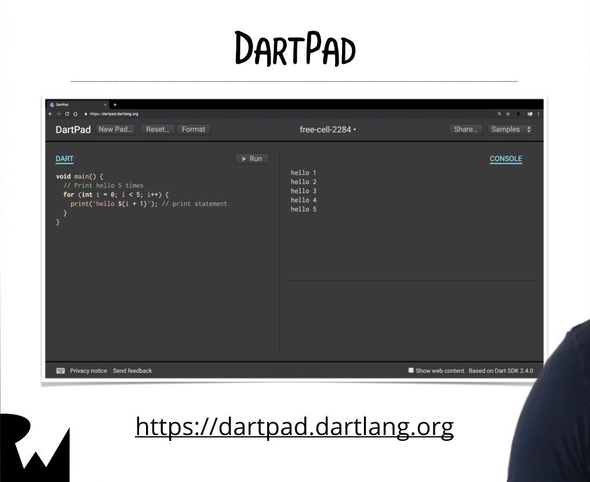

# Introduction

- [Dart](https://dart.dev/)是Google在2011年推出，當初的計畫是用來取代JavaScript，現在Dart已經到v2.4

  

------

- Dart是Statically-typed, 也就是說所有type必須在compiler time就被決定，且不能再run time做任何更改

 

------

- Dart在近期因為Flutter推出，又被重視，Flutter是要用Dart寫。

------

- Dart也被用在Google新[Fuchsia作業系統](https://fuchsia.dev/)

 

------

- [JIT, AOT](https://www.itread01.com/content/1550053457.html)

  

------

- [Dartpad](https://dartpad.dartlang.org/)

  