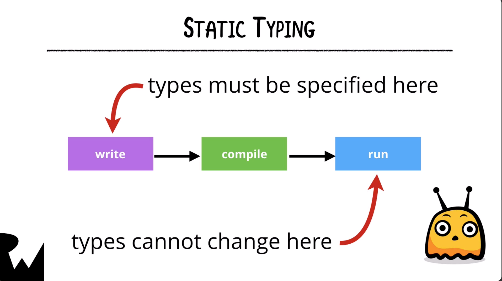
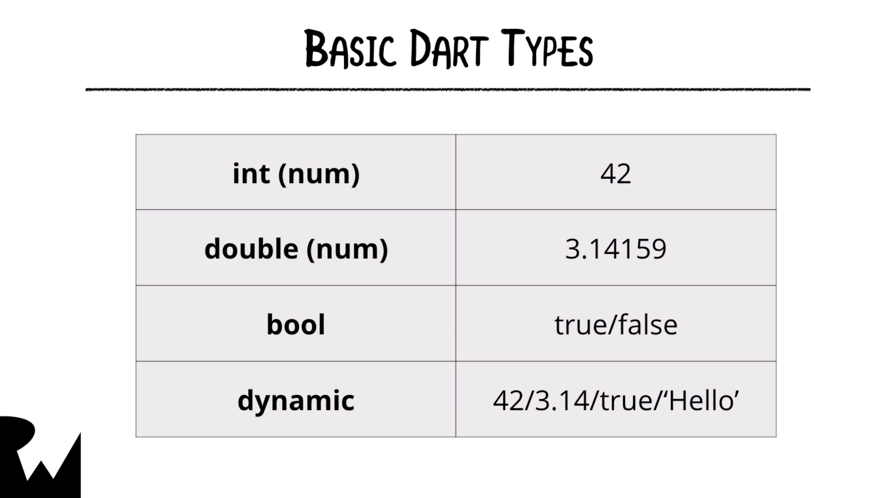
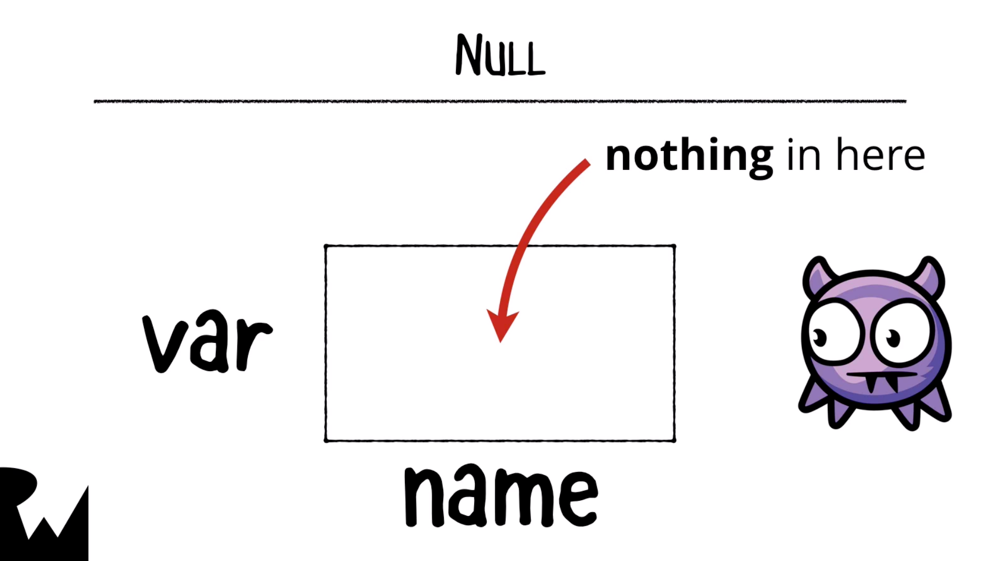

# Variable and Data Types

```dart
void main() {
  var myAge = 35;
  print(myAge);
  
  int yourAge = 42;
  print(yourAge);
  
  var pi = 3.14;
  double c = 2.99;
  print(pi);
  prtint(c);
  
  dynamic numbrtOfKittens; 
  numbrtOfKittens = 'There are not kittens!';
  print(numbrtOfKittens);
  
  numbrtOfKittens = 8.0;
  print(numberOfKittens);
  
  numbrtOfKittens = 0;
  
  bool areThereKittens = false;
  print(areThereKittens);
  
  int numberOfPuppies;
  print(numberOfPuppies); // null
  
  const speedOfLight = 334343;
  print(speedOfLight);
  
  final planet = 'Jupiter';
  final String moon = 'Europe';
  print('$planet has a moon $moon');
  
  final moreNumbers = const[7, 8, 9];
  moreNumbers = [4, 5, 6]; // compile time error，final不可以再次被指定
  moreNumbers.add(10); // run time errror, 因為list是const

}
```

- Dart是static types, 也就是說所有在dart中的變數都一定有一個type，且在compiler之前就已經被決定好了，且在執行時就不能被更改，這跟Python, JavaScript這種dynamic type的語言不同。

  

  

  

  