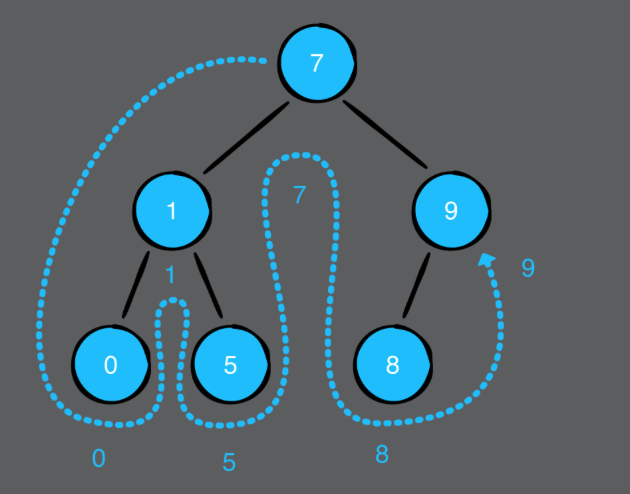
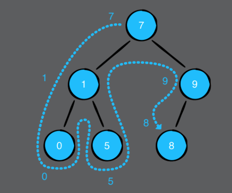
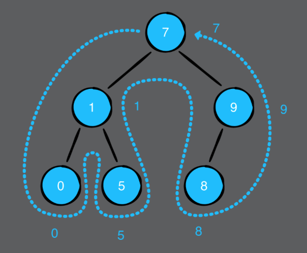

# Chapter 12: Binary Trees

#### 前言

二元樹是一個相當重要的樹結構，後面會提到的binary search tree和AVL tree都是根據二元樹再插入跟刪除方面做一個加強的限制。

------

#### 大綱

- Implementation
- Building a diagram
- Traversal algorithms
  - In-order traversal
  - Pre-order traversal
  - Post-order traversal

------

## Implementation

- 二元樹，就是每個node最多只有兩個children。

```swift
public class BinaryNode<Element> {

    public var value: Element
    public var leftChild: BinaryNode?
    public var rightChild: BinaryNode?

    public init(value: Element) {
        self.value = value
    }
}
```


------

## Building a diagram

- 只是把樹狀結構畫出來，我是覺得不重要。但還是把code寫出來

```swift
extension BinaryNode: CustomStringConvertible {

    public var description: String {
        return diagram(for: self)
    }

    private func diagram(for node: BinaryNode?,
                         _ top: String = "",
                         _ root: String = "",
                         _ bottom: String = "") -> String {
        guard let node = node else {
            return root + "nil\n"
        }
        if node.leftChild == nil && node.rightChild == nil {
            return root + "\(node.value)\n"
        }
        return diagram(for: node.rightChild,
                       top + " ", top + "┌──", top + "│ ")
            + root + "\(node.value)\n"
            + diagram(for: node.leftChild,
                      bottom + "│ ", bottom + "└──", bottom + " ")
    }
}
```


------

## Traversal algorithms

- 前一章介紹的兩種Traversal當然也可以用在二元樹，但在二元樹又有其他比較特殊的Traversal。
- **In-order traversal(左根右)**



```swift
  public func traverseInOrder(visit: (Element) -> Void) {
        leftChild?.traverseInOrder(visit: visit)
        visit(value)
        rightChild?.traverseInOrder(visit: visit)
    }
```


- **Pre-order traversal(根左右)**



```swift
    public func traversePreOrder(visit: (Element) -> Void) {
        visit(value)
        leftChild?.traversePreOrder(visit: visit)
        rightChild?.traversePreOrder(visit: visit)
    }

```


- **Post-order traversal(左右根)**



```swift
    public func traversePostOrder(visit: (Element) -> Void) {
        leftChild?.traversePostOrder(visit: visit)
        rightChild?.traversePostOrder(visit: visit)
        visit(value)
    }
```

