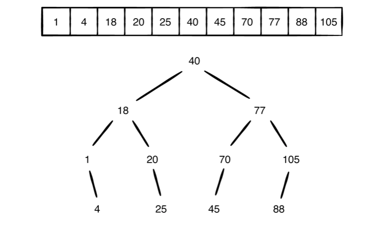
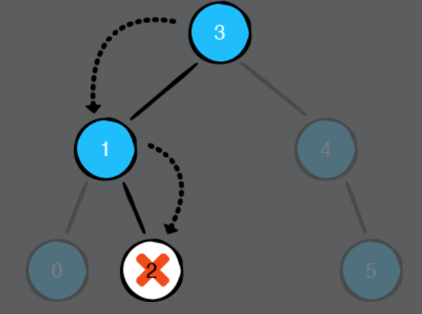
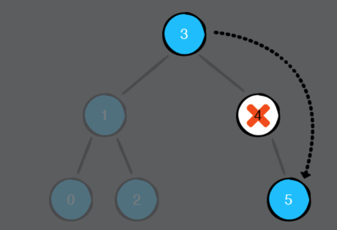
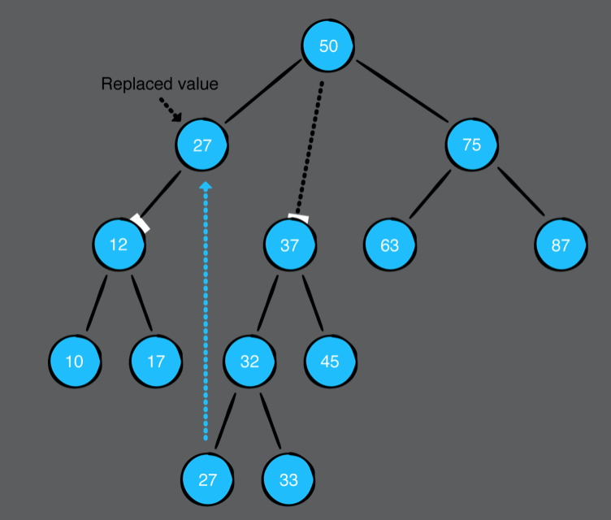

# Chapter 14: Binary Search Trees

#### 前言

二元搜尋樹是一個相當厲害的資料結構，在尋找，插入，刪除的平均時間複雜度為O(log n)，相對其他線性的資料結構都快上很多。

------

#### 大綱

- Case study: array vs. BST
  - Lookup
  - Insertion
  - Removal
- Implementation
  - Inserting elements
  - Finding elements
  - Optimizing contains
  - Removing elements
    - Case 1: Leaf node
    - Case 2: Nodes with one child
    - Case 3: Nodes with two children
    - Implementation

------

#### Case study: array vs. BST

先來討論一下array和BST的差異，以下面case為例



- Lookup
  - 對於一個unsorted array只能一一尋找所需要的元素
    - That’s why array.contains(:) is an O(n) operation.
  - 對於一顆平衡的BST, 每次的尋找都可以排除一半其他不可能的元素，其複雜度為O(log n) 
- Insertion
  - 每次插入元素都array中，都會造成被插入位置的後方元素進行位移的動作
    - In the above example, zero is inserted in front of the array, causing all other elements to shift backwards by one position. Inserting into an array has a time complexity of O(n).
  - 對於BST找到對應插入位置只需要O(log n) 
- - Removing an element from a BST is still an O(log n) operation.

------

#### Inserting elements

- 對於一顆BST的定義
  - leftChild.vale < root.value
  - rightChild.value >= root.value

```swift
extension BinarySearchTree {

    public mutating func insert(_ value: Element) {
        // 根據插入值決定新的root位置
        root = insert(from: root, value: value)
    }

    private func insert(from node: BinaryNode<Element>?, value: Element) -> BinaryNode<Element> {
        // 如果目前沒有root, 則當前的插入值則為新root
        guard let node = node else {
            return BinaryNode(value: value)
        }

        // 利用遞迴方式繼續往下尋找
        if value < node.value {
            node.leftChild = insert(from: node.leftChild, value: value)
        } else {
            node.rightChild = insert(from: node.rightChild, value: value)
        }

        return node
    }
}
```

------

#### Finding elements

- 透過traverseInOrder來找element，並沒有好好活用到BST的特性。

```swift
    public func contains(_ value: Element) -> Bool {
        guard let root = root else {
            return false
        }

        var found = false
        // In-order traversal has a time complexity of O(n)
        root.traverseInOrder {
            if $0 == value {
                found = true
            }
        }

        return found
    }
```

------

#### Optimizing contains

- 活用BST特性，不用每個element都要走過。

```swift
    public func opt_contains(_ value: Element) -> Bool {

        var current = root

        while let node = current {
            if node.value == value {
                return true
            }
            // 利用BST特點來尋找
            // This implementation of contains is an O(log n) operation in blanced binary search tree
            if value < node.value {
                current = node.leftChild
            } else {
                current = node.rightChild
            }
        }

        return false
    }
```

------

#### Removing elements

- 刪除元素，對BST是比較複雜的，有下列種case要討論

  - Case 1: Leaf node 

    - 被刪除的節點是葉子，這個好處理就直接刪除

    

  - Case 2: Nodes with one child

    - 被刪除的節點有一個child, 那需要處理這個child，但也很簡單，就是把這個child連接到阿公節點。
    - 
    - 

  - Case 3: Nodes with two children

    - 被刪除的節點有兩個child, 處理方式就是拿右子樹的最小值來當root，當然也可以拿左子樹的最大值來當root。

    

  - 

```swift
extension BinarySearchTree {

    public mutating func remove(_ value: Element) {
        root = remove(node: root, value: value)
    }

    private func remove(node: BinaryNode<Element>?, value: Element) -> BinaryNode<Element>? {
        guard let node = node else {
            // 連root都沒有，也沒啥好刪
            return nil
        }

        if value == node.value {
            // case1: 在leaf
            if node.leftChild == nil && node.rightChild == nil {
                // 直接刪除root
                return nil
            }

            // case2: 此node只有一個child
            if node.leftChild == nil {
                return node.rightChild
            }
            if node.rightChild == nil {
                return node.leftChild
            }

            // case3: 此node有兩個children
            node.value = node.rightChild!.min.value
            node.rightChild = remove(node: node.rightChild, value: node.value)

        } else if value < node.value {
            // 遞迴處理
            node.leftChild = remove(node: node.leftChild, value: value)
        } else {
            // 遞迴處理
            node.rightChild = remove(node: node.rightChild, value: value)
        }

        return node
    }
    
}
```

