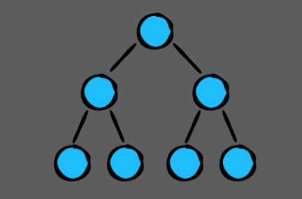
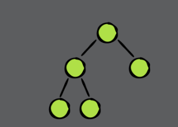
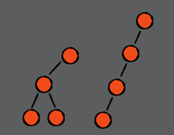
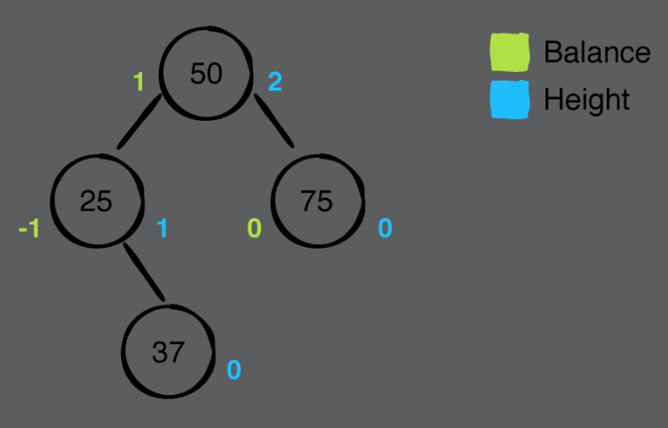
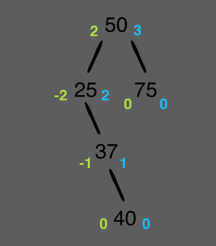
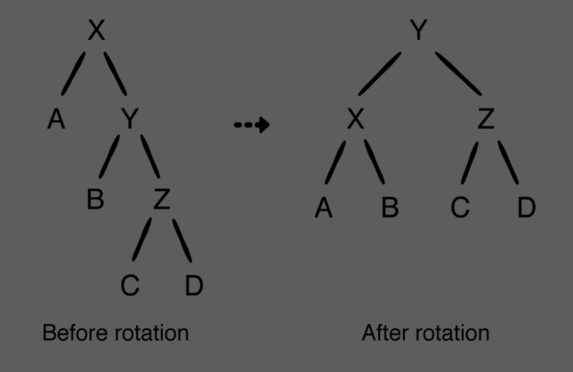
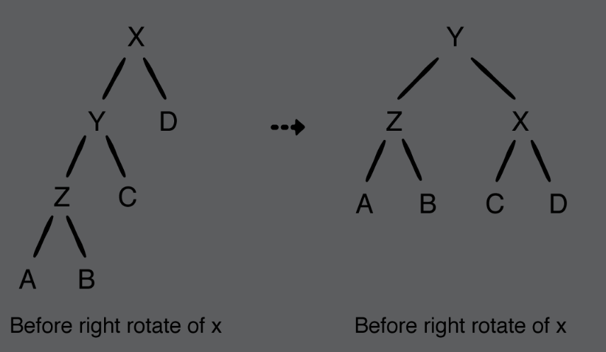
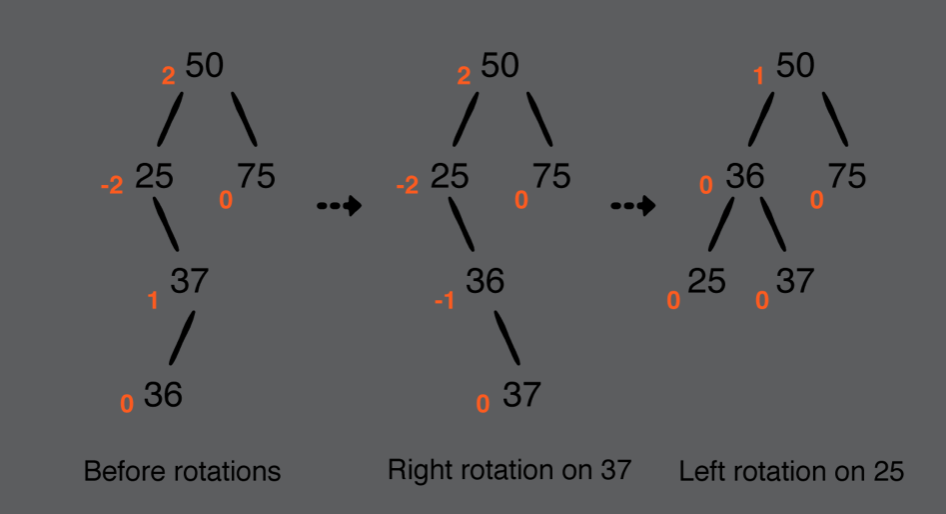
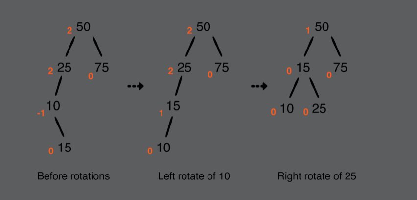

# Chapter 16: AVL Trees

#### 前言

AVL tree是在每次插入，刪除node時，會注意tree的平衡性。非平衡的BST就是失去BST該有的優異特性，所以不斷保持tree的平衡，就是AVL tree的特色。

------

#### 大綱

- Understanding balance
  - Perfect balance
  - "Good-enough" balance
  - Unbalanced
- Implementation
  - Measuring balance
  - Rotations
    - Left rotation
    - Right rotation
    - Right-left rotation
    - Left-right rotation
  - Balance
  - Revisiting insertion
  - Revisiting remove

------

#### Understanding balance

首先，我們要給平衡下個定義，怎樣的狀況才叫做平衡。

- Perfect balance

  - The definition of a balanced tree is that every level of the tree must be filled, except for the bottom level.

  

- "Good-enough" balance

  - The definition of a balanced tree is that every level of the tree must be filled, except for the bottom level
  - 

- Unbalanced



------

#### Measuring balance

-  balance factor: 左右子樹的高度差不能超過1。

- 從樹的底端開始向上找起，找到第一個balance factor大於1或小於-1的node，進行調整。

  - you only need to perform the balancing procedure on the bottom-most node containing the invalid balance factor: the node containing 25

  



```swift
    public var height = 0
    public var leftHeight: Int {
        // 如果沒有左子樹就回傳-1
        return leftChild?.height ?? -1
    }
    public var rightHeight: Int {
        // 如果沒有右子樹就回傳-1
        return rightChild?.height ?? -1
    }
    // 用來衡量當前node的左右兩個子樹是否平衡
    public var balenceFactor: Int {
        return leftHeight - rightHeight
    }
```

------

#### Rotations

當遇到沒有平衡的node, 必須經過rotation，讓這個node恢復平衡，根據不平衡的情況，總共有4種rotation狀況。

- Left rotation



```swift
    // Left rotation
    private func leftRotate(_ node: AVLNode<Element>) -> AVLNode<Element> {
        // pivot經過Left rotation會變成當前的root
        let pivot = node.rightChild!
        // node是當前的root經過Left rotation其右子樹是原本pivot的左邊
        node.rightChild = pivot.leftChild
        // pivot變成root後，左子樹為之前的root
        pivot.leftChild = node
        // 更新經過Left rotation, 前後兩個root的高度
        node.height = max(node.leftHeight, node.rightHeight) + 1
        pivot.height = max(pivot.leftHeight, pivot.rightHeight) + 1

        return pivot
    }
```


- Right rotation



```swift
    // Right rotation
    private func rightRotate(_ node: AVLNode<Element>) -> AVLNode<Element> {
        let pivot = node.leftChild!
        node.leftChild = pivot.rightChild
        pivot.rightChild = node
        node.height = max(node.leftHeight, node.rightHeight) + 1
        pivot.height = max(pivot.leftHeight, pivot.rightHeight) + 1

        return pivot
    }
```


- Right-left rotation



```swift
    // Right-left rotation
    private func rightLeftRotate(_ node: AVLNode<Element>) -> AVLNode<Element> {
        guard let rightChild = node.rightChild else {
            return node
        }
        // 先對當前node的右子樹進行rightRotate
        node.rightChild = rightRotate(rightChild)

        // 在對當前node為root的整棵樹進行leftRotate
        return leftRotate(node)
    }
```


- Left-right rotation



```swift
    // Left-right rotation
    private func leftRightRotate(_ node: AVLNode<Element>) -> AVLNode<Element> {
        guard let leftChild = node.leftChild else {
            return node
        }
        node.leftChild = leftRotate(leftChild)

        return rightRotate(node)
    }
```

------

#### Balance

現在已經有上面4種不同rotation方式，接下來就是依據不同情況進行不同的rotaion，讓tree恢復成平衡。

```swift
    // 進行平衡
    private func balence(_ node: AVLNode<Element>) -> AVLNode<Element> {
        switch node.balenceFactor {
        case 2: // 表示左邊比右邊長
            // 判斷要進行哪種rotate
            if let leftChild = node.leftChild, leftChild.balenceFactor == -1 {
                return leftRotate(node)
            } else {
                return leftRotate(node)
            }
        case -2: // 表示右邊比左邊長
            if let rightChild = node.rightChild, rightChild.balenceFactor == 1 {
                return rightLeftRotate(node)
            } else {
                return leftRotate(node)
            }
        default:
            // 此node當前是平衡，無需調整
            return node
        }
    }
```

------

#### Revisiting insertion

有了balence的function, 接下就是修改insert fucntion，讓每次插入新的node時都要保持tree平衡。

```swift
 private func insert(from node: AVLNode<Element>?, value: Element) -> AVLNode<Element> {
    guard let node = node else {
      return AVLNode(value: value)
    }
    if value < node.value {
      node.leftChild = insert(from: node.leftChild, value: value)
    } else {
      node.rightChild = insert(from: node.rightChild, value: value)
    }

    // 檢查插入後當前node是否需要進行平衡動作
    let balancedNode = balence(node)
    balancedNode.height = max(balancedNode.leftHeight, balancedNode.rightHeight) + 1

    return balancedNode
  }
```

------

#### Revisiting remove

跟插入一樣類似的動作

```swift
private func remove(node: AVLNode<Element>?, value: Element) -> AVLNode<Element>? {
    guard let node = node else {
      return nil
    }
    if value == node.value {
      if node.leftChild == nil && node.rightChild == nil {
        return nil
      }
      if node.leftChild == nil {
        return node.rightChild
      }
      if node.rightChild == nil {
        return node.leftChild
      }
      node.value = node.rightChild!.min.value
      node.rightChild = remove(node: node.rightChild, value: node.value)
    } else if value < node.value {
      node.leftChild = remove(node: node.leftChild, value: value)
    } else {
      node.rightChild = remove(node: node.rightChild, value: value)
    }

    let balancedNode = balence(node)
    balancedNode.height = max(balancedNode.leftHeight, balancedNode.rightHeight) + 1

    return balancedNode
  }
```

