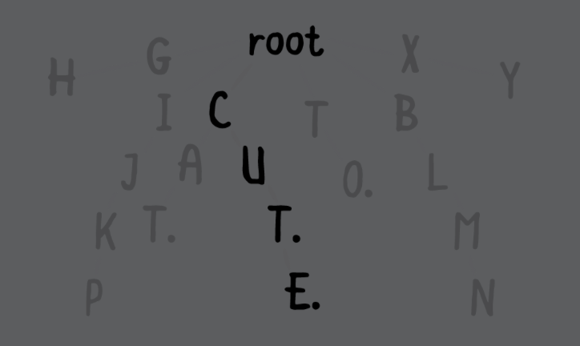

# Chapter 18: Tries

#### 前言

The trie (pronounced as try) is a tree that specializes in storing data that can be represented as a collection, such as English words. 

------

#### 大綱

- Example
- Implementation
  - TrieNode
  - Trie
  - Insert
  - Contains
  - Remove
  - Prefix matching

------

#### Example

什麼情況會用到trie這個結構。ex. 進行字串比對


利用暴力比對法

- The time complexity of words(matching:) is O(k*n), where k is the longest string in the collection, and n is the number of words you need to check


```swift
class EnglishDictionary {

  private var words: [String]
  
  func words(matching prefix: String) -> [String] {
    return words.filter { $0.hasPrefix(prefix) }
  }
}
```

------

#### TrieNode



```swift
public class TrieNode<Key: Hashable> {

    // key: 存的就是node中的資料，設成optional是因為trie的root是不會有key
    public var key: Key?

    // weak是用在後面的remove中
    public weak var parent: TrieNode?

    // 在trie中每個node會有很多children，利用dict來記錄這些children
    public var children: [Key: TrieNode] = [:]

    // 是否是一個collection的結束位置
    // ex. 一個字串中的最後一個字元
    public var isTerminating = false

    public init(key: Key?, parent: TrieNode?) {
        self.key = key
        self.parent = parent
    }
}
```

------

#### Trie

```swift
// The Trie class is built for all types that adopt the Collection protocol
// Each element inside the collection must be Hashable.
// This is required because you’ll use the collection’s elements as keys for the children dictionary in TrieNode.

public class Trie<CollectionType: Collection> where CollectionType.Element: Hashable {

    public typealias Node = TrieNode<CollectionType.Element>

    public let root = Node(key: nil, parent: nil)

    public init() {}

}

```

------

#### Insert

時間複雜度: O(K), k是collection的長度，因為要重複k次，把collection每個元素一一進行插入。

```swift
    public func insert(_ collection: CollectionType) {

        var current = root

        for element in collection {
            // 當前node中並沒有此elemnt的child
            if current.children[element] == nil {
                // 替當前node新增一個child
                current.children[element] = Node(key: element, parent: current)
            }
            // 繼續往下長
            current = current.children[element]!
        }

        // 走完上面迴圈，表示現在current已經走到collection尾端了
        current.isTerminating = true
    }

```

------

#### Contains

時間複雜度: O(K), k是collection的長度，因為要重複k次，把collection每個元素一一進行檢查確認。

```swift
    public func contains(_ collection: CollectionType) -> Bool {
        var currnt = root
        for element in collection {
            guard let child = currnt.children[element] else {
                // 目前node的child中並沒有當前元素，所以這個trie並沒包含這個collection
                return false
            }
            currnt = child
        }

        // 走到最末端，還要確認當前是否是終止節點
        return currnt.isTerminating
    }
```

------

#### Remove

時間複雜度: O(K), k是collection的長度，因為要重複k次，把collection每個元素一一進行刪除。

```swift
    public func remove(_ collection: CollectionType) {
        var current = root
        // 確認是否可以trie中走到collection最後一個元素
        for element in collection {
            guard let child = current.children[element] else {
                return
            }
            current = child
        }

        // 確保是結束節點
        guard current.isTerminating else {
            return
        }

        // 開始進行刪除
        current.isTerminating = false

        // current.children.isEmpty: 當前被刪除的元素是否是被其他collection所共用
        // current.isTerminating: collection中每個元素應該都不能是結束節點
        while let parent = current.parent, current.children.isEmpty && !current.isTerminating {
            // 清除
            parent.children[current.key!] = nil
            // 從末端往回一一清除
            current = parent
        }
    }
```

------

#### Prefix matching

這個Trie最經典有名的應用了

時間複雜度: k: 是在collection中符合prefix的長度, m: 是在目前collection中符合當前prefix的數量，原本暴力算法是n，每次都要比對原始collection的數量, 透過trie讓m會小於n

> collection(startingWith:) has a time complexity of O(k*m), where k represents the longest collection matching the prefix and m represents the number of collections that match the prefix.
> Recall that arrays have a time complexity of O(k*n), where n is the number of elements in the collection.

```swift
// 我們會用RangeReplaceableCollection中的append方法
public extension Trie where CollectionType: RangeReplaceableCollection {

    func collections(startingWith prefix: CollectionType) -> [CollectionType] {
        var current = root
        for element in prefix {
            guard let child = current.children[element] else {
                // 在tril中找不到任何符合的prefix
                return []
            }
            current = child
        }

        // 現在這個node之後的所有child都符合此prefix
        return collections(startingWith: prefix, after: current)
    }

    // 找出此node之後所有組合
    private func collections(startingWith prefix: CollectionType,
                             after node: Node) -> [CollectionType] {

        var results: [CollectionType] = []

        if node.isTerminating {
            results.append(prefix)
        }

        for child in node.children.values {
            var prefix = prefix
            prefix.append(child.key!)
            // 遞迴，繼續往下找組合
            results.append(contentsOf: collections(startingWith: prefix,
                after: child))
        }

        return results
    }

}
```

