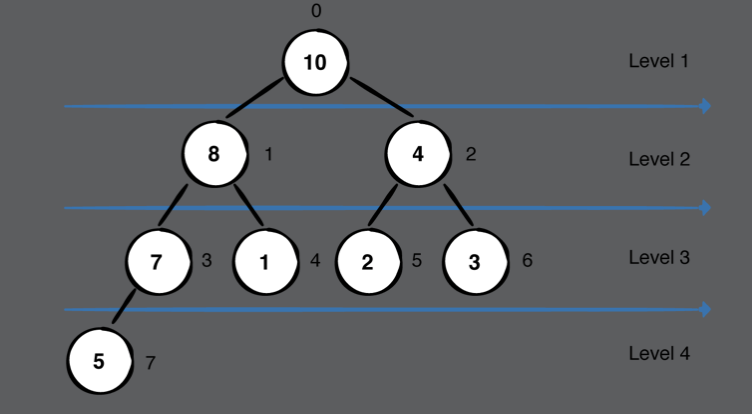
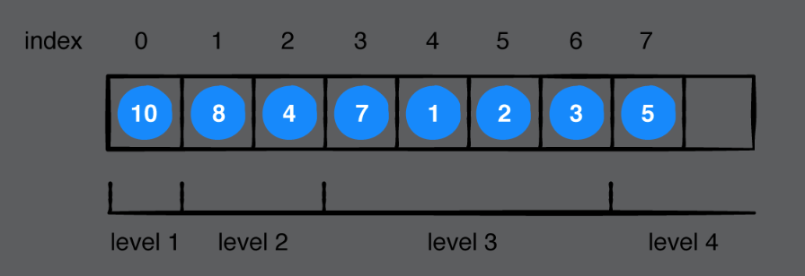
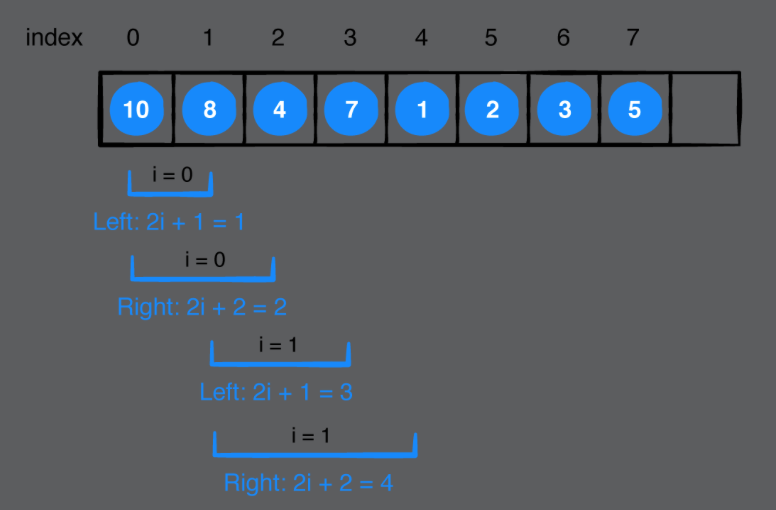
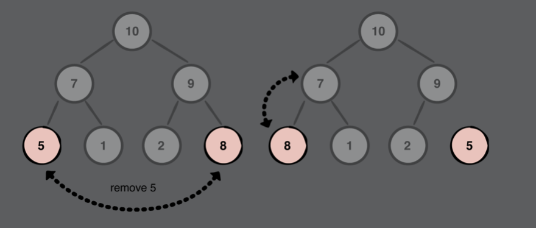
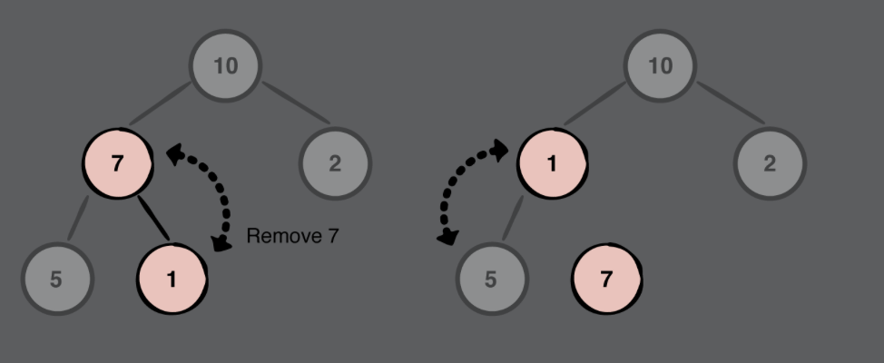
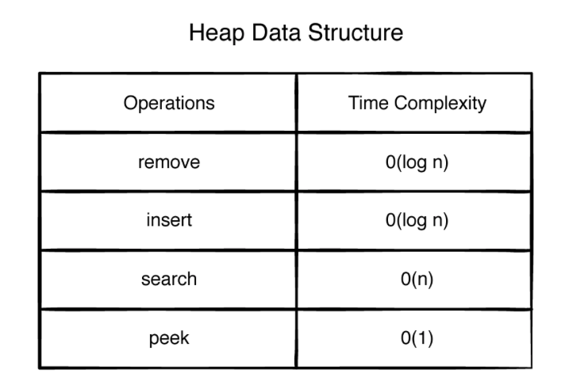

# Chapter 22: The Heap Data Structure

#### 前言

Heap資料結構是用來依序找出資料中最高(低)優先權的元素，優先權的定義是依照不同資料性質而定。

------

#### 大綱

- What is a heap?
- The heap property
- Heap applications
- Common heap operations
- How do you represent a heap?
- Removing from a heap
  - Implementation of remove
- Inserting into a heap
  - Implementation of insert
- Removing from an arbitrary index
- Searching for an element in a heap
- Building a heap
- Testing

------

#### What is a heap?

- Heap是一個complete binary tree, 所以跟tree一樣可以用一個array來進行構建。
  - Max Heap: elements with a higher value have a higher priority.
  - Min heap:  elements with a lower value have a higher priority.

------

#### The heap property

- Heap主要的兩個特性
  - Max Heap, 父節點的值一定大於或等於子節點的值，Min heap則相反。
  - Complete binary tree, 除了葉節點那層level以外，其他level節點數目必須是長齊的。

------

#### Heap applications

- Calculating the minimum or maximum element of a collection.
- Heap sort.(CH32)
- Constructing a priority queue.(CH24)
- Constructing graph algorithms, like Prim’s or Dijkstra’s, with a priority queue.(CH42,44)

------

#### How do you represent a heap?

- 給一個node其index = i, 則
  - Left child = 2i + 1
  - Right child = 2i + 2

> Traversing down an actual binary tree to get the left and right child of a node is a O(log n) operation. In a random-access data structure, such as an array, that same operation is just O(1).
>







```Swift
    var isEmpty: Bool {
        return elements.isEmpty
    }

    var count: Int {
        return elements.count
    }

    func peek() -> Element? {
        return elements.first
    }

    func leftChildIndex(ofParentAt index: Int) -> Int {
        return (2 * index) + 1
    }

    func rightChildIndex(ofParentAt index: Int) -> Int {
        return (2 * index) + 2
    }

    func parentIndex(ofChildAt index: Int) -> Int {
        return (index - 1) / 2
    }
```

------

#### Removing from a heap

- Step1: 將root跟heap中最後一個元素對調
- Step2: 移除最後一個元素
- Step3: 調整heap, 由頂端root逐層向下調整(sift down), 維持heap特性

```swift
    mutating func remove() -> Element? {
        guard !isEmpty else { return nil }
        // 交換heap中root和最後一個元素
        elements.swapAt(0, count - 1)

        defer {
            // 確認是否需要進行heap調整
            siftDown(from: 0)
        }
        // 移除heap中最後一個元素
        return elements.removeLast()
    }

    mutating func siftDown(from index: Int) {
        // 指向parent
        var parent = index
        // 開始進行調整
        while true {
            // 取得左右小孩的index
            let left = leftChildIndex(ofParentAt: parent)
            let right = rightChildIndex(ofParentAt: parent)

            // 指向需要跟parent進行swap的index
            var candidate = parent
            if left < count && sort(elements[left], elements[candidate]) {
                // 如果有左小孩, 且左小孩的priority大於candidate
                candidate = left
            }
            if right < count && sort(elements[right], elements[candidate]) {
                // 如果有右小孩, 且右小孩的priority大於candidate
                candidate = right
            }
            if candidate == parent {
                // 如果candidate還是原來的parent, 表示不需要進行任何動作
                return
            }
            elements.swapAt(parent, candidate)
            parent = candidate
        }
    }
```

------

#### Inserting into a heap

- Step1: 將要插入元素放到heap中最後一個
- Step2: 調整heap, 由底端葉子逐層向上調整(sift up), 維持heap特性

```swift
    mutating func insert(_ element: Element) {
        elements.append(element)
        siftUp(from: elements.count - 1)
    }

    mutating func siftUp(from index: Int) {
        var child = index
        var parent = parentIndex(ofChildAt: index)
        while child > 0 && sort(elements[child], elements[parent]) {
            elements.swapAt(child, parent)
            child = parent
            // child > 0, 表示還可以繼續仼上找parent
            parent = parentIndex(ofChildAt: child)
        }
    }
```

------

#### Removing from an arbitrary index

```swift
    mutating func remove(at index: Int) -> Element? {
        guard index < elements.count else {
            return nil
        }
        if index == elements.count - 1 {
            return elements.removeLast()
        } else {
            // remove動作都是交換元素到最後一個
            elements.swapAt(index, elements.count - 1)
        }

        defer {
            // 如果刪除的節點不是葉子層，那就需要做siftDown
            siftDown(from: index)
            // 如果刪除的節點是葉子層，那就需要做siftUp
            siftUp(from: index)
        }

        return elements.removeLast()
    }
```



​	如果刪除的節點是葉子層(5)，那就需要做siftUp



如果刪除的節點不是葉子層(7)，那就需要做siftDown

------

#### Searching for an element in a heap

> heaps are not designed for fast searches. With a binary search tree, you can perform a search in O(log n) time, but since heaps are built using an array, and the node ordering in an array is different, you can’t even perform a binary search.

- the worst-case, an O(n) operation

```swift

    func index(of element: Element, startingAt i: Int) -> Int? {
        if i >= count {
            return nil
        }
        if sort(element, elements[i]) {
            // 如果要找的元素，比現在最大元素都還大，表示找不到了
            return nil
        }
        if element == elements[i] {
            return i
        }
        // 仼左邊下去找，且有找到
        if let j = index(of: element, startingAt: leftChildIndex(ofParentAt: i)) {
            return j
        }
        // 仼右邊下去找，且有找到
        if let j = index(of: element, startingAt: rightChildIndex(ofParentAt: i)) {
            return j
        }

        return nil
    }
```

------

#### Building a heap

> loop through the array backwards, starting from the first non-leaf node, and sift down all parent nodes.
>

```swift
    init(sort: @escaping (Element, Element) -> Bool, elements: [Element] = []) {
        self.sort = sort
        self.elements = elements

        // 對element內容進行調整
        if !elements.isEmpty {
            for i in stride(from: (elements.count / 2) - 1, through: 1, by: -1) {
                // 從非葉子的node，仼回進行調整
                siftDown(from: i)
            }
        }
    }
```

------

#### Testing

