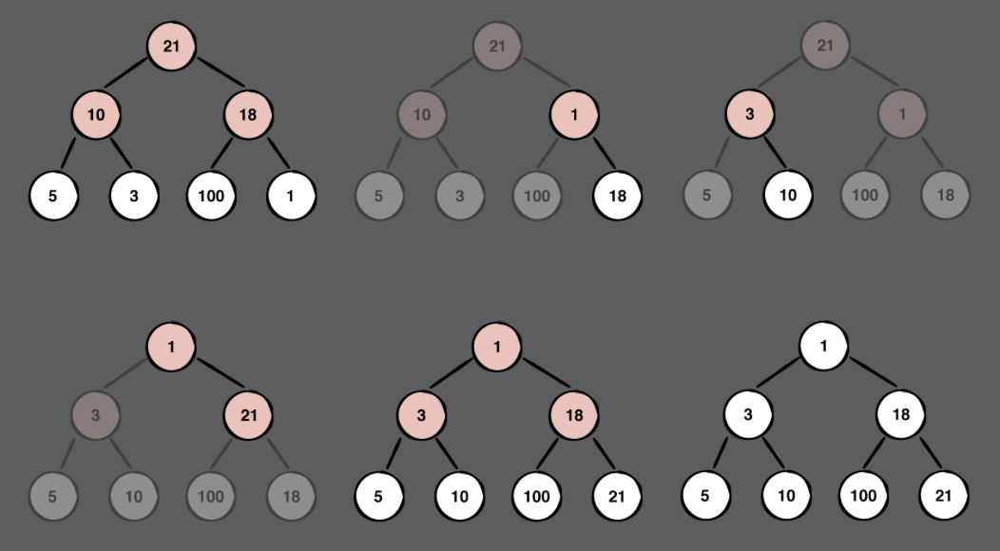

# Chapter 23: Heap Data Structure Challenges

> Challenge 1:
>
> Write a function to find the nth smallest integer in an unsorted array

- 思路: 利用min heap，每次remove都是移除當前最小，重複remove n次後的element, 就是array第n小的元素。

```swift
 func getNthSmallestElement(n: Int, elements: [Int]) -> Int? {
 
   // Your code here

+    var heap = Heap(sort: <, elements: elements) // O(n)
+    var current = 1 // 當前最小index的指針
+    while !heap.isEmpty {
+        let element = heap.remove() // O(log n)
+        if current == n { // 會重複執行n次，每次remove動作, 所以O(nlog n)
+            return element
+        }
+        current += 1 
+    }
+
   return nil
 }

```


------

> Challenge 2
>
> Given the following array, visually construct a min heap. Provide a step-by-step diagram of how the min heap is constructed.



------

> Challenge 3
>
> Write a method that combines two heaps.

- 思路: 先把兩個heap的elements, 利用array串接出來，然後再開始一個一個構建。

```swift
   mutating public func merge(heap: Heap) {
-
+    elements = elements + heap.elements
+    buildHeap()
   }

```


------

> Challenge 4
>
> Write a function to check if a given array is a min heap

- 思路: min heap的重要性質就是parent要比左右小孩都要小。

```swift
func isMinHeap<Element: Comparable> (elements: [Element]) -> Bool {

  // Your code here
    guard !elements.isEmpty else {
        return true
    }
    for i in stride(from: elements.count / 2 - 1, through: 0, by: -1) {
        let left = leftChildIndex(ofParentAt: i)
        let right = rightChildIndex(ofParentAt: i)
        // min heap是要滿足parent必須小於左右小孩
        if elements[left] < elements[i] {
            return false
        }
        if elements[right] < elements[i] {
            return false
        }
    }
  
  return true
}
```

