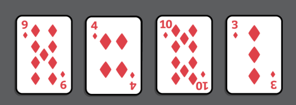
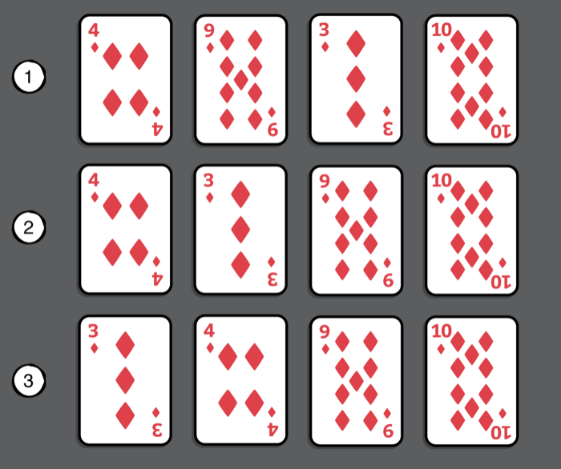
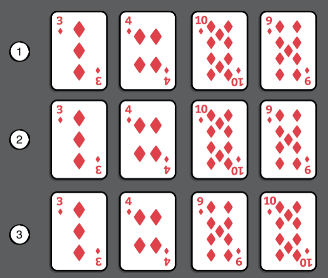
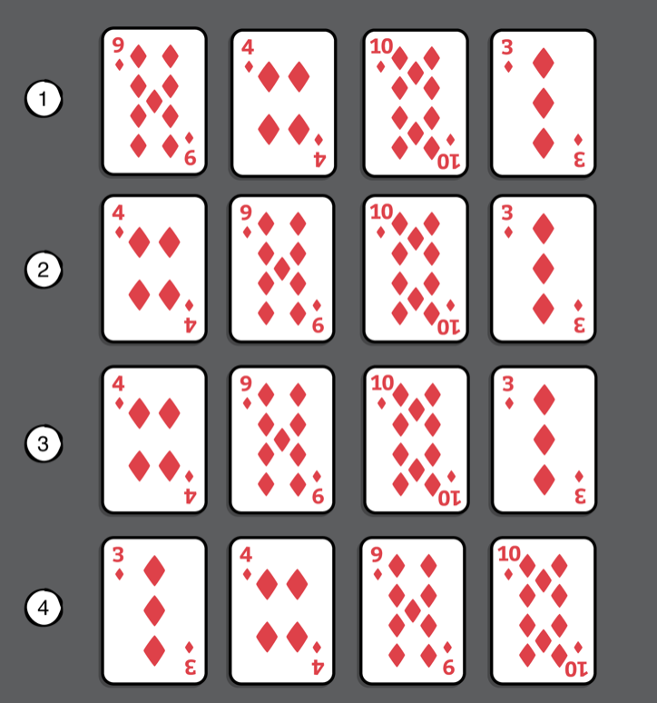

# Chapter 26: O(n²) Sorting Algorithms

#### 前言

O(n²)不算是效率很好的排序算法，但這類型算法是相對比較簡單好懂，這些算法在空間複雜度只需要O(1), 也相對優異。這些算法的基本原理都是**comparison-based sorting method**

------

#### 大綱

- Bubble sort
  - Example
  - Implementation
- Selection sort
  - Example
  - Implementation
- Insertion sort
  - Example
  - Implementation
- Generalization

------

#### Bubble sort

- Example
  - 每一回合，都是相鄰的兩邊一一進行比較，把較大的值仼右進行交換。





- Implementation

```swift
public func bubbleSort<Element>(_ array: inout [Element]) where Element: Comparable {
    guard array.count > 2 else {
        return
    }

    // 第一個for loop是總共要比n-1回
    // end = [3, 2, 1]
    for end in (1..<array.count).reversed() {
        var swapped = false
        // 每一回要比end-1次
        // 每一回結束時，end位置已經是最大，所以下一回合，就只是需要比到end-1的位置就夠了
        for current in 0..<end {
            if array[current] > array[current + 1] {
                array.swapAt(current, current + 1)
                swapped = true
            }
        }
        // 如果有某個回合中，都沒有swap動作，就確保已經排序完成
        if !swapped {
            return
        }
    }
}
```

------

#### Selection sort

- Example
  - 每一回合，都會找到最小的值，然後放到最左邊。




- Implementation

```swift
public func selectionSort<Element>(_ array: inout [Element]) where Element: Comparable {
    guard array.count > 2 else {
        return
    }
    // 要比ｎ－１回
    for current in 0..<(array.count - 1) {
        var lowest = current
        // 每一回結束時，current位置已經是最小，所以下一回合，就只是需要比到current＋1的位置就夠了
        for other in (current + 1)..<array.count {
            if array[lowest] > array[other] {
                lowest = other
            }
        }
        // 比bubble優化的地方，只有在lowest不在current才進行swap
        if lowest != current {
            array.swapAt(lowest, current)
        }
    }
}
```

------

#### Insertion sort

- Example
  - 每一回合，都是從從到右開始，每張卡回開始移動直到正確位置。




- Implementation

```Swift
public func insertionSort<Element>(_ array: inout [Element]) where Element: Comparable {
    guard array.count > 2 else {
        return
    }

    // 每一回合都要跟左邊開始比，index = 0沒有左邊，從index = 1開始比起
    // 要比n-2回
    for current in 1..<array.count {
        for shifting in (1...current).reversed() {
            // 每一回合依序跟左邊開始比
            if array[shifting] < array[shifting - 1] {
                array.swapAt(shifting, shifting - 1)
            } else {
                break
            }
        }

    }
}
```

------

#### Generalization

```swift
public func bubbleSort<T>(_ collection: inout T) where T: MutableCollection, T.Element: Comparable {
    guard collection.count >= 2 else {
        return
    }
    for end in collection.indices.reversed() {
        var swapped = false
        var current = collection.startIndex
        while current < end {
            let next = collection.index(after: current)
            if collection[current] > collection[next] {
                collection.swapAt(current, next)
                swapped = true
            }
            current = next
        }
        if !swapped {
            return
        }
    }
}

public func insertionSort<T>(_ collection: inout T)
    where T: BidirectionalCollection & MutableCollection,
    T.Element: Comparable {
        guard collection.count >= 2 else {
            return
        }
        for current in collection.indices {
            var shifting = current
            while shifting > collection.startIndex {
                let previous = collection.index(before: shifting)
                if collection[shifting] < collection[previous] {
                    collection.swapAt(shifting, previous)
                } else {
                    break
                }
                shifting = previous
            }
        }
}

public func selectionSort<T>(_ collection: inout T)
    where T: MutableCollection, T.Element: Comparable {
        guard collection.count >= 2 else {
            return
        }
        for current in collection.indices {
            var lowest = current
            var other = collection.index(after: current)
            while other < collection.endIndex {
                if collection[lowest] > collection[other] {
                    lowest = other
                }
                other = collection.index(after: other)
            }
            if lowest != current {
                collection.swapAt(lowest, current)
            }
        }
}

```

