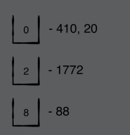
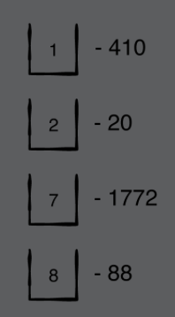
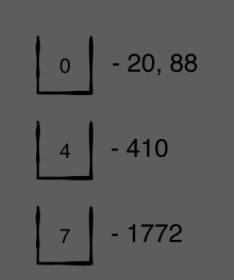
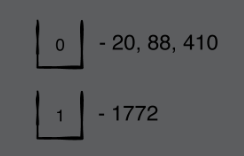

# Chapter 30: Radix Sort

#### 前言

Radix Sort是一很特殊的算法，他不是利用comparative sort，比較像vending machines accept coins — the coins are distinguished by size. Radix Sort用來排序進位制的數字的最快一種算法

------

#### 大綱

- Example
- Implementation
  - Bucket Sort
  - When do you stop?


------

#### Example

- 一開始, 有4個數字88, 410, 1772, 20
- 先觀察，4個數字的個位數符號，分別是0,2,8
  - 先把4個數字分別放到0,2,8這3個桶子中



```swift
array = [410, 20, 1772, 88]
```


- 再觀察十位數符號，分別是1,2,7,8



```Swift
array = [410, 20, 1772, 88]
```


- 再觀察百位數符號，分別是0,4,7



```Swift
array = [20, 88, 410, 1772]
```


- 再觀察千位數符號，分別是0,1



```swift
array = [20, 88, 410, 1772]
```

------

#### Implementation

```swift
// RadixSort只能用在不同進位的數字上(ex. 10進位)
extension Array where Element == Int {

    public mutating func radixSort() {

        // 10進位
        let base = 10
        // 紀錄是否已經完成整個sort
        var done = false
        var digits = 1

        while !done {
            done = true
            // 開始進行bucket sort
            // 10進位，分成10個bucket
            var bucket: [[Int]] = .init(repeating: [], count: base)

            // 每次需要將array所有數字進行分桶 = O(n)
            forEach { (number) in
                // ex. remainingPart = 317 / 10 = 31.7
                let remainingPart = number / digits
                // ex. digit = 1
                let digit = remainingPart % base
                // 放入對應的bucket中
                bucket[digit].append(number)
                // 設定終止條件
                // 總共會需要進行k次
                // k is the number of significant digits of the largest number”
                if remainingPart > 0 {
                    done = false
                }
            }

            // 準備進行下一回
            digits *= base
            // 將所有bucket在打散
            self = bucket.flatMap { $0 }
        }
    }

}
```

