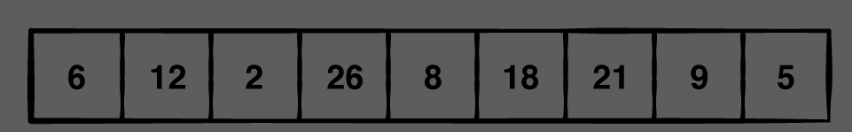
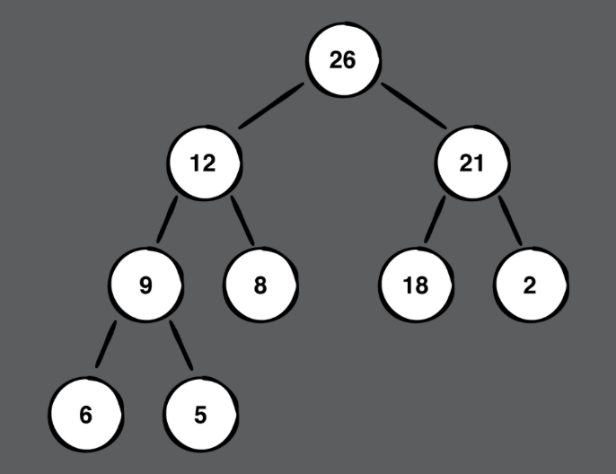
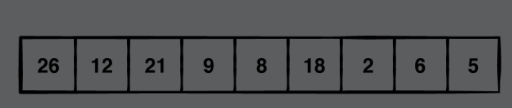
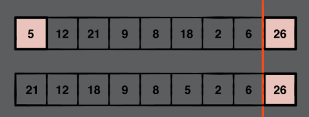
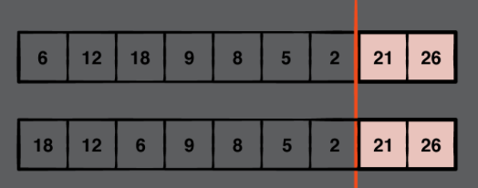

# Chapter 32: Heap Sort

#### 前言

Heap sort的作法就是將資料集建成max或min heap再利用comparison-based來進行sort。

------

#### 大綱

- Getting started
- Example
- Implementation
- Performance

------

#### Example

- 先把array的資料轉成max heap

  





- 每次都把最大元素搬到array的最後一個index，再把被交換的元素搬到正確位置。
  - You simply repeat the swapping and sifting steps until you reach a heap of size 1. The array is then fully sorted.






------

#### Implementation

```swift
extension Heap {
    func sorted() -> [Element] {
        // 建立一個heap
        var heap = Heap(sort: sort, elements: elements)
        // 從heap末端開始處理 ex. 10, 9, 8....
        // O(n): traverse the whole list once
        for index in heap.elements.indices.reversed() {
            // 把第一個也是root, 也是heap中最大的元素，搬到最末端
            heap.elements.swapAt(0, index)
            // 把剛剛交換到index = 0的元素放到正確位置
            // O(log n): siftDown 
            heap.siftDown(from: 0, upTo: index)
        }

        return heap.elements
    }
}
```

