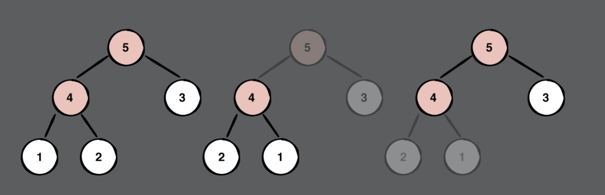
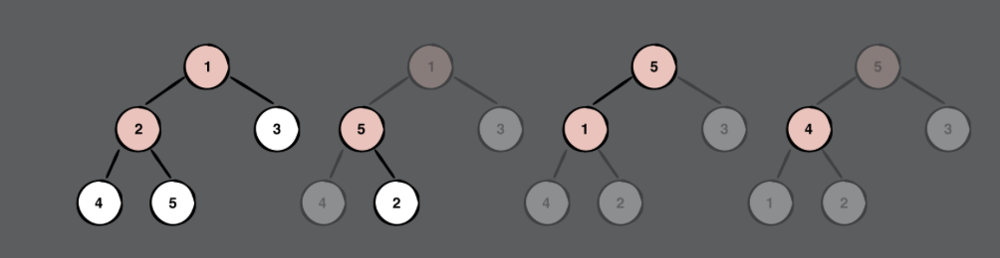

# Chapter 33: Heap Sort Challenges

> Challenge 1
>
> Add a heapSort() method to Array. This method should sort the array in ascending order. A template has been provided for you in the starter playground.

- 思路: 要可以進行heap sort, 表示array中的元素要 Comparable

```swift
extension Array where Element: Comparable {
  
  func leftChildIndex(ofParentAt index: Int) -> Int {
    return (2 * index) + 1
  }
  
  func rightChildIndex(ofParentAt index: Int) -> Int {
    return (2 * index) + 2
  }
  
  mutating func siftDown(from index: Int, upTo size: Int) {
    var parent = index
    while true {
      let left = leftChildIndex(ofParentAt: parent)
      let right = rightChildIndex(ofParentAt: parent)
      var candidate = parent
      
      if (left < size) && (self[left] > self[candidate]) {
        candidate = left
      }
      if (right < size) && (self[right] > self[candidate]) {
        candidate = right
      }
      if candidate == parent {
        return
      }
      swapAt(parent, candidate)
      parent = candidate
    }
  }
  
  mutating func heapSort() {
    // do something
    // 建立heap
    if !isEmpty {
        for i in stride(from: count / 2  - 1, through: 0, by: -1) {
            siftDown(from: i, upTo: count)
        }
    }

    // 執行heap sort
    for index in indices.reversed() {
        swapAt(0, index)
        siftDown(from: 0, upTo: index)
    }
  }
}
```


------

> Challenge 2
>
> When performing a heap sort in ascending order, which of these starting arrays requires the fewest comparisons?
>
> [1,2,3,4,5]
> [5,4,3,2,1]

- 思路: 首先要建立max heap, 而我們要看的就是在建立max heap總共分別進行幾次比較

* [5,4,3,2,1] 需要2次比較

  

* [1,2,3,4,5] 需要3次比較

  

------

> Challenge 3
>
> The current implementation of heap sort in Chapter 32 sorts the elements in ascending order. How would you sort in descending order?

- 思路: 先建立一個min heap, 再進行heap sort。

```swift
let heap = Heap(sort: <, elements: [6, 12, 2, 26, 8, 18, 21, 9, 5])
print(heap.sorted())
```

