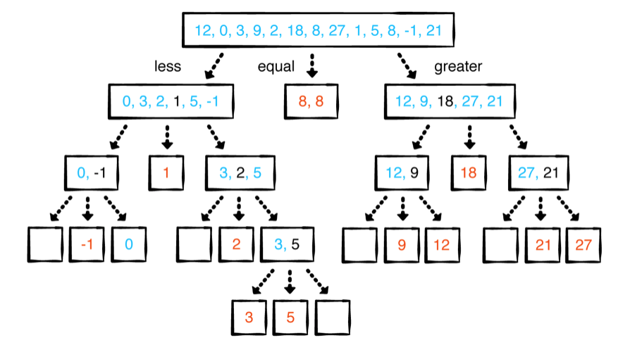

# Chapter 34: Quicksort

#### 前言

Quicksort也是comparison-based sorting algorithm跟Merge sort很像，但有一個很重要特性Quicksort利用pivot來分割資料集

```
[ elements < pivot | pivot | elements > pivot ]
```

------

#### 大綱

- Example
- Partitioning strategies
  - Lomuto’s partitioning
  - Hoare’s partitioning
- Effects of a bad pivot choice
  - Median of three
  - Dutch national flag partitioning


------

#### Example

- 每次都選擇中間當pivot

```swift
public func quicksortNaive<T: Comparable>(_ a: [T]) -> [T] {
  guard a.count > 1 else {
    return a
  }
  let pivot = a[a.count / 2]
  let less = a.filter { $0 < pivot }
  let equal = a.filter { $0 == pivot }
  let greater = a.filter { $0 > pivot }
  return quicksortNaive(less) + equal + quicksortNaive(greater)
}
```

  

> - Calling filter three times on the same array is not efficient.
> - Creating a new array for every partition isn’t space efficient. Could you possibly sort in place?
> - Is picking the middle element the best pivot strategy? What pivot strategy should you adopt?

------

#### Lomuto’s partitioning

- Always chooses the last element as the pivot

```
[ values <= pivot | values > pivot | not compared yet | pivot ]
  low         i-1   i          j-1   j         high-1   high
```

```swift
public func partitonLomuto<T: Comparable>(_ a: inout [T], low: Int, high: Int) -> Int {
    // Lomuto是將最後一個元素設成pivot
    let pivot = a[high]

    // i用來記錄有多少元素小於pivot
    var i = low
    // 遍歷low到high, 但不包括high, 因為high已經拿來當pivot
    for j in low..<high {
        if a[j] <= pivot {
            // 若j指向的元素小於pivot，則跟i當前指向元素進行交換
            a.swapAt(i, j)
            i += 1
        }
    }
    // 最後跟pivot交換，讓pivot永遠是小於區塊跟大於區塊的分界點
    a.swapAt(i, high)

    return i
}

public func quicksortLomuto<T: Comparable>(_ a: inout [T], low: Int, high: Int) {
    // 遞迴終止條件
    if low < high {
        let pivot = partitonLomuto(&a, low: low, high: high)
        // 遞迴
        quicksortLomuto(&a, low: low, high: pivot - 1)
        quicksortLomuto(&a, low: pivot + 1, high: high)
    }

}
```

------

#### Hoare’s partitioning

- Always chooses the First element as the pivot

```swift
public func partitionHoare<T: Comparable>(_ a: inout [T], low: Int, high: Int) -> Int {
    // Hoare是將第一個元素設成pivot
    let pivot = a[low]
    // 在i之前的元素，是小於等於pivot
    var i = low - 1
    // 在j之後的元素，是大於pivot
    var j = high + 1

    while true {
        repeat { j -= 1 } while a[j] > pivot
        repeat { i += 1 } while a[i] < pivot

        if i < j {
            // 當i所指元素大於pivot
            // 或j所指元素小於pivot
            a.swapAt(i, j)
        } else {
            // 迴圈終止條件
            return j
        }
    }
}

public func quicksortHoare<T: Comparable>(_ a: inout [T], low: Int, high: Int) {
    if low < high {
        let p = partitionHoare(&a, low: low, high: high)
        quicksortHoare(&a, low: low, high: p)
        quicksortHoare(&a, low: p + 1, high: high)
    }
}
```

------

#### Median’s partitioning

- 非最前，非最後，非中間

```swift
public func medianOfThree<T: Comparable>(_ a: inout [T], low: Int, high: Int) -> Int {
    let center = (low + high) / 2
    if a[low] > a[center] {
        a.swapAt(low, center)
    }
    if a[low] > a[high] {
        a.swapAt(low, high)
    }
    if a[center] > a[high] {
        a.swapAt(center, high)
    }
    return center
}

public func quickSortMedian<T: Comparable>(_ a: inout [T], low: Int, high: Int) {
    if low < high {
        // 預處理，找一個非第一個，非最後一個的元素
        let pivotIndex = medianOfThree(&a, low: low, high: high)
        a.swapAt(pivotIndex, high)
        let pivot = partitonLomuto(&a, low: low, high: high)
        quicksortLomuto(&a, low: low, high: pivot - 1)
        quicksortLomuto(&a, low: pivot + 1, high: high)
    }
}
```

------

#### Dutch national flag partitioning

- 比前幾個partitioning多處理相同的元素，相同的元素會放在一起

```swift
public func partitionDutchFlag<T: Comparable>(_ a: inout [T], low: Int, high: Int, pivotIndex: Int) -> (Int, Int) {
    let pivot = a[pivotIndex]
    var smaller = low
    // 在smaller和equal中間的所有元素皆等於pivot
    var equal = low
    var larger = high

    // 遞迴終止條件
    while equal <= larger {
        if a[equal] < pivot {
            // 當搬元素到小於的區域時，smaller,equal兩根指針都要向右移
            a.swapAt(smaller, equal)
            smaller += 1
            equal += 1
        } else if a[equal] == pivot {
            // 當搬元素到等於的區域時，equal指針都要向右移
            equal += 1
        } else {
            // 當搬元素到大於的區域時，larger指針都要向左移
            a.swapAt(equal, larger)
            larger -= 1
        }
    }
    return (smaller, larger)
}

public func quicksortDutchFlag<T: Comparable>(_ a: inout [T], low: Int, high: Int) {
    if low < high {
        let (middleFirst, middleLast) = partitionDutchFlag(&a, low: low, high: high, pivotIndex: high)
        quicksortDutchFlag(&a, low: low, high: middleFirst - 1)
        quicksortDutchFlag(&a, low: middleLast + 1, high: high)
    }
}
```

