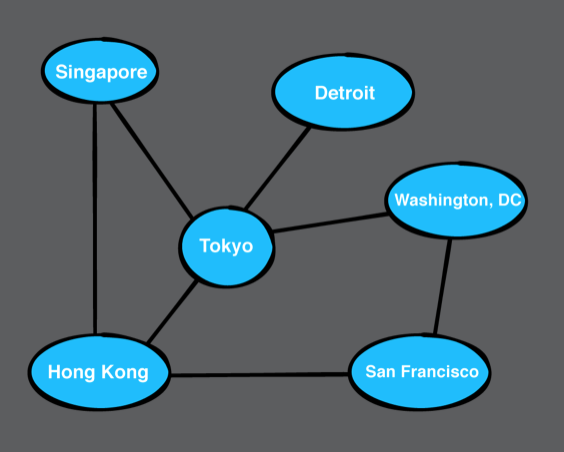
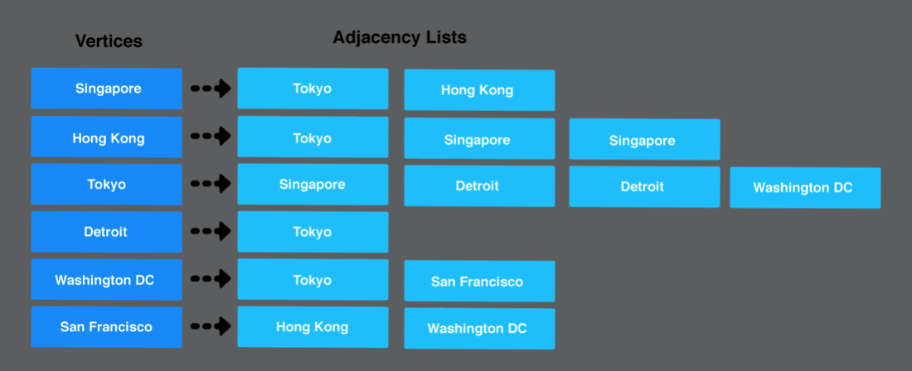
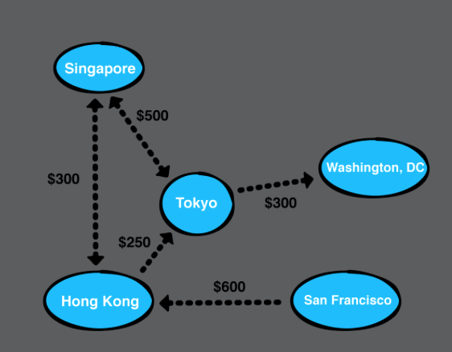
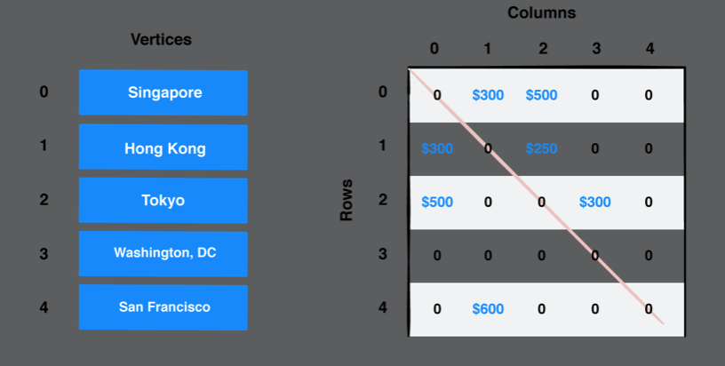
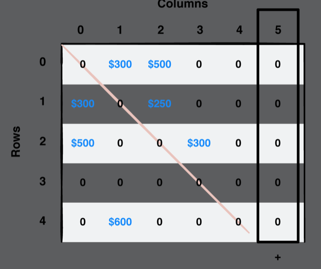
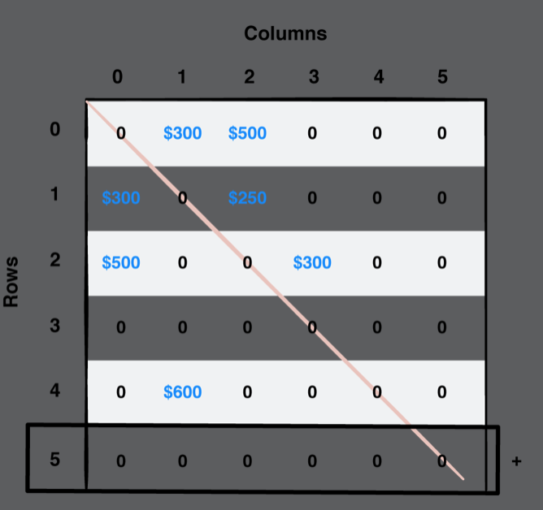
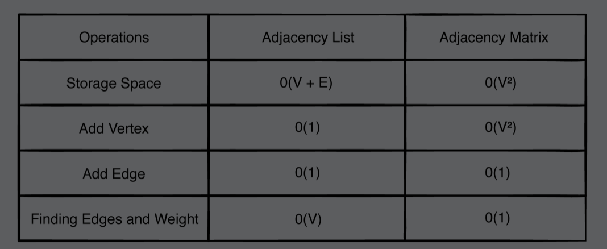

# Chapter 36: Graphs

#### 前言

圖是由點跟邊所構成的。本章介紹兩種不同方式來組成graph。

------

#### 大綱

- Weighted graphs
  - Directed graphs
  - Undirected graphs
- Common operations
- Defining a vertex
- Defining an edge
- Adjacency list
  - Implementation
    - Creating a vertex
    - Creating a directed edge
    - Creating an undirected edge
    - Retrieving the outgoing edges from a vertex
    - Retrieving the weight of an edge
    - Visualizing the adjacency list
    - Building a network
- Adjacency matrix
  - Implementation
    - Creating a Vertex
    - Creating edges
    - Retrieving the outgoing edges from a vertex
    - Retrieving the weight of an edge
    - Visualize an adjacency matrix
    - Building a network
- Graph analysis

------

#### Weighted graphs

- 邊具有權重

Directed graphs: 邊具有方向性

Undirected graphs: 無向邊可以看成雙向的意思

------

#### Common operations

常見的操作

- 加入點
- 加入方向邊
- 加入無向邊
- 取得於某個點相連的所有邊
- 取得某兩點之間邊的權重

```Swift
public enum EdgeType {

    case directed
    case undirected
}

public protocol Graph {

    associatedtype Element

    // 建立一個頂點並加入圖中
    func createVertex(data: Element) -> Vertex<Element>

    // 建立一個有向邊並加入圖中
    func addDirectedEdge(from source: Vertex<Element>,
                          to destination: Vertex<Element>,
                          weight: Double?)

    // 建立一個無向邊並加入圖中
    func addUndirectedEdge(between source: Vertex<Element>,
                           and destination: Vertex<Element>,
                           weight: Double?)

    // 利用EdgeType來決定邊並加入圖中
    func add(_ edge: EdgeType, from source: Vertex<Element>,
             to destination: Vertex<Element>,
             weight: Double?)

    // 取得從某個頂點出發的所有邊集合
    func edges(from source: Vertex<Element>) -> [Edge<Element>]

    // 取得任兩個頂點之間的所有邊的權重和
    func weight(from source: Vertex<Element>,
                to destination: Vertex<Element>) -> Double?

}
```

------

#### Defining a vertex

- A vertex has a unique index within its graph and holds a piece of data
- The Hashable protocol inherits from Equatable, so you must also satisfy this protocol's requirement. The compiler can synthesize conformance to both protocols, which is why the extensions above are empty.

```swift
// A vertex has a unique index within its graph and holds a piece of data.
public struct Vertex<T> {

    public let index: Int
    public let data: T
}

// The Hashable protocol inherits from Equatable, so you must also satisfy this protocol's requirement. The compiler can synthesize conformance to both protocols, which is why the extensions above are empty.
extension Vertex: Hashable where T: Hashable {}
extension Vertex: Equatable where T: Equatable {}

extension Vertex: CustomStringConvertible {

    public var description: String {
        return "\(index): \(data)"
    }
}
```

------

#### Defining an edge

- 邊可能具有權重，並且連接兩個點

```swift
public struct Edge<T> {

    public let source: Vertex<T>
    public let destination: Vertex<T>
    public let weight: Double?
}
```

------

#### Adjacency list

  

  

- Init

```swift
public class AdjacencyList<T: Hashable>: Graph {

    // 利用Dict來存相關訊息，因為要將利用T來當作Dict的key, 所以T必須是Hashable
    private var adjacencies: [Vertex<T>: [Edge<T>]] = [:]

    public init() {}
}
```

- Creating a vertex

```swift
    public func createVertex(data: T) -> Vertex<T> {
        let vertex = Vertex(index: adjacencies.count, data: data)
        adjacencies[vertex] = []
        return vertex
    }
```

- Creating a directed edge

```swift
    public func addDirectedEdge(from source: Vertex<T>,
                          to destination: Vertex<T>,
                          weight: Double?) {
        let edge = Edge(source: source, destination: destination, weight: weight)
        adjacencies[source]?.append(edge)
    }
```

- Creating an undirected edge

```swift
extension Graph {
    // 無向邊就是雙向邊
    public func addUndirectedEdge(between source: Vertex<Element>,
                                     and destination: Vertex<Element>,
                                     weight: Double?) {
        addDirectedEdge(from: source, to: destination, weight: weight)
        addDirectedEdge(from: destination, to: source, weight: weight)
    }

    public func add(_ edge: EdgeType, from source: Vertex<Element>,
                       to destination: Vertex<Element>,
                       weight: Double?) {
        switch edge {
        case .directed:
            addDirectedEdge(from: source, to: destination, weight: weight)
        case .undirected:
            addUndirectedEdge(between: source, and: destination, weight: weight)
        }
    }
  
}
```

- Retrieving the outgoing edges from a vertex

```swift
    public func edges(from source: Vertex<T>) -> [Edge<T>] {
        return adjacencies[source] ?? []
    }
```

- Retrieving the weight of an edge

```swift
    public func weight(from source: Vertex<T>, to destination: Vertex<T>) -> Double? {
        return edges(from: source)
            .first { $0.destination == destination }?
            .weight
    }
```

------

#### Adjacency matrix






- Init

```swift
public class AdjacencyMatrix<T>: Graph {

    private var vertices: [Vertex<T>] = []
    // weight是個martix
    private var weights: [[Double?]] = []

    public init() {}

}
```

- Creating a Vertex

```swift
    public func createVertex(data: T) -> Vertex<T> {
        let vertex = Vertex(index: vertices.count, data: data)
        vertices.append(vertex)

        // 在matrix上把新增的點對應的列跟行都設成nil
        for i in 0..<weights.count {
            weights[i].append(nil)
        }
        let row = [Double?](repeating: nil, count: vertices.count)
        weights.append(row)

        return vertex
    }
```





- Creating edges

```swift
    public func addDirectedEdge(from source: Vertex<T>, to destination: Vertex<T>, weight: Double?) {
        // 在martix對應位置上加上weight
        weights[source.index][destination.index] = weight
    }
```

- Retrieving the outgoing edges from a vertex

```swift
    public func edges(from source: Vertex<T>) -> [Edge<T>] {
        var edges: [Edge<T>] = []

        for column in 0..<weights.count {
            if let weight = weights[source.index][column] {
                edges.append(Edge(source: source, destination: vertices[column], weight: weight))
            }
        }

        return edges
    }
```

- Retrieving the weight of an edge

```swift
    public func weight(from source: Vertex<T>, to destination: Vertex<T>) -> Double? {
        return weights[source.index][destination.index]
    }
```

------

#### Graph analysis



- If there are few edges in your graph, it is considered a sparse graph, and an adjacency list would be a good fit. 
- If your graph has lots of edges, it’s considered a dense graph, and an adjacency matrix would be a better fit as you’d be able to access your weights and edges far more quickly.