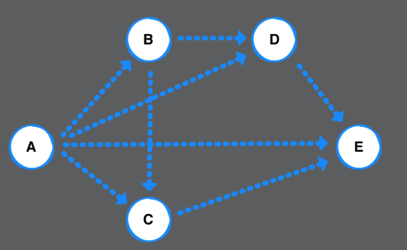

# Chapter 37: Graphs Challenges

> Challenge 1
>
> Write a method to count the number of paths between two vertices in a directed graph. The example graph below has 5 paths from A to E:




- 思路: 利用DFS

```swift
extension Graph where Element: Hashable {
    
  public func numberOfPaths(from source: Vertex<Element>, to destination: Vertex<Element>) -> Int {
    // Implement Solution Here.
    var numberOfPaths = 0
    var visited: Set<Vertex<Element>> = []
    // DFS
    paths(from: source, to: destination, visited: &visited, pathCounts: &numberOfPaths)

    return numberOfPaths
  }

    func paths(from source: Vertex<Element>, to destination: Vertex<Element>, visited: inout Set<Vertex<Element>>, pathCounts: inout Int) {
        visited.insert(source)
        if source == destination {
            // 找到一個path
            pathCounts += 1
        } else {
            let neighbors = edges(from: source)
            for edge in neighbors {
                // 要走之前沒走過的點
                if !visited.contains(edge.destination) {
                    paths(from: edge.destination, to: destination, visited: &visited, pathCounts: &pathCounts)
                }
            }
        }

        // Remove the source vertex from the visited set, so you can continue to find other paths to that node
        visited.remove(source)

    }
}
```


------


> Challenge 2
>
> Vincent has three friends, Chesley, Ruiz and Patrick. Ruiz has friends as well: Ray, Sun, and a mutual friend of Vincent’s. Patrick is friends with Cole and Kerry. Cole is friends with Ruiz and Vincent. Create an adjacency list that represents this friendship graph. Which mutual friend do Ruiz and Vincent share?

- 思路: 就利用AdjacencyList畫出來觀察

```swift
let graph = AdjacencyList<String>()

let vincent = graph.createVertex(data: "vincent")
let chesley = graph.createVertex(data: "chesley")
let ruiz = graph.createVertex(data: "ruiz")
let patrick = graph.createVertex(data: "patrick")
let ray = graph.createVertex(data: "ray")
let sun = graph.createVertex(data: "sun")
let cole = graph.createVertex(data: "cole")
let kerry = graph.createVertex(data: "kerry")

graph.add(.undirected, from: vincent, to: chesley, weight: 0)
graph.add(.undirected, from: vincent, to: ruiz, weight: 0)
graph.add(.undirected, from: vincent, to: patrick, weight: 0)
graph.add(.undirected, from: ruiz, to: ray, weight: 0)
graph.add(.undirected, from: ruiz, to: sun, weight: 0)
graph.add(.undirected, from: patrick, to: cole, weight: 0)
graph.add(.undirected, from: patrick, to: kerry, weight: 0)
graph.add(.undirected, from: cole, to: ruiz, weight: 0)
graph.add(.undirected, from: cole, to: vincent, weight: 0)

print(graph)
print("Ruiz and Vincent both share a friend name Cole")

```

