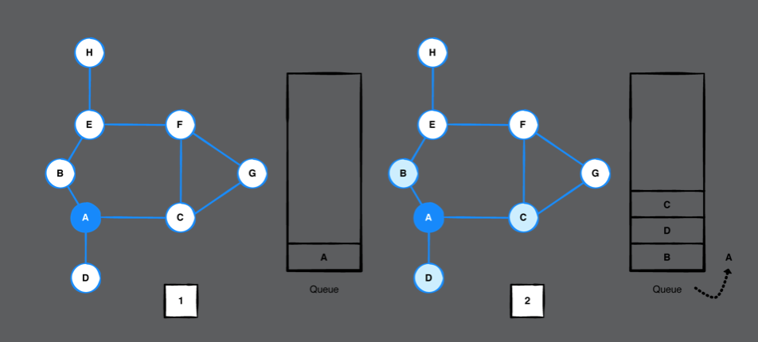
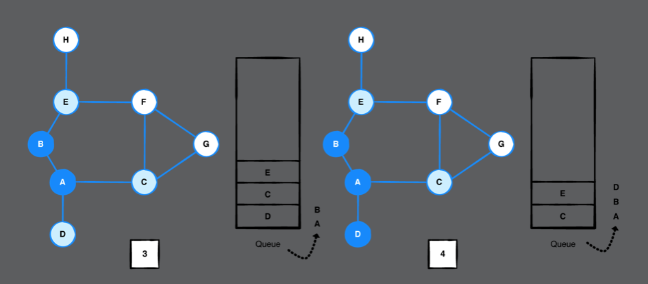
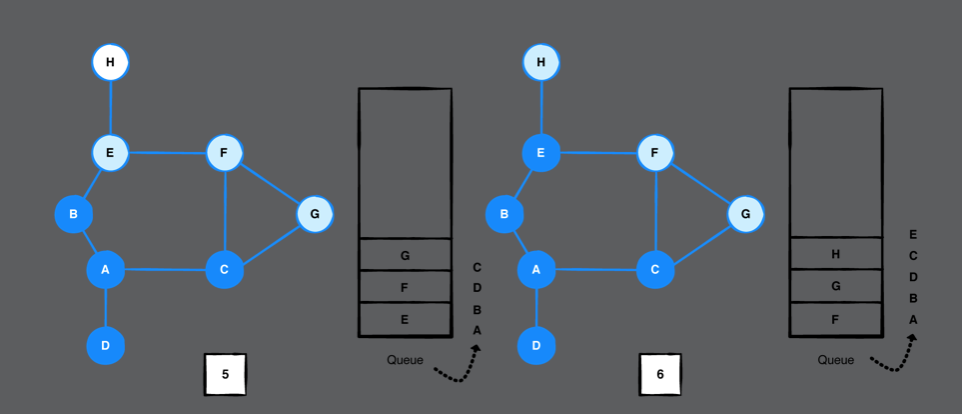
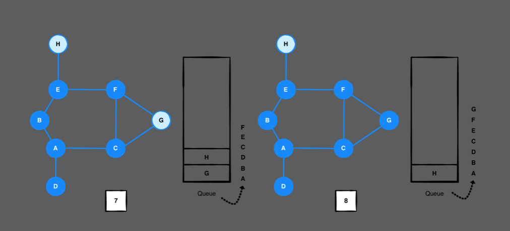
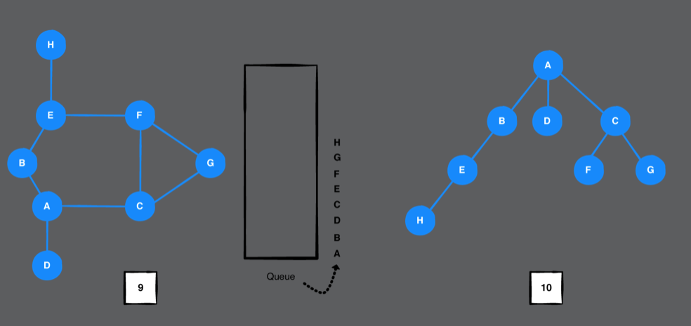

# Chapter 38: Breadth-First Search

#### 前言

BFS是用來走遍圖上的每一個點，走的方式是走第一層鄰居，走完接著走下一層鄰居。通常用在圖上有很多相連的點。

------

#### 大綱

- Example
- Implementation
- Performance

------

#### Example

- Use a queue to keep track of which vertices to visit next

- It’s important to note that you only add a vertex to the queue when it has not yet been visited and is not already in the queue.”

  

  ​							  










------

#### Implementation

```swift
extension Graph where Element: Hashable {

    func breadFirstSearch(from source: Vertex<Element>) -> [Vertex<Element>] {
        // 紀錄接下來要拜訪的鄰居
        var queue = QueueStack<Vertex<Element>>()
        // enqueued remembers which vertices have been enqueued before so you don’t enqueue the same vertex twice. You use a Set type here so that lookup is cheap and only takes O(1).
        var enqueued: Set<Vertex<Element>> = []
        // 記錄拜訪的順序
        var visited: [Vertex<Element>] = []

        queue.enqueue(source)
        enqueued.insert(source)

        while let vertex = queue.dequeue() {
            visited.append(vertex)
            // 取出下一層的鄰居們
            let neighborEdges = edges(from: vertex)
            neighborEdges.forEach { edge in
                if !enqueued.contains(edge.destination) {
                    // 表示這個點尚未被加入queue中
                    queue.enqueue(edge.destination)
                    enqueued.insert(edge.destination)
                }
            }
        }

        return visited
    }
}
```

------

#### Performance

- The overall time complexity for breadth-first search is O(V + E).
  - Each vertex is enqueued once. This has a time complexity of O(V). 
  - During this traversal, you also visit all the the edges. The time it takes to visit all edges is O(E).
- The space complexity of BFS is O(V),
  - since you have to store the vertices in three separate structures: queue, enqueued and visited.
- 