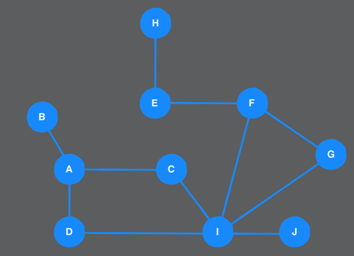
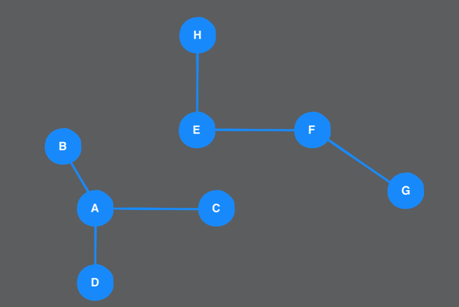

# Chapter 39: Breadth-First Search Challenges

> Challenge 1
>
> For the following undirected graph, list the maximum number of items ever in the queue. Assume that the starting vertex is A.

  

思路: 動手畫畫看

同時在queue中的最多點數是3。


> Challenge 2
>
> In this chapter, you went over an iterative implementation of breadth-first search. Now write a recursive implementation.

- 思路: Iterateion和Recursive要可以互換，可以用Recursive就可以改寫成Iterateion，可以Iterateion就可以改寫成Recursive

```Swift
extension Graph where Element: Hashable {
    
  func bfs(from source: Vertex<Element>) -> [Vertex<Element>] {
    var queue = QueueStack<Vertex<Element>>()
    var enqueued: Set<Vertex<Element>> = []
    var visited: [Vertex<Element>] = []

    // Recursive implementation
    queue.enqueue(source)
    enqueued.insert(source)
    bfs(queue: &queue, enqueued: &enqueued, visited: &visited)

    return visited
  }

  
    private func bfs(queue: inout QueueStack<Vertex<Element>>, enqueued: inout Set<Vertex<Element>>, visited: inout [Vertex<Element>]) {
        // 遞迴終止條件
        guard let vertex = queue.dequeue() else { return }

        // 此點已經拜訪過
        visited.append(vertex)
        // 找出此點的鄰居們
        let neighborEdges = edges(from: vertex)
        neighborEdges.forEach { edge in
            // 確保此鄰居在之前沒被拜訪過
            if !enqueued.contains(edge.destination) {
                queue.enqueue(edge.destination)
                enqueued.insert(edge.destination)
            }
        }

        // 遞迴
        bfs(queue: &queue, enqueued: &enqueued, visited: &visited)
    }
}
```


> Challenge 3
>
> Add a method to Graph to detect if a graph is disconnected. An example of a disconnected graph is shown below:

  

> To help you solve this challenge, a property allVertices was added to the Graph protocol:
> var allVertices: [Vertex<Element>] { get }
> This property is already implemented by AdjacencyMatrix and AdjacencyList.

思路: disconnected表示有兩個點找不到任何路徑可以相連。

```swift
extension Graph where Element: Hashable {
  func isDisconnected() -> Bool {
    // Add your code here
    guard let firstVertex = allVertices.first else {
        // 若圖沒有任何一個點也定義為相連
        return false
    }

    // 利用BFS找出所有相連的點
    let visited = breadthFirstSearch(from: firstVertex)

    for vertex in allVertices {
        // 若此點不存在visited裡面，表示找不到一個path可以連接這個點
        if !visited.contains(vertex) {
            return true
        }
    }

    return false
  }

```

