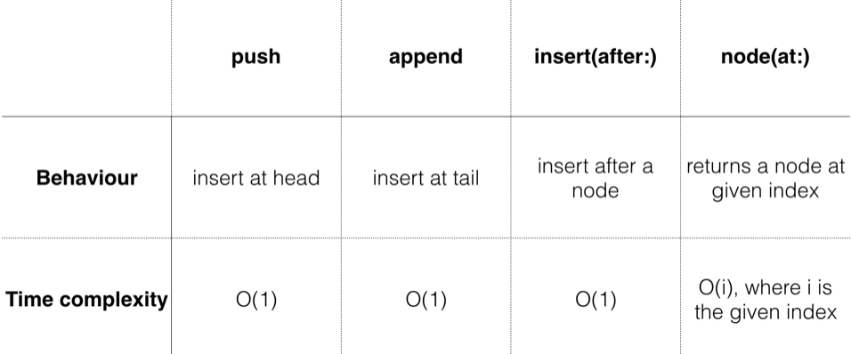
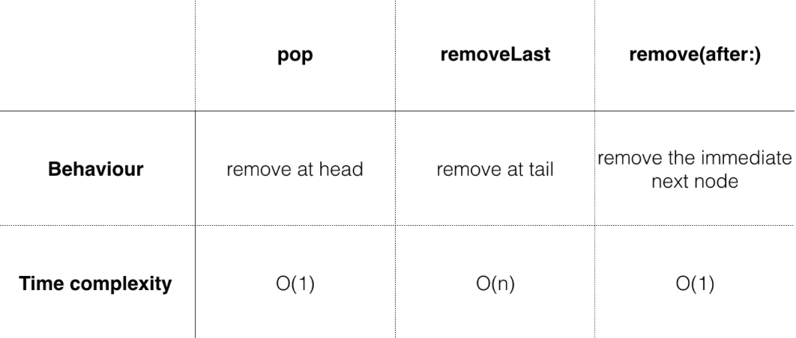

# Chapter 4: Linked List

#### 前言

先從linked list登場，不過這章所介紹的只有單向串列，更複雜的雙向串列就需要自己額外延伸了，這章前半部講單向串列基本操作的實作，後半部則是利用Swift standard library中一些以定義的protocol來增加linked list的功能。

------

#### 大綱

- [Node](#1)
- [LinkedList](#2)
- Adding values to the list
  - [push operations](#3)
  - [append operations](#4)
  - [insert(after:) operations](#5)
  - [Performance analysis](#6)
- Removing values from the list
  - [pop operations](#7)
  - [removeLast operations](#8)
  - [remove(after:) operations](#9)
  - [Performance analysis](#10)
- [Swift collection protocols](#11)
  - Becoming a Swift collection
  - Custom collection indexes
- [Value semantics and copy-on-write](#12)
- [Optimizing COW](#13)
  - isKnownUniquelyReferenced

------

<h2 id="1">Node</h2>

- Node的結構
  - 含有一個value
  - 含有一個next指標，指向下個node

```swift
public class Node<Value> {

    public var value: Value
    public var next: Node?

    public init(value: Value, next: Node? = nil) {
        self.value = value
        self.next = next
    }
}
```

------


<h2 id="2">LinkedList</h2>

- Linked List的結構
  - 將多個Node串接起來
  - 含有一個head指標，指向第一個node
  - 含有一個tail指標，指向最後一個node

```Swift
public struct LinkedList<Value> {

    public var head: Node<Value>?
    public var tail: Node<Value>?

    public init() {}

    public var isEmpty: Bool {
        return head == nil
    }
}
```

------


<h2 id="3">push operations</h2>

- 加入一個值到list的最前端
  - 將這個值產生一個node, 並將這個node的next指標指向當前的head
  - 如果沒有tail指標，則tail跟head指向同一個node

```swift
		public mutating func push(_ value: Value) {
        // 技巧: 現在新增的node的next指向目前head
        head = Node(value: value, next: head)
        // 如果還沒tail, 則第一個push的值，將是trail
        if tail == nil {
            tail = head
        }
    }

//////////////////

example(of: "push") {
    var list = LinkedList<Int>()
    list.push(3)
    list.push(2)
    list.push(1)

    print(list)
}

---Example of push---
1 -> 2 -> 3

```

------


<h2 id="4">append operations</h2>

- 加入一個值到list的最末端
  - 如果當前list是空的，可以直接做之前push的動作
  - 把tail next指向當前新增的node
  - 再把tail移動到新增的node

```Swift
    public mutating func append(_ value: Value) {

        guard !isEmpty else {
            // 如果目前串列為空
            push(value)
            return
        }

        // 當前tail next指向新增的node
        tail!.next = Node(value: value)

        // 移動tail指針
        tail = tail!.next
    }

///////////////

example(of: "append") {
    var list = LinkedList<Int>()
    list.append(1)
    list.append(2)
    list.append(3)

    print(list)
}

---Example of append---
1 -> 2 -> 3 
```


------


<h2 id="5">insert(after:) operations</h2>

- 插入值在某個index的node後面
  - 先找出對應index的node
  - 插入新的node

```swift
    // 根據index找出串列中對應的node
    public func node(at index: Int) -> Node<Value>? {
        var currentNode = head
        var currentIndex = 0

        // currentNode != nil確保萬一index大於串列長度的情況
        while currentNode != nil && currentIndex < index {
            currentNode = currentNode!.next
            currentIndex += 1
        }

        return currentNode
    }

///////////////////////////////

    @discardableResult
    public mutating func insert(_ value: Value, after node: Node<Value>) -> Node<Value> {
        // 利用functionally equivalent來確認當前要被插入的節點是否為末端節點
        guard tail !== node else {
            // 被插入的點為末端節點
            append(value)
            return tail!
        }

        // 技巧: 把當前要插入的node next指向被插入node的next
        node.next = Node(value: value, next: node.next)

        return node.next!
    }

////////////////////////////

example(of: "inserting at a particular index") {
    var list = LinkedList<Int>()
    list.push(3)
    list.push(2)
    list.push(1)

    print("Before inserting: \(list)")

    var middleNode = list.node(at: 1)!
    for _ in 1...4 {
        // 插入4個node到當前middleNode之後
        middleNode = list.insert(-1, after: middleNode)
    }
    
    print("After inserting: \(list)")
}

---Example of inserting at a particular index---
Before inserting: 1 -> 2 -> 3
After inserting: 1 -> 2 -> -1 -> -1 -> -1 -> -1 -> 3
```


------


<h2 id="6">Performance analysis</h2>

- push, append, insert這3個動作，都是針對next指標進行操作，所以都是0(1)
- node(at index: Int), 這個動作是從head開始往後遍歷尋找，所以會依據index大小，而遞增尋找時間。



------


<h2 id="7">pop operations</h2>

- 移除list中最前端的node。
  - 把head指標移到當前的head的next指標。

```swift
@discardableResult
    public mutating func pop() -> Value? {
        defer {
            // 把head指針移到head的next
            head = head?.next
            if isEmpty {
                tail = nil
            }
        }

        return head?.value
    }

//////////////////////////////////////

example(of: "pop") {
    var list = LinkedList<Int>()
    list.push(3)
    list.push(2)
    list.push(1)

    print("Before popping list: \(list)")
    let poppedValue = list.pop()
    print("After popping list: \(list)")
    print("Popped value: " + String(describing: poppedValue))

}

//////////////////////////////////////

---Example of pop---
Before popping list: 1 -> 2 -> 3
After popping list: 2 -> 3
Popped value: Optional(1)
```


------


<h2 id="8">removeLast operations</h2>

- 移除list最末端的元素
- 這個是所有list操作中比較複雜，原因是在處理tail，移除最後一個元素，就是把tail指標指向的node移掉，這是沒問題，但移掉後，tail要怎麼指向在原本list倒數第二個元素(最後元素已經被移除)，因爲node結構並沒有前一個node資訊，所以需要兩個指針由head往後遍歷，直到有個指針可以指到list中倒數第二個node。

```swift
    @discardableResult
    public mutating func removeLast() -> Value? {
        // 當前串列是否有head
        guard let head = head else {
            return nil
        }

        // 當前串列是否只有head
        guard head.next != nil else {
            return pop()
        }

        // 利用兩根指針找到最末端
        var prev = head // 這個最終會指向list中倒數第二個node
        var current = head

        // 技巧: 當current還有next存在，移動指針
        while let next = current.next {
            prev = current
            current = next
        }

        // 刪除與末端的連結
        prev.next = nil
        // 設定tail
        tail = prev

        return current.value
    }

//////////////////////////////////////

example(of: "removing the last node") {
    var list = LinkedList<Int>()
    list.push(3)
    list.push(2)
    list.push(1)

    print("Before removing last node: \(list)")
    let removedValue = list.removeLast()

    print("After removing last node: \(list)")
    print("Removed value: " + String(describing: removedValue))
}

///////////////////////////////////////

---Example of removing the last node---
Before removing last node: 1 -> 2 -> 3
After removing last node: 1 -> 2
Removed value: Optional(3)

```


------


<h2 id="9">remove(after:) operations</h2>

- 這個跟Inset after動作很像，也是要先找到要刪除index的node。

```swift
    @discardableResult
    // 如果index剛好是末端節點，此時要回傳nil
    public mutating func remove(after node: Node<Value>) -> Value? {
        defer {
            // 如果node.next剛好tail, 表示tail的node要被刪除，現在node會變成當前tail
            if node.next === tail {
                tail = node
            }
            // 技巧: 利用此方式斷開要被刪除的node相關連結
            node.next = node.next?.next
        }

        return node.next?.value
    }

//////////////////////////////////////

example(of: "removing a node after a particular node") {
    var list = LinkedList<Int>()
    list.push(3)
    list.push(2)
    list.push(1)

    print("Before removing at particular index: \(list)")
    // 要刪除index = 1的node
    let index = 1
    // 先找index = 0的node
    let node = list.node(at: index - 1)!
    // 刪除index = 0的node後面那個node
    let removedValue = list.remove(after: node)

    print("After removing at index \(index): \(list)")
    print("Removed value: " + String(describing: removedValue))
}

//////////////////////////////////////

---Example of removing a node after a particular node---
Before removing at particular index: 1 -> 2 -> 3
After removing at index 1: 1 -> 3
Removed value: Optional(2)
```


------


<h2 id="10">Performance analysis</h2>

- 因為removeLast是利用兩個指針從頭開始到，所需要找到倒數第二個node，需要O(n)，其他都是指針的處理。



------


<h2 id="11">Swift collection protocols</h2>

OK, 這章前半部，基本就是實作了所有linked list的基本操作，接下來，就要利用Swift的特色，讓linked list有更多功能。

- **Tier 1, Sequence:** 
  - A sequence type provides sequential access to its elements. This axiom comes with a caveat: Using the sequential access may destructively consume the elements.
- **Tier 2, Collection**: 
  - A collection type is a sequence type that provides additional guarantees. A collection type is finite and allows for repeated nondestructive sequential access.
- **Tier 3, BidirectionalColllection**: 
  - A collection type can be a bidirectional collection type if it, as the name suggests, can allow for bidirectional travel up and down the sequence. This isn’t possible for the linked list, since you can only go from the head to the tail, but not the other way around.
- **Tier 4, RandomAccessCollection**: 
  - A bidirectional collection type can be a random access collection type if it can guarantee that accessing an element at a particular index will take just as long as access an element at any other index. This is not possible for the linked list, since accessing a node near the front of the list is substantially quicker than one that is further down the list.

針對linked list

First, since a linked list is a chain of nodes, adopting **the Sequence protocol** makes sense. 

Second, since the chain of nodes is a finite sequence, it makes sense to adopt **the Collection protocol**

#### Becoming a Swift collection

```swift

// https://developer.apple.com/documentation/swift/collection
extension LinkedList: Collection {

    public var startIndex: Index {
        return Index(node: head)
    }

    public var endIndex: Index {
        return Index(node: tail?.next)
    }

    public func index(after i: Index) -> Index {
        return Index(node: i.node?.next)
    }

    public subscript(position: Index) -> Value {
        return position.node!.value
    }

    public struct Index: Comparable {

        public var node: Node<Value>?

        // 實作Equatable
        static public func == (lhs: Index, rhs: Index) -> Bool {
            switch (lhs.node, rhs.node) {
            case let (left?, right?):
                return left.next === right.next
            case (nil, nil):
                return true
            default:
                return false
            }
        }

        // 實作Comparable
        static public func < (lhs: Index, rhs: Index) -> Bool {
            guard lhs != rhs else {
                return false
            }
            // https://developer.apple.com/documentation/swift/2015879-sequence
            let nodes = sequence(first: lhs.node) { $0?.next }
            return nodes.contains { $0 === rhs.node }
        }
    }

}

///////////////////////////////////


example(of: "using collection") {
    var list = LinkedList<Int>()
    for i in 0...9 {
        list.append(i)
    }

    print("List: \(list)")
    print("First element: \(list[list.startIndex])")
    print("Array containing first 3 elements: \(Array(list.prefix(3)))")
    print("Array containing last 3 elements: \(Array(list.suffix(3)))")

    let sum = list.reduce(0, +)
    print("Sum of all values: \(sum)")
}

///////////////////////////////////

---Example of using collection---
List: 0 -> 1 -> 2 -> 3 -> 4 -> 5 -> 6 -> 7 -> 8 -> 9
First element: 0
Array containing first 3 elements: [0, 1, 2]
Array containing last 3 elements: [7, 8, 9]
Sum of all values: 45
```


------


<h2 id="12">Value semantics and copy-on-write</h2>

- copy-on-write是Swift非常重要的特色。是assine by value, 不是assign by reference。

```swift
   // 接下來，在每個操作都加上這個method 
   private mutating func copyNodes() {
        guard var oldNode = head else {
            return
        }

        head = Node(value: oldNode.value)
        var newNode = head

        while let nextOldNode = oldNode.next {
            // 每次都從old node copy一份新的出來
            newNode!.next = Node(value: nextOldNode.value)
            newNode = newNode!.next
            oldNode = nextOldNode
        }

        tail = newNode
    }

///////////////////////////////////

example(of: "array cow") {
    let array1 = [1, 2]
    // copy-on-write
    var array2 = array1

    print("array1: \(array1)")
    print("array2: \(array2)")

    print("---After adding 3 to array 2---")
    // array1不會受影響
    array2.append(3)
    print("array1: \(array1)")
    print("array2: \(array2)")
}

example(of: "linked list cow") {
    var list1 = LinkedList<Int>()
    list1.append(1)
    list1.append(2)
    // 不支援copy-on-write
    var list2 = list1
    print("List1: \(list1)")
    print("List2: \(list2)")

    print("After appending 3 to list2")
    // list1也受影響
    list2.append(3)
    print("List1: \(list1)")
    print("List2: \(list2)")
}

/////////////////////////////////////

---Example of linked list cow---
List1: 1 -> 2
List2: 1 -> 2
After appending 3 to list2
List1: 1 -> 2 -> 3
List2: 1 -> 2 -> 3
```


------


<h2 id="13">Optimizing COW</h2>

每個操作並不一定都要執行copy動作，只有當出現assing動作才需要執行copy動作，可以透過`isKnownUniquelyReferenced`來判斷是否有assign動作。

```Swift
print("List1 uniquely referenced: \(isKnownUniquelyReferenced(&list1.head))")
var list2 = list1
print("List1 uniquely referenced: \(isKnownUniquelyReferenced(&list1.head))")

//////////////////////////////////////

List1 uniquely referenced: true
List1 uniquely referenced: false

/////////////////////////////////////

    private mutating func copyNodes() {
        // 當head有被多個list的reference時，才進行cow動作
        // isKnownUniquelyReferenced(&head) = true, 表示不需要進行cow
        guard !isKnownUniquelyReferenced(&head) else {
            return
        }

        guard var oldNode = head else {

```

