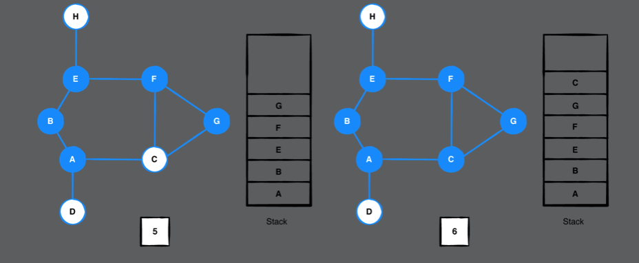

# Chapter 40: Depth-First Search

#### 前言

DFS利用了backtrack (move a step back)的技巧，也是因為這個技巧，需要用到stack這個資料結構。

There are a lot of applications for DFS:

- Topological sorting.
- Detecting a cycle.
- Path finding, such as in maze puzzles.
- Finding connected components in a sparse graph.

------

#### 大綱

- Example
- Implementation
- Performance

------

#### Example

Stack, Pushed, Visted 這三個等會在code中被使用到 

> As long as the **stack** is not empty, you **visit** the top vertex on the stack and **push** the first neighboring vertex that has yet to be

  





> The next vertex to visit is C. It has neighbors [A, F, G], but all of these have been visited. You have reached a dead end, so it’s time to backtrack by popping C off the stack.


------

#### Implementation

```swift
extension Graph where Element: Hashable {

    func depthFirstSearch(from source: Vertex<Element>) -> [Vertex<Element>] {

        // 跟BFS利用queue不同，DFS是利用stack
        var stack: Stack<Vertex<Element>> = []
        // 記錄目前push到stack的元素
        // pushed remembers which vertices have been pushed before so that you don’t visit the same vertex twice. It is a Set to ensure fast O(1) lookup.
        var pushed: Set<Vertex<Element>> = []
        // 記錄拜訪的順序
        var visted: [Vertex<Element>] = []

        stack.push(source)
        pushed.insert(source)
        visted.append(source)

        // 終止條件
        outer: while let vertex = stack.peek() {
            let neighbors = edges(from: vertex)
            guard !neighbors.isEmpty else {
                // 若找不到任何neighbor, 表示走到盡頭
                stack.pop()
                continue
            }
            for edge in neighbors {
                if !pushed.contains(edge.destination) {
                    // 尚未被拜訪過
                    stack.push(edge.destination)
                    pushed.insert(edge.destination)
                    visted.append(edge.destination)
                    // Now that you’ve found a neighbor to visit, you continue the outer loop and move to the newly pushed neighbor.
                    continue outer
                }
            }
            // If the current vertex did not have any unvisited neighbors, you know you’ve reached a dead end and can pop it off the stack.
            stack.pop()
        }

        return visted
    }
}
```

------

#### Performance

- Overall, the time complexity for depth-first search is O(V + E).
  - DFS will visit every single vertex at least once. This has a time complexity of O(V).
  - you have to check all neighboring vertices to find one available to visit. The time complexity of this is O(E) 
- The space complexity of depth-first search is O(V) since you have to store vertices in three separate data structures: stack, pushed and visited