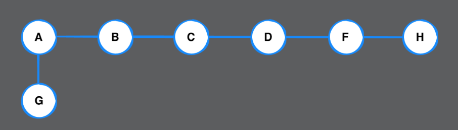

# Chapter 41: Depth-First Search Challenges

> Challenge 1
>
> For each of the following two examples, which traversal (depth-first or breadth-first) is better for discovering if a path exists between the two nodes? Explain why.
>
> Path from A to F.
> Path from A to G.





DFS: 找深 - Path from A to F

BFS: 找寬 - Path from A to G

> Challenge 2
>
> In this chapter, you went over an iterative implementation of depth-first search. Now write a recursive implementation.

```swift
extension Graph where Element: Hashable {
  
  func depthFirstSearch(from source: Vertex<Element>)
    -> [Vertex<Element>] {
        // visited keeps track of the vertices visited in order
      var visited: [Vertex<Element>] = []
        // pushed keeps tracks of which vertices have been visited
      var pushed: Set<Vertex<Element>> = []

      // Add your code here
    depthFirstSearch(from: source, visited: &visited, pushed: &pushed)
      
      return visited
  }

    func depthFirstSearch(from source: Vertex<Element>,
                             visited: inout [Vertex<Element>],
                             pushed: inout Set<Vertex<Element>>) {
        // Insert the source vertex into the queue, and mark it as visited
        pushed.insert(source)
        visited.append(source)

        let neighbors = edges(from: source)
        // For every neighboring edge
        for edge in neighbors {
            if !pushed.contains(edge.destination) {
                // As long as the adjacent vertex has not been visited yet, continue to dive deeper down the branch recursively.
                depthFirstSearch(from: edge.destination,
                    visited: &visited,
                    pushed: &pushed)
            }
        }
    }

}
```


> Challenge 3
>
> Add a method to Graph to detect if a directed graph has a cycle

```swift
extension Graph where Element: Hashable {
  
  func hasCycle(from source: Vertex<Element>) -> Bool  {
    
    // Add your code here
    var pushed: Set<Vertex<Element>> = []
    
    return hasCycle(from: source, pushed: &pushed)
  }

    func hasCycle(from source: Vertex<Element>, pushed: inout Set<Vertex<Element>>) -> Bool {
        pushed.insert(source)

        let neighbors = edges(from: source)
        for edge in neighbors {
            if !pushed.contains(edge.destination) &&
                hasCycle(from: edge.destination, pushed: &pushed) {
                // If the adjacent vertex has not been visited before, recursively dive deeper down a branch to check for a cycle.
                return true
            } else if pushed.contains(edge.destination) {
                return true
            }
        }
        // Remove the source vertex so you can continue to find other paths with a potential cycle.
        pushed.remove(source)

        return false
    }

}
```

