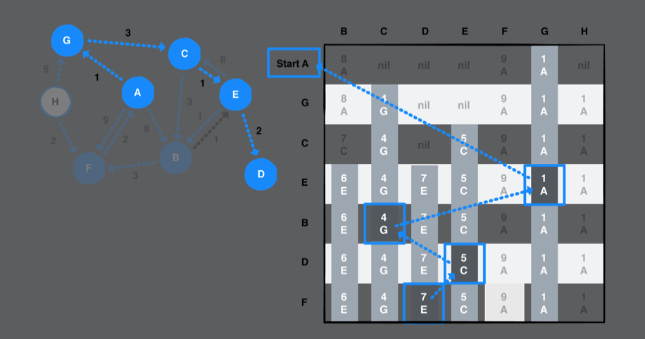

# Chapter 42: Dijkstra’s Algorithm

#### 前言

- Dijkstra’s algorithm is particularly useful in GPS networks to help find the shortest path between two places.
- Dijkstra’s algorithm is a greedy algorithm. 
  - A greedy algorithm constructs a solution step-by-step, and it picks the most optimal path at every step. 

------

#### 大綱

- Example
- Implementation
  - Helper methods
    - Tracing back to the start
    - Calculating total distance
  - Generating the shortest paths
  - Finding a specific path
- Trying out your code
- Performance

------

#### Example

- Every value in the output table has two parts: 
  - the total cost to reach that vertex
  - the last neighbor on the path to that vertex.
  - For example, the value 4 G in the column for vertex C means that the cost to reach C is 4

  

------

#### Init

```swift
public enum Visit<T: Hashable> {
    case start
    // The vertex has an associated edge that leads to a path back to the starting vertex.
    case edge(Edge<T>)
}

public class Dijkstra<T: Hashable> {

    public typealias Graph = AdjacencyList<T>
    let graph: Graph

    public init(graph: Graph) {
        self.graph = graph
    }
}
```

------

#### Tracing back to the start

```swift
    // Tracing back to the start
    // 從目前所在的點回到起始點的路徑
    // paths: 記錄在每個點時拜訪其他點的紀錄
    private func route(to destination: Vertex<T>, with paths: [Vertex<T> : Visit<T>]) -> [Edge<T>] {
        var vertex = destination
        var path: [Edge<T>] = []

        // As long as you have not reached the start case, continue to extract the next edge
        while let visit = paths[vertex], case .edge(let edge) = visit {
            path = [edge] + path
            // Set the current vertex to the edge’s source vertex. This moves you closer to the start vertex.
            vertex = edge.source
        }

        return path
    }
```

------

#### Calculating total distance

```swift
    // Calculating total distance
    private func distance(to destination: Vertex<T>, with paths: [Vertex<T> : Visit<T>]) -> Double {
        let path = route(to: destination, with: paths)
        let distance = path.compactMap { $0.weight }

        return distance.reduce(0.0, +)
    }
```

------

#### Generating the shortest paths

```swift
    public func shortestPath(from start: Vertex<T>) -> [Vertex<T> : Visit<T>] {
        var paths: [Vertex<T> : Visit<T>] = [start : .start]

        // Create a min-priority queue to store the vertices that must be visited.
        var priorityQueue = PriorityQueue<Vertex<T>> (sort:{
            // distance越小越優先
            self.distance(to: $0, with: paths) < self.distance(to: $1, with: paths)
        })

        // Enqueue the start vertex as the first vertex to visit
        priorityQueue.enqueue(start)

        while let vertex = priorityQueue.dequeue() {
            // 找到與此點相連所有邊
            for edge in graph.edges(from: vertex) {
                guard let weight = edge.weight else { continue }

                // 此邊的另一端點尚未拜訪過
                // 或找到一條更cheaper path
                if paths[edge.destination] == nil || distance(to: vertex, with: paths) + weight < distance(to: edge.destination, with: paths) {
                    paths[edge.destination] = .edge(edge)
                    priorityQueue.enqueue(edge.destination)
                }
            }
        }

        return paths
    }
```

------

#### Finding a specific path

```swift
    public func shortestPath(to destination: Vertex<T>,
                                paths: [Vertex<T> : Visit<T>]) -> [Edge<T>] {
        return route(to: destination, with: paths)
    }
```

------

#### Performance

- Constructed your graph using an adjacency list
- Used a min-priority queue to store vertices and extract the vertex with the minimum path.
  - heap operations of extracting the minimum element or inserting an element both take **O(log V)**
- Dijkstra’s algorithm is somewhat similar to breadth-first search
  - O(V + E) to traverse all the vertices and edges
  - use a min-priority queue to select a single vertex with the shortest distance to traverse down. That means it is O(1 + E) or simply **O(E)**
-  it takes **O(E log V)** to perform Dijkstra’s algorithm

