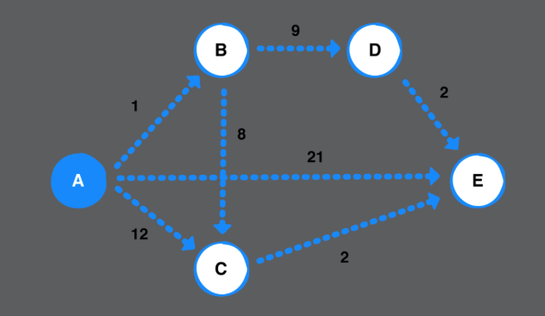
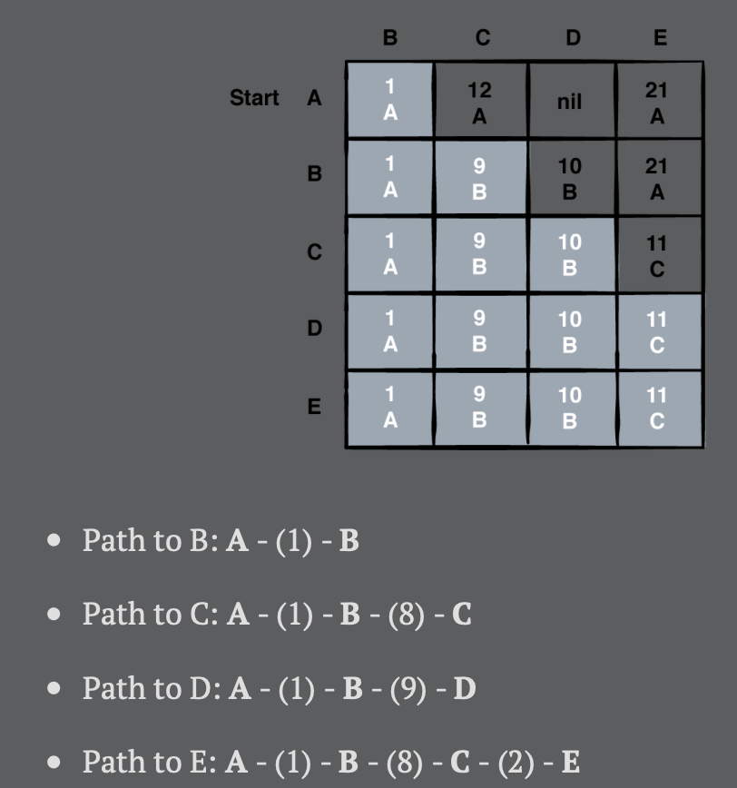

# Chapter 43: Dijkstra’s Algorithm Challenges

> Challenge 1
>
> Given the following graph, step through Dijkstra’s algorithm to produce the shortest path to every other vertex starting from vertex A. Provide the final table of the paths as shown in the previous chapter.

  




> Challenge 2
>
> Add a method to class Dijkstra that returns a dictionary of all the shortest paths to all vertices given a starting vertex. Here’s the method signature to get you started:

```swift
public func getAllShortestPath(from source: Vertex<T>)
    -> [Vertex<T> : [Edge<T>]] {
  var pathsDict = [Vertex<T> : [Edge<T>]]() // 1
  let pathsFromSource = shortestPath(from: source) // 2
  for vertex in graph.vertices { // 3
    let path = shortestPath(to: vertex, paths: pathsFromSource)
    pathsDict[vertex] = path
  }
  return pathsDict // 4
}
```

