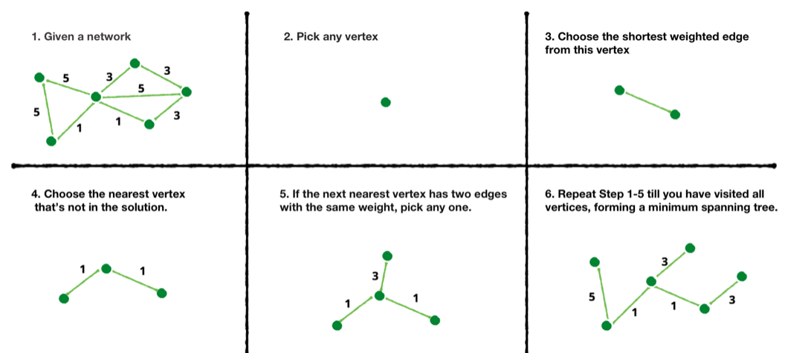
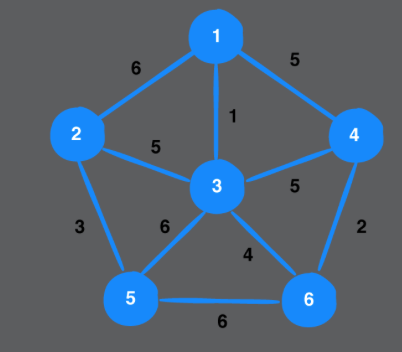
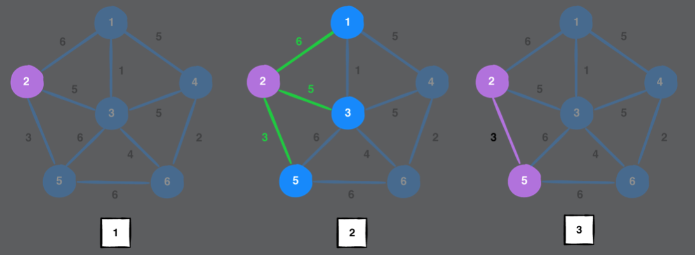
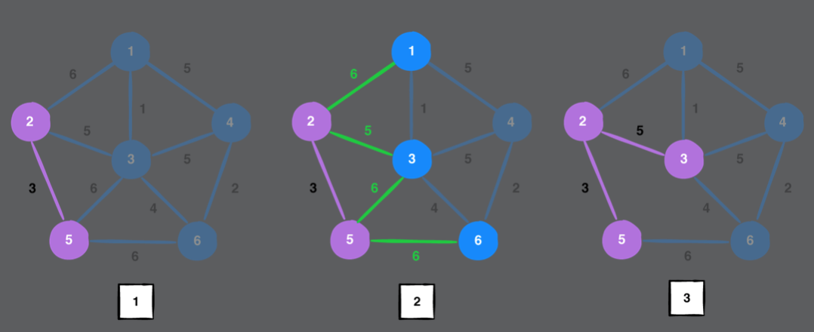
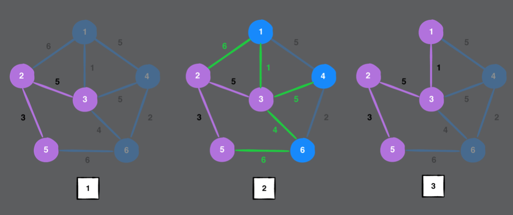
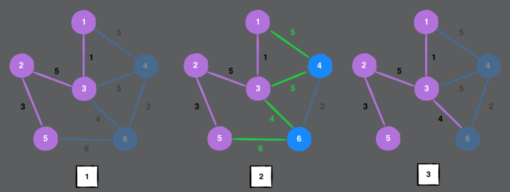
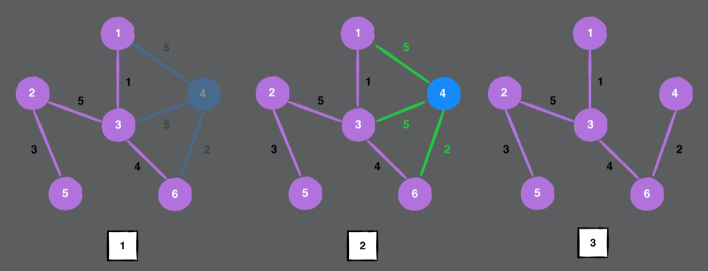
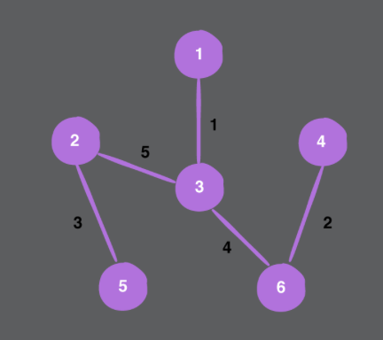

# Chapter 44: Prim’s Algorithm

#### 前言

- Prim’s algorithm, a greedy algorithm used to construct a minimum spanning tree
  - 什麼是spanning tree
    - A spanning tree is a subgraph of an undirected graph, containing all of the graph’s vertices, connected with the fewest number of edge
    - cannot contain a cycle and cannot be disconnected

------

#### 大綱

- Example
- Implementation
  - Helper methods
    - Copying a graph
    - Finding edges
  - Producing a minimum spanning tree
- Testing your code
- Performance

------

#### Example

  















------

#### Copying a graph

- Create a minimum spanning tree, you must include all vertices from the original graph.

```swift
    // 複製圖上的所有點
    public func copyVertices(from graph: AdjacencyList) {
        for vertex in graph.vertices {
            adjacencies[vertex] = []
        }
    }
```

------

#### Finding edges

- Find and store the edges of every vertex you explore.

```swift
    internal func addAvailableEdges(for vertex: Vertex<T>,
                           in graph: Graph,
                           check visited: Set<Vertex<T>>,
                           to priorityQueue: inout PriorityQueue<Edge<T>>) {
        // 對於目前的點所有相連的邊
        for edge in graph.edges(from: vertex) {
            // 若對應的想連的點，之前並未被拜訪過
            if !visited.contains(edge.destination) {
                // 將此邊加入priorityQueue中
                priorityQueue.enqueue(edge)

            }
        }
    }
```

------

#### Producing a minimum spanning tree

```swift
    public func produceMinimumSpanningTree(for graph: Graph) -> (cost: Double, mst: Graph) {
        var cost = 0.0
        let mst = Graph()
        var visited: Set<Vertex<T>> = []
        var priorityQueue = PriorityQueue<Edge<T>>(sort: {
            $0.weight ?? 0.0 < $1.weight ?? 0.0
        })
        // Copy all the vertices from the original graph to the minimum spanning tree
        mst.copyVertices(from: graph)

        guard let start = graph.vertices.first else {
            return (cost: cost, mst: mst)
        }

        visited.insert(start)
        // Add all potential edges from the start vertex into the priority queue.
        addAvailableEdges(for: start, in: graph, check: visited, to: &priorityQueue)

        while let smallestEdge = priorityQueue.dequeue() {
            let vertex = smallestEdge.destination
            // If this vertex has been visited, restart the loop and get the next smallest edge.”
            guard !visited.contains(vertex) else {
                continue
            }

            visited.insert(vertex)
            cost += smallestEdge.weight ?? 0.0

            // Add the smallest edge into the minimum spanning tree you are constructing.
            mst.add(.undirected, from: smallestEdge.source, to: smallestEdge.destination, weight: smallestEdge.weight)
            // Add the available edges from the current vertex
            addAvailableEdges(for: vertex, in: graph, check: visited, to: &priorityQueue)
        }

        return (cost: cost, mst: mst)
    }
```

------

#### Performance

- Adding vertices and edges to an adjacency list is O(1)
- Checking if the set contains a vertex also have a time complexity of O(1)
- The priority queue is built on top of a heap and insertion takes O(log E).
- The worst-case time complexity of Prim’s algorithm is O(E log E). 
  - This is because, each time you dequeue the smallest edge from the priority queue, you have to traverse all the edges of the destination vertex ( O(E) ) and insert the edge into the priority queue ( O(logE) )