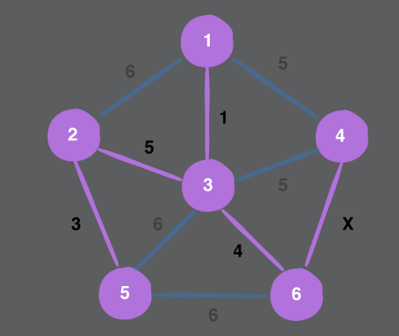
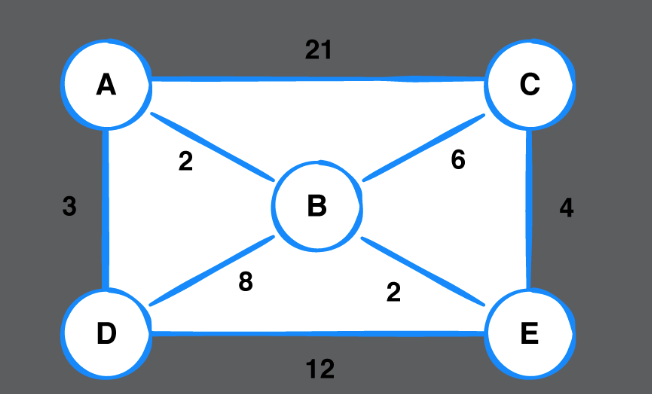
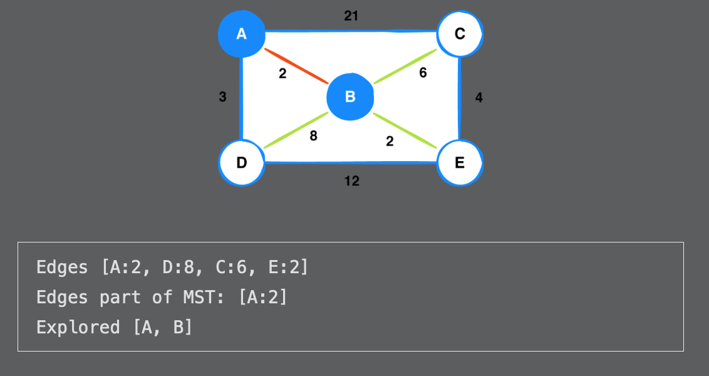
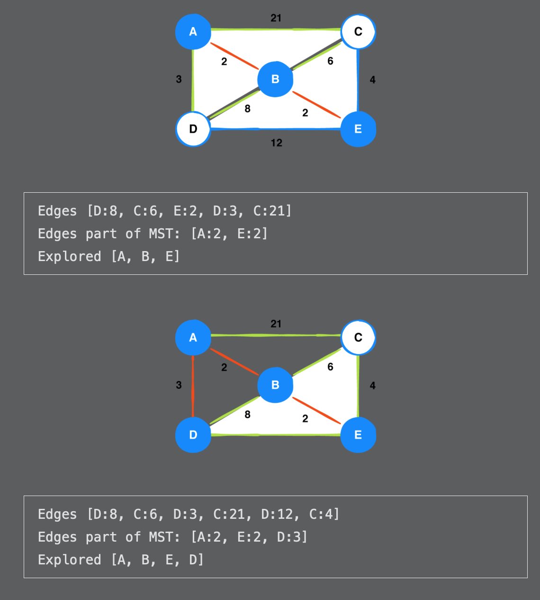
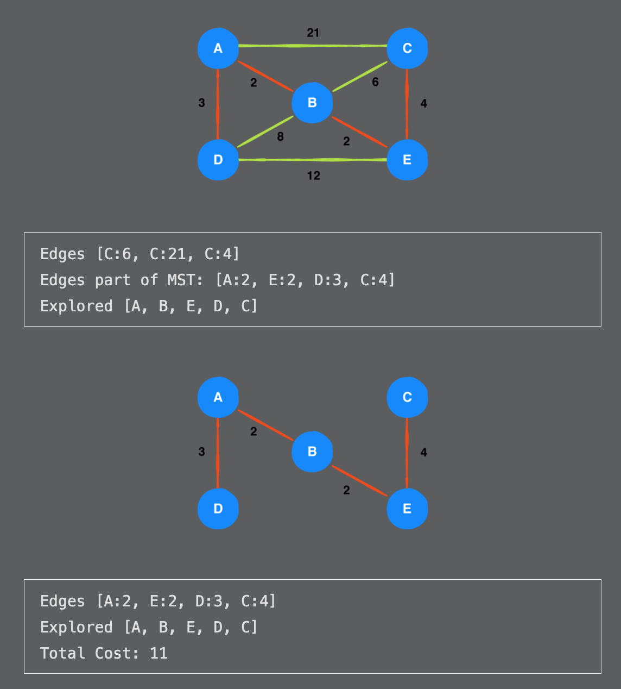

# Chapter 45: Prim’s Algorithm Challenges

> Challenge 1
>
> Given the graph and minimum spanning tree below, what can you say about the value of x?

The value of x is less than 

------

> Challenge 2
>
> Given the graph below, step through Prim’s algorithm to produce a minimum spanning tree, and provide the total cost. Start at vertex B. If two edges share the same weight, prioritize them alphabetically.

