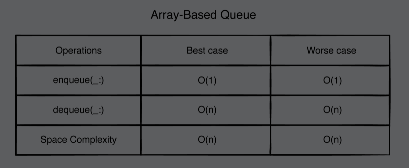
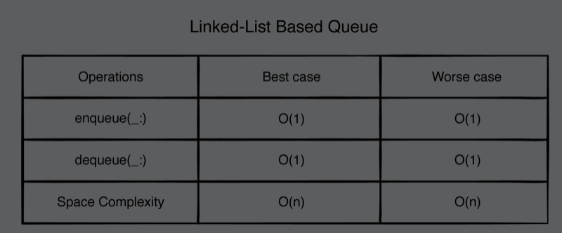
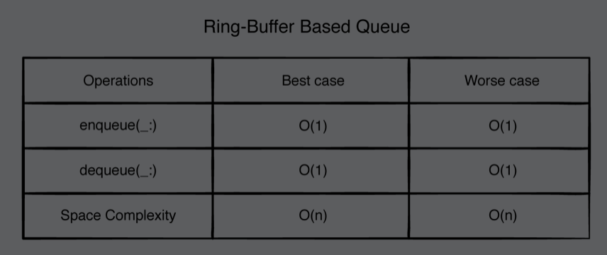
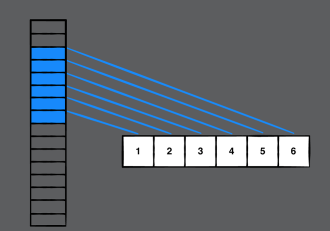
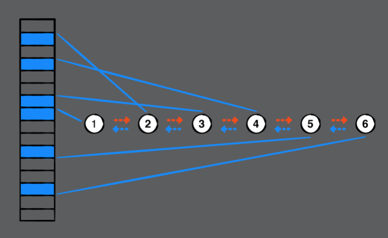
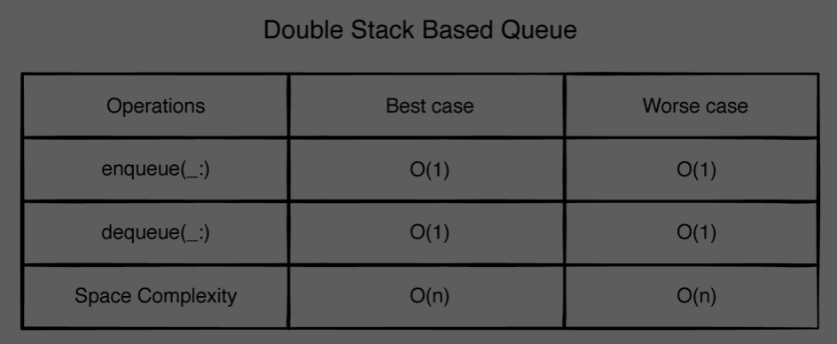

# Chapter 8: Queues

#### 前言

Queue是FIFO的資料結構，本章會介紹4種不同實作方式來實作queue，並分析其時間複雜度。

------

#### 大綱

- [Common operations](#1)
- [Array-based implementation](#2)
- [Doubly linked list implementation](#3)
- [Ring buffer implementation](#4)
- [Double-stack implementation](#5)

------

<h2 id="1">Common operations</h2>

- Queue常見的基本操作
  - Enqueue: 插入元素到queue的做末端，如果插入成功回傳true
  - Dequeue: 移除queue的最前端元素，並回傳此元素
  - isEmpty: 判斷queue是否為空
  - Peek: 回傳queue最前端元素，並沒有移除

```swift
public protocol Queue {
  associatedtype Element
  
  mutating func enqueue(_ element: Element) -> Bool
  mutating func dequeue() -> Element?
  var isEmpty: Bool { get }
  var peek: Element? { get }
}
```


------


<h2 id="2">Array-based implementation</h2>

- 利用Array來實作Queue

```swift
public struct QueueArray<T>: Queue {
    private var array: [T] = []
    public init() {}

    public var isEmpty: Bool {
        return array.isEmpty
    }

    public var peek: T? {
        return array.first
    }

    public mutating func enqueue(_ element: T) -> Bool {
        array.append(element)
        return true
    }

    public mutating func dequeue() -> T? {
        return isEmpty ? nil : array.removeFirst()
    }
}
```

- 優缺點
  - enqueue快速，但萬一遇到array滿了，就會有額外的工在進行resiz。
  - dequeue慢，每次搬移後都需要將array中的元素進行shift的動作。



------


<h2 id="3">Doubly linked list implementation</h2>

- Doubly linked list是利用有紀錄previos跟next的node進行實作。

```Swift
public class QueueLinkedList<T>: Queue {

    private var list = DoublyLinkedList<T>()
    public init() {}

    public func enqueue(_ element: T) -> Bool {
        list.append(element)
        return true
    }

    public func dequeue() -> Element? {
        guard !list.isEmpty, let element = list.first else {
            return nil
        }

        return list.remove(element)
    }

    public var isEmpty: Bool {
        return list.isEmpty
    }

    public var peek: T? {
        return list.first?.value
    }

}
```

- 優缺點
  - Doubly linked list的dequeu只需要O(1)，Array-based需要O(n)。
  - list中每個元素都需要額外紀錄前一個跟後一個元素的reference。
    - Moreover, every time you create a new element, it requires a relatively expensive dynamic allocation. By contrast QueueArray does bulk allocation, which is faster.



------


<h2 id="4">Ring buffer implementation</h2>

- Ring buffer - circular buffer, is a fixed-size array, 用來優化Doubly linked list的空間複雜度。
  - **The read pointer** keeps track of the front of the queue.
  - **The write pointer** keeps track of the next available slot so that you can override existing elements that have already been read
  - 當read和write在相同的index時，表示queue是empty

```swift
public struct QueueRingBuffer<T>: Queue {
    private var ringBuffer: RingBuffer<T>

    public init(count: Int) {
        ringBuffer = RingBuffer<T>(count: count)
    }

    public var isEmpty: Bool {
        return ringBuffer.isEmpty
    }

    public var peek: T? {
        return ringBuffer.first
    }

    public mutating func enqueue(_ element: T) -> Bool {
        return ringBuffer.write(element)
    }

    public mutating func dequeue() -> T? {
        return isEmpty ? nil : ringBuffer.read()
    }
}
```

- 優缺點
  - 跟link list有相同的性能。
  - 唯一不同的是空間複雜度，ring buffer是固定size, 所以有可能出現euqueue失敗的情況。



------


<h2 id="5">Double-stack implementation</h2>

- 利用兩個stack實作queue
  - 當要enqueue，就在right stack放入元素。
  - 當要dequeue, 就把right stack中所有元素進行反轉，然後放入左邊stack, 就達成FIFO的目的。

```swift
public struct QueueStack<T>: Queue {
    private var leftStack: [T] = []
    private var rightStack: [T] = []

    public init() {}

    public var isEmpty: Bool {
        return leftStack.isEmpty && rightStack.isEmpty
    }

    public var peek: T? {
        return leftStack.isEmpty ? rightStack.first : leftStack.last
    }

    public mutating func enqueue(_ element: T) -> Bool {
        rightStack.append(element)
        return true
    }

    public mutating func dequeue() -> T? {
        // 表示之前沒有任何deqeue動作，或者已經deqeue多次了
        if leftStack.isEmpty {
            leftStack = rightStack.reversed()
            rightStack.removeAll()
        }

        return leftStack.popLast()
    }
}
```

- 優缺點
  - 跟**array**相比，利用兩個stack來優化dequeue效能。
  - two-stack implementation is fully dynamic and doesn’t have the fixed size restriction that your **ring-buffer-based** queue implementation has.
  - It beats the **linked list** in terms of **spacial locality**
    - A linked list wherein the elements aren’t in contiguous blocks of memory. This could lead to more cache misses, which will increase access time





