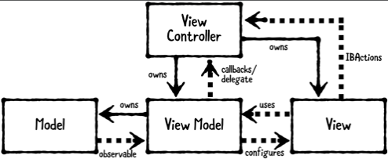

# Chapter 10: Model-View-ViewModel Pattern

------

## 大綱

- [When should you use it?](#1)
- [Playground example](#2)
- [What should you be careful about?](#3)
- [Tutorial project](#4)
- [Key points](#5)

------

<h2 id="1">When should you use it?</h2>

- **Model-View-ViewModel (MVVM)** is a structural design pattern that separates objects into **three distinct groups**:

  - **Models** : hold app data. They’re usually structs or simple classes.
  - **Views**: display visual elements and controls on the screen. They’re typically subclasses of UIView.
  - **View models**: transform model information into values that can be displayed on a view. They’re usually classes, so they can be passed around as references.
  - **view controllers**: do exist in MVVM, but their role is minimized.

  

- **When should you use it?**

  - Use this pattern when you need to transform models into another representation for a view. 
  - MVVM is a great way to slim down massive view controllers that require several model-to-view transformations


------

<h2 id="2">Playground example</h2>

- Model

```swift
// MARK: - Model
public class Pet {

  public enum Rarity {
    case common
    case uncommon
    case rare
    case veryRare
  }

  public let name: String
  public let birthday: Date
  public let rarity: Rarity
  public let image: UIImage

  public init(name: String,
              birthday: Date,
              rarity: Rarity,
              image: UIImage) {

    self.name = name
    self.birthday = birthday
    self.rarity = rarity
    self.image = image
  }
}
```

- ViewModel

```Swift
// MARK: - ViewModel
public class PetViewModel {

  private let pet: Pet
  private let calendar: Calendar

  public init(pet: Pet) {
    self.pet = pet
    self.calendar = Calendar(identifier: .gregorian)
  }

  // declared two computed properties for name and image, where you return the pet’s name and image respectively.
  public var name: String {
    return pet.name
  }

  public var image: UIImage {
    return pet.image
  }

  // another computed property
  public var ageText: String {
    let today = calendar.startOfDay(for: Date())
    let birthday = calendar.startOfDay(for: pet.birthday)
    let components = calendar.dateComponents([.year],
                                             from: birthday,
                                             to: today)
    let age = components.year!
    return "\(age) years old"
  }

  // computed property
  public var adoptionFeeText: String {
    switch pet.rarity {
    case .common:
      return "$50.00"
    case .uncommon:
      return "$75.00"
    case .rare:
      return "$150.00"
    case .veryRare:
      return "$500.00"
    }
  }
}

extension PetViewModel {
  // configue ViewModel到View中
  public func configure(_ view: PetView) {
    view.nameLabel.text = name
    view.imageView.image = image
    view.ageLabel.text = ageText
    view.adoptionFeeLabel.text = adoptionFeeText
  }
}

```

- View

```swift
// MARK: - View
public class PetView: UIView {

  public let imageView: UIImageView
  public let nameLabel: UILabel
  public let ageLabel: UILabel
  public let adoptionFeeLabel: UILabel

  public override init(frame: CGRect) {
    var childFrame = CGRect(x: 0,
                            y: 16,
                            width: frame.width,
                            height: frame.height / 2)

    imageView = UIImageView(frame: childFrame)
    imageView.contentMode = .scaleAspectFit

    childFrame.origin.y += childFrame.height + 16
    childFrame.size.height = 30
    nameLabel = UILabel(frame: childFrame)
    nameLabel.textAlignment = .center

    childFrame.origin.y += childFrame.height
    ageLabel = UILabel(frame: childFrame)
    ageLabel.textAlignment = .center

    childFrame.origin.y += childFrame.height
    adoptionFeeLabel = UILabel(frame: childFrame)
    adoptionFeeLabel.textAlignment = .center

    super.init(frame: frame)

    backgroundColor = .white
    addSubview(imageView)
    addSubview(nameLabel)
    addSubview(ageLabel)
    addSubview(adoptionFeeLabel)
  }

  @available(*, unavailable)
  public required init?(coder: NSCoder) {
    fatalError("init?(coder:) is not supported")
  }
}
```

- Configure

```swift
// MARK: - Example
let birthday = Date(timeIntervalSinceNow: (-2 * 86400 * 366))
let image = UIImage(named: "stuart")!
let stuart = Pet(name: "Stuart",
                 birthday: birthday,
                 rarity: .veryRare,
                 image: image)

let viewModel = PetViewModel(pet: stuart)

let frame = CGRect(x: 0, y: 0, width: 300, height: 420)
let view = PetView(frame: frame)

viewModel.configure(view)

PlaygroundPage.current.liveView = view
```


------

<h2 id="3">What should you be careful about?</h2>

- MVVM works well if your app requires many model-to-view transformations. 
- However, not every object will neatly fit into the categories of model, view or view model. Instead, you should use MVVM in combination with other design patterns.

------

<h2 id="4">Tutorial project</h2>

- CoffeeQuest

------

<h2 id="5">Key points</h2>

- **MVVM helps slim down view controllers**, making them easier to work with. Thus combatting the "Massive View Controller" problem.
- **View models are classes that take objects and transform them into different objects**, which can be passed into the view controller and displayed on the view. They’re especially useful for converting computed properties such as Date or Decimal into a String or something else that actually can be shown in a UILabel or UIView.
- If you’re only using **the view model with one view, it can be good to put all the configurations into the view model.** However, if you’re using **more than one view**, you might find that putting all the logic in the view model clutters it. Having **the configure code separated into each view may be simpler**.
- MVC may be a better starting point if your app is small. As your app’s requirements change, you’ll likely need to choose different design patterns based on your changing requirements.