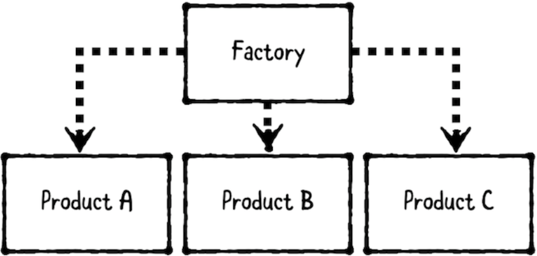

# Chapter 11: Factory Pattern

------

## 大綱

- [When should you use it?](#1)
- [Playground example](#2)
- [What should you be careful about?](#3)
- [Tutorial project](#4)
- [Key points](#5)

------

<h2 id="1">When should you use it?</h2>

- **The factory pattern** is a creational pattern that provides a way to make objects without exposing creation logic.
  - **The factory**: creates objects.
  - **The products**: the objects that are created.



- **When should you use it?**
  - Use the factory pattern whenever you want to **separate out product creation logic**, instead of having consumers create products directly.


------

<h2 id="2">Playground example</h2>

- 目標:  use a factory to create a “job applicant response” email: The factory can generate email details depending on whether the candidate was accepted, rejected or needs to be interviewed.

```swift
var jackson = JobApplicant(name: "Jackson Smith",
                           email: "jackson.smith@example.com",
                           status: .new)

let emailFactory = EmailFactory(senderEmail: "RaysMinions@RaysCoffeeCo.com")

// New
print(emailFactory.createEmail(to: jackson), "\n")

// Interview
jackson.status = .interview
print(emailFactory.createEmail(to: jackson), "\n")

// Hired
jackson.status = .hired
print(emailFactory.createEmail(to: jackson), "\n")
```

- Objects: 

```Swift
public struct JobApplicant {
  public let name: String
  public let email: String
  public var status: Status
  
  public enum Status {
    case new
    case interview
    case hired
    case rejected
  }
}

public struct Email {
  public let subject: String
  public let messageBody: String
  public let recipientEmail: String
  public let senderEmail: String
}
```

- Factory

```Swift
public struct EmailFactory {
  
  public let senderEmail: String
  
  public func createEmail(to recipient: JobApplicant) -> Email {
    switch recipient.status {
    case .new:
      return Email(
        subject: "We Received Your Application",
        messageBody: "Thanks for applying for a job here! " +
        "You should hear from us in 17-42 business days.",
        recipientEmail: recipient.email,
        senderEmail: senderEmail)
      
    case .interview:
      return Email(
        subject: "We Want to Interview You",
        messageBody: "Thanks for your resume, \(recipient.name)! " +
        "Can you come in for an interview in 30 minutes?",
        recipientEmail: recipient.email,
        senderEmail: senderEmail)
      
    case .hired:
      return Email(
        subject: "We Want to Hire You",
        messageBody: "Congratulations, \(recipient.name)! " +
        "We liked your code, and you smelled nice. We want to offer you a position! Cha-ching! $$$",
        recipientEmail: recipient.email,
        senderEmail: senderEmail)
      
    case .rejected:
      return Email(
        subject: "Thanks for Your Application",
        messageBody: "Thank you for applying, \(recipient.name). " +
          "We have decided to move forward with other candidates. " +
        "Please remember to wear pants next time!",
        recipientEmail: recipient.email,
        senderEmail: senderEmail)
    }
  }
}
```

------

<h2 id="3">What should you be careful about?</h2>

- Not all polymorphic objects require a factory. If your objects are very simple, you can always put the creation logic directly in the consumer, such as a view controller itself.
- if your object requires a series of steps to build it, you may be better off using the builder pattern or another pattern instead.

------

<h2 id="4">Tutorial project</h2>


------

<h2 id="5">Key points</h2>

- A factory’s goal is to isolate object creation logic within its own construct.
- A factory is most useful if you have a group of related products, or if you cannot create an object until more information is supplied (such as completing a network call, or waiting on user input).
- The factory method adds a layer of abstraction to create objects, which reduces duplicate code.

