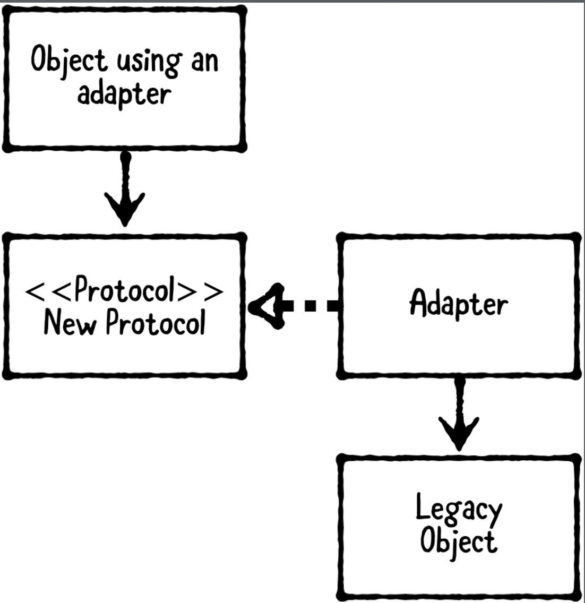

# Chapter 12: Adapter Pattern

------

## 大綱

- [When should you use it?](#1)
- [Playground example](#2)
- [What should you be careful about?](#3)
- [Tutorial project](#4)
- [Key points](#5)

------

<h2 id="1">When should you use it?</h2>

- **The adapter pattern** is a behavioral pattern that allows incompatible types to work together.
  - **An object using an adapter**: the object that depends on the new protocol.
  - **The new protocol**:  the desired protocol for use.
  - **A legacy object**:  existed before the protocol was made and cannot be modified directly to conform to it.
  - **An adapter**: created to conform to the protocol and passes calls onto the legacy object.



- The Adapter Pattern is about: connecting two elements that otherwise won’t “fit” with each other.
- **When should you use it?**
  - Classes, modules, and functions can’t always be modified, especially if they’re from a third-party library. Sometimes you have to adapt instead!


------

<h2 id="2">Playground example</h2>

目標: adapt a third-party authentication service to work with an app’s internal authentication service.

```Swift
var authService: AuthenticationService = GoogleAuthenticatorAdapter()
authService.login(
  email: "user@example.com", password: "password",
  success: { user, token in
    print("Auth succeeded: \(user.email), \(token.value)")
   
}, failure: { error in
  if let error = error {
    print("Auth failed with error: \(error)")
  } else {
    print("Auth failed with error: no error given")
  }
})
```


- a third-party authentication service

```Swift
// Third-Party Classes
public class GoogleAuthenticator {
  public  func login(email: String,
                     password: String,
                     completion: @escaping (GoogleUser?, Error?) -> Void) {
    
    // Make networking calls, which return a `Token`
    let token = "special-token-value"
    
    let user = GoogleUser(email: email, password: password, token: token)
    completion(user, nil)
  }
}

public  struct GoogleUser {
  public var email: String
  public var password: String
  public var token: String
}
```

- authentication protocol

```swift
// AuthenticationService
public protocol AuthenticationService {
  func login(email: String,
             password: String,
             success: @escaping (User, Token) -> Void,
             failure: @escaping (Error?) -> Void)
}

public struct User {
  public let email: String
  public let password: String
}

public struct Token {
  public let value: String
}
```

- adapter

```Swift
public class GoogleAuthenticatorAdapter: AuthenticationService {
  
  private var authenticator = GoogleAuthenticator()
  
  public func login(email: String,
                    password: String,
                    success: @escaping (User, Token) -> Void,
                    failure: @escaping (Error?) -> Void) {
    
    authenticator.login(email: email, password: password) { (googleUser, error) in
      guard let googleUser = googleUser else {
        failure(error)
        return
      }
      
      let user = User(email: googleUser.email, password: googleUser.password)
      let token = Token(value: googleUser.token)
      success(user, token)
    }
  }
}
```


------

<h2 id="3">What should you be careful about?</h2>

- **Protocols are a requirement for the adapter design pattern**. You’re adapting an existing interface, and the protocol ensures your adapter will work with the target.
- Remember not to jump to the adapter pattern **unless you recognize there’s a possibility for change**.

------

<h2 id="4">Tutorial project</h2>


------

<h2 id="5">Key points</h2>

- The adapter pattern is useful when working with classes from third party libraries that cannot be modified. You can use protocols to have them work with project’s custom classes.
- To use an adapter, you can either extend the legacy object, or make a new adapter class.
- The adapter pattern allows you to reuse a class even if it lacks required components or has incompatible components with required objects.
- In A Briefer History of Time, Steven Hawking said, “Intelligence is the ability to adapt to change.” Maybe he wasn’t talking about the adapter pattern exactly, but this idea is an important component in this pattern and many others: plan ahead for future changes.”