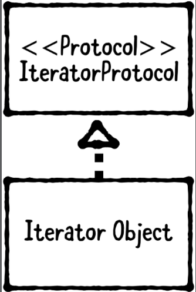

# Chapter 13: Iterator Pattern

------

## 大綱

- [When should you use it?](#1)
- [Playground example](#2)
- [What should you be careful about?](#3)
- [Tutorial project](#4)
- [Key points](#5)

------

<h2 id="1">When should you use it?</h2>

- **The iterator pattern** is a behavioral pattern that provides a standard way to loop through a collection
  - **The Swift IterableProtocol**: defines a type that can be iterated using a for in loop.
  - **A custom object**: an object you want to make iterable. 
- Instead of conforming to Iterable directly, however, **you can conform to Sequence**, which itself conforms to Iterable. 



- **When should you use it?**
  - Use the iterator pattern when you have a class or struct that holds a group of ordered objects, and you want to make it iterable using a for in loop.


------

<h2 id="2">Playground example</h2>

- 目標: 

```swift
var queue = Queue<Ticket>()
queue.enqueue(Ticket(description: "Wireframe Tinder for dogs app", priority: .low))
queue.enqueue(Ticket(description: "Set up 4k monitor for Josh", priority: .medium))
queue.enqueue(Ticket(description: "There is smoke coming out of my laptop", priority: .high))
queue.enqueue(Ticket(description: "Put googly eyes on the Roomba", priority: .low))
queue.dequeue()

print("List of Tickets in queue:")
for ticket in queue {
  print(ticket?.description ?? "No Description")
}

// The ability to sort through groups so easily is a powerful feature, and becomes more valuable as your lists and queues get larger.
let sortedTickets = queue.sorted { $0!.sortIndex > ($1?.sortIndex)! }
var sortedQueue = Queue<Ticket>()

for ticket in sortedTickets {
  sortedQueue.enqueue(ticket!)
}

print("\n")
print("Tickets sorted by priority:")
for ticket in sortedQueue {
  print(ticket?.description ?? "No Description")
}

```


- creating a queue

```swift
public struct Queue<T> {
  private var array: [T?] = []
  private var head = 0
  
  public var isEmpty: Bool {
    return count == 0
  }
  
  public var count: Int {
    return array.count - head
  }
  
  public mutating func enqueue(_ element: T) {
    array.append(element)
  }
  
  public mutating func dequeue() -> T? {
    guard head < array.count,
      let element = array[head] else {
        return nil
    }

    array[head] = nil
    head += 1
    
    let percentage = Double(head) / Double(array.count)
    if array.count > 50,
      percentage > 0.25 {
        array.removeFirst(head)
        head = 0
    }
    return element
  }
}
```

- Custom object

```swift
public struct Ticket {
  var description: String
  var priority: PriorityType

  enum PriorityType {
    case low
    case medium
    case high
  }

  init(description: String, priority: PriorityType) {
    self.description = description
    self.priority = priority
  }
}

extension Ticket {
  var sortIndex: Int {
    switch self.priority {
    case .low:
      return 0
    case .medium:
      return 1
    case .high:
      return 2
    }
  }
}
```

- Conforming the Sequence protocol
  - The first is your associated type, which is your Iterator. In the code above, **IndexingIterator** is your associated type, which is the default iterator for any collection that doesn’t declare its own.
  - The second part is the Iterator protocol, which is the required **makeIterator** function. It constructs an iterator for your class or struct

```swift
extension Queue: Sequence {
  public func makeIterator() -> IndexingIterator<ArraySlice<T?>> {
    let nonEmptyValues = array[head ..< array.count]
    return nonEmptyValues.makeIterator()
  }
}
```

------

<h2 id="3">What should you be careful about?</h2>

- it’s almost always better to conform to Sequence and provide custom next() logic, instead of conforming to IteratorProtocol directly.


------

<h2 id="4">Tutorial project</h2>


------

<h2 id="5">Key points</h2>

- The iterator pattern provides a standard way to loop through a collection using a for in syntax.
- It’s better to make your custom objects **conform to Sequence**, instead of IteratorProtocol directly.
- By conforming to Sequence, you will get higher-order functions like map and filter for free.